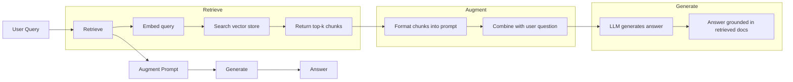
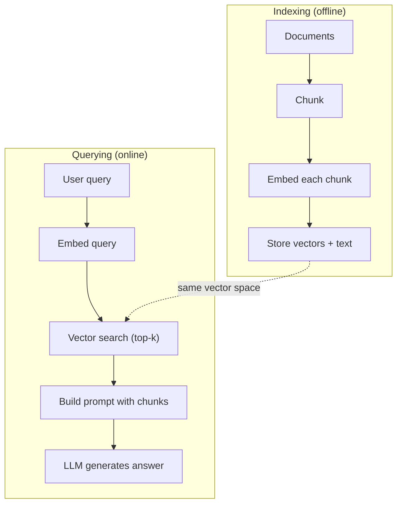

# RAG（檢索增強生成）

> 你的 LLM 無所不知，但也僅限於其訓練截止日之前的世界。它對你公司的內部文件、程式碼庫或上週的會議紀錄一無所知。RAG 透過檢索關聯文件並將其填入 Prompt 來解決這個難題。它是正式環境 AI 中被部署最廣泛的架構模式。如果你只能從這門課帶走一項實戰成果，請務必親手打造一套 RAG 管線。

**Type:** Build
**Languages:** Python
**Prerequisites:** Phase 10 (LLMs from Scratch), Phase 11 Lessons 01-05
**Time:** ~90 minutes
**Related:** Phase 5 · 23 (Chunking Strategies for RAG) for the six chunking algorithms and when each wins. Phase 5 · 22 (Embedding Models Deep Dive) for picking the embedder. Phase 11 · 07 (Advanced RAG) for hybrid search, reranking, and query transformation.

## Learning Objectives｜學習目標

- 建構完整的 RAG 管線：文件載入、分塊、embedding 向量化、向量儲存、檢索與答案生成
- 使用向量資料庫（ChromaDB、FAISS 或 Pinecone）實作帶有適當索引的語意搜尋
- 解釋為何在知識扎根型應用中 RAG 優於 fine-tuning（成本、新鮮度、可歸因性）
- 使用檢索指標（精確率 precision、召回率 recall）與生成指標（忠實度 faithfulness、關聯度 relevance）評估 RAG 品質

## The Problem｜問題

你為公司建構了一款客服聊天機器人。一位客戶詢問：「企業方案的退款政策是什麼？」LLM 給出了一段關於一般 SaaS 常見退款條款的泛泛之論。然而真正躺在公司 200 頁內部 Wiki 中的實際政策規定：企業客戶享有 60 天的寬限期並可依比例退款。LLM 從未見過這份內部文件，它自然無法回答它未曾受訓過的知識。

Fine-tuning 是直覺想到的解法之一：拿內部文件重新訓練 LLM，並部署更新後的模型。這雖然可行，但存在嚴重的硬傷。每次訓練需耗費數千美元的算力成本；文件一旦更新，模型立刻再度過期；你完全無法稽核模型究竟從哪段原文推導出答案；而若下個月公司併購了新產品線，你又得從頭 fine-tuning 一次。

RAG 是另一種截然不同的解法：完全不碰模型權重。當問題進來時，在你的文件庫中搜尋關聯段落，將這些段落貼入 Prompt 中置於問題之前，並指示模型以此脈絡作答。文件庫可以在數分鐘內完成即時索引更新；你能精確看清檢索出的每一段原始出處；而模型本身始終保持穩定。這正是 RAG 成為正式環境絕對主流架構的主因：成本更低、資料更新更即時、完全可供審計稽核，且能無縫適配任何 LLM。

## The Concept｜核心概念

### RAG 模式架構

整個模式濃縮為四大步驟：



查詢 -> 檢索（Retrieve）-> 增強 Prompt（Augment prompt）-> 生成回答（Generate）。所有 RAG 系統皆遵循此一範式。各生產級 RAG 系統之間的優劣差異，僅在於每個步驟的工程細節：如何分塊、如何產生 embedding、如何搜尋，以及如何組裝 Prompt。

### 為何 RAG 優於 Fine-Tuning

| 評估維度 | Fine-tuning | RAG |
|---------|------------|-----|
| 成本 | 每次訓練耗費 $1,000-$100,000+ | 每次查詢僅需 $0.01-$0.10（embedding + LLM） |
| 資料新鮮度 | 重新訓練前始終陳舊 | 重新索引文件只需數分鐘即可完成更新 |
| 可稽核性 | 無法精準追溯答案的真實出處 | 能明確展示檢索出的確切原始段落 |
| 幻覺抑制 | 仍可能自信滿滿地捏造事實 | 嚴格扎根於檢索出的真實參考文件 |
| 資料隱私 | 訓練資料直接熔鑄於神經權重中 | 機密文件妥善保存在私有向量儲存中 |

Fine-tuning 永久改變了模型的權重參數。RAG 則是暫時改變了模型的輸入脈絡。對於絕大多數應用而言，暫時性脈絡正是最合適的解法。

Fine-tuning 唯一佔優勢的場景：當你需要模型學習特定風格、語氣或純靠 Prompt 無法達成的特殊推理模式。若目標是取得客觀的事實知識，RAG 每次都能勝出。

### Embedding 模型選型

Embedding 模型將文字轉化為密集向量。語意相似的文字在此高維空間中會緊密靠攏。「How do I reset my password?」與「I need to change my password」即便字詞重疊極少，也會產出近乎相同的向量。而「The cat sat on the mat」則會產出方向截然不同的向量。

常見 Embedding 模型（2026 年最新陣容——完整分析請參閱 Phase 5 · 22）：

| 模型 | 維度 | 提供者 | 特性說明 |
|-------|-----------|----------|-------|
| text-embedding-3-small | 1536（Matryoshka） | OpenAI | 多數場景下的最佳性價比首選 |
| text-embedding-3-large | 3072（Matryoshka） | OpenAI | 更高準確率，支援截斷至 256/512/1024 |
| Gemini Embedding 2 | 3072（Matryoshka） | Google | MTEB 檢索榜首；支援 8K 脈絡 |
| voyage-4 | 1024/2048（Matryoshka） | Voyage AI | 提供特定領域變體（程式碼、金融、法律） |
| Cohere embed-v4 | 1024（Matryoshka） | Cohere | 強大多語言支援，支援 128K 脈絡 |
| BGE-M3 | 1024（密集 + 稀疏 + ColBERT） | BAAI（開源權重） | 單一模型提供三重視角 |
| Qwen3-Embedding | 4096（Matryoshka） | 阿里巴巴（開源權重） | 開源權重中最高檢索評分 |
| all-MiniLM-L6-v2 | 384 | 開源權重（Sentence Transformers） | 輕量原型驗證基準 |

在本課中，我們使用 TF-IDF 從零建構自己的簡易 embedding。這並非正式環境會採用的技術，但能將核心概念具象化：輸入文字、輸出向量、相似文字產出相似向量。

### 向量相似度度量

給定兩個向量，該如何測量它們的相似程度？三種常見選項：

**餘弦相似度（Cosine similarity）**：兩向量夾角的餘弦值。範圍介於 -1（完全相反）到 1（方向完全一致）之間。它忽略向量的長度大小，只聚焦於空間方向。這是 RAG 的預設標準度量。

```
cosine_sim(a, b) = dot(a, b) / (||a|| * ||b||)
```

**點積（Dot product）**：兩向量的原始內積。長度較大的向量會獲得較高的分數。當向量長度本身具備資訊量時（例如篇幅較長的文件可能蘊含更高關聯性）非常實用。

```
dot(a, b) = sum(a_i * b_i)
```

**L2（歐氏）距離（Euclidean distance）**：向量空間中的直線距離。距離越小 = 越相似。對向量長度差異高度敏感。

```
L2(a, b) = sqrt(sum((a_i - b_i)^2))
```

餘弦相似度是業界標準。由於它以向量長度進行正規化，因此能優雅處理長短不一的文件。當人們談及「向量搜尋」時，絕大多數指的就是餘弦相似度。

### 分塊策略

長篇文件無法作為單一向量直接建立 embedding。一份 50 頁的 PDF 向量化後效果極差，因為它同時包含了幾十個主題。你必須先將文件切分為多個區塊，並為每個區塊分別生成 embedding。

**固定大小分塊（Fixed-size chunking）**：每隔 N 個 token 進行切分。實作簡單且完全可預期。512 token 的區塊搭配 50 token 的重疊意味著：區塊 1 涵蓋 token 0-511，區塊 2 涵蓋 token 462-973，依此類推。重疊設計能確保句子不會在倒楣的斷點被強行截斷。

**語意分塊（Semantic chunking）**：在自然語意邊界處切分，例如段落、章節或 Markdown 標題。每個區塊都是具備凝聚力的語意單元。實作較複雜，但能帶來更高的檢索品質。

**遞迴分塊（Recursive chunking）**：優先嘗試在最大邊界處切分（章節標題）。若區塊仍然過大，退回段落換行；若段落依然過大，再退回句子標點。這正是 LangChain RecursiveCharacterTextSplitter 的運作模式，在實務中表現非常穩健。

區塊大小的影響超乎一般人的預期：

- 太小（64-128 tokens）：每個區塊缺乏充足脈絡。「它在上季度成長了 15%」在不知道「它」指代何物的情況下毫無意義。
- 太大（2048+ tokens）：每個區塊涵蓋多個不同主題，稀釋了關鍵資訊的權重。當你搜尋營收資料時，撈出的區塊可能 10% 談營收、90% 都在講人事編制。
- 甜蜜點（256-512 tokens）：具備足夠的自我解釋脈絡，同時保持聚焦。

絕大多數正式環境 RAG 系統採用 256 到 512 tokens 的區塊，搭配 50 tokens 的重疊。Anthropic 的 RAG 官方指引亦強烈推薦此區間。

### 向量資料庫選型

一旦擁有了 embedding，你需要一個專用系統來儲存並檢索它們。熱門選項：

| 資料庫 | 類型 | 最佳場景 |
|----------|------|----------|
| FAISS | 函式庫（行程內運算） | 原型驗證、中小型資料集 |
| Chroma | 輕量級資料庫 | 本機開發、小型部署架構 |
| Pinecone | 代管服務 | 追求零維運負擔的正式環境 |
| Weaviate | 開源資料庫 | 自架正式環境 |
| pgvector | Postgres 擴充套件 | 原本已重度依賴 Postgres 的專案 |
| Qdrant | 開源資料庫 | 高效能自架環境 |

在本課中，我們實作一個簡易的記憶體內部向量儲存庫。它將向量保存在清單中，並執行暴力餘弦相似度比對。這等同於使用 Flat 索引的 FAISS。在規模達到約 10 萬個向量前速度尚可。生產級系統則會採用 HNSW 等近似最近鄰（ANN）演算法，在數毫秒內完成數百萬向量的檢索。

### 完整端到端管線



索引階段在每份文件建立（或更新）時執行一次。查詢階段則在每次使用者提出請求時即時觸發。在正式環境中，索引階段可能耗費數小時處理數百萬份文件；而查詢階段必須在 1 秒內回傳解答。

### 實務參考數字

多數正式環境 RAG 系統執行的基準參數：

- 每次查詢檢索 **k = 5 到 10** 個區塊
- **區塊大小 = 256 到 512 tokens**，搭配 50-token 重疊
- **脈絡預算**：每次查詢預留 2,500 到 5,000 tokens 給檢索內容
- **整體 Prompt 大小**：約 8,000 到 16,000 tokens（系統提示 + 檢索區塊 + 對話歷程 + 當前問題）
- **Embedding 維度**：依選用模型不同介於 384 到 3072 維之間
- **索引吞吐量**：呼叫 API embedding 時約每秒 100 到 1,000 份文件
- **查詢延遲**：檢索耗時 50 到 200ms，生成耗時 500 到 3000ms

```figure
rag-chunking
```

## Build It｜動手實作

### 步驟 1：文件分塊

```python
def chunk_text(text, chunk_size=200, overlap=50):
    words = text.split()
    chunks = []
    start = 0
    while start < len(words):
        end = start + chunk_size
        chunk = " ".join(words[start:end])
        chunks.append(chunk)
        start += chunk_size - overlap
    return chunks
```

### 步驟 2：TF-IDF Embedding

我們實作一個基礎的 embedding 函式。TF-IDF（詞頻—逆文件頻率）雖然不是神經網路 embedding，但它能以捕捉單字重要性的方式將文字轉化為向量。在單份文件中頻繁出現的單字獲得較高的 TF；在整個語料庫中罕見的單字獲得較高的 IDF。兩者相乘得到的向量中，具備高區別力的關鍵字會獲得突出的數值。

```python
import math
from collections import Counter

def build_vocabulary(documents):
    vocab = set()
    for doc in documents:
        vocab.update(doc.lower().split())
    return sorted(vocab)

def compute_tf(text, vocab):
    words = text.lower().split()
    count = Counter(words)
    total = len(words)
    return [count.get(word, 0) / total for word in vocab]

def compute_idf(documents, vocab):
    n = len(documents)
    idf = []
    for word in vocab:
        doc_count = sum(1 for doc in documents if word in doc.lower().split())
        idf.append(math.log((n + 1) / (doc_count + 1)) + 1)
    return idf

def tfidf_embed(text, vocab, idf):
    tf = compute_tf(text, vocab)
    return [t * i for t, i in zip(tf, idf)]
```

### 步驟 3：餘弦相似度搜尋

```python
def cosine_similarity(a, b):
    dot = sum(x * y for x, y in zip(a, b))
    norm_a = math.sqrt(sum(x * x for x in a))
    norm_b = math.sqrt(sum(x * x for x in b))
    if norm_a == 0 or norm_b == 0:
        return 0.0
    return dot / (norm_a * norm_b)

def search(query_embedding, stored_embeddings, top_k=5):
    scores = []
    for i, emb in enumerate(stored_embeddings):
        sim = cosine_similarity(query_embedding, emb)
        scores.append((i, sim))
    scores.sort(key=lambda x: x[1], reverse=True)
    return scores[:top_k]
```

### 步驟 4：Prompt 建構

這正是 RAG 中「增強（augmented）」發生的關鍵位置。取得檢索到的區塊，將它們格式化組裝進 Prompt，並指示 LLM 嚴格依據所附脈絡回答問題。

```python
def build_rag_prompt(query, retrieved_chunks):
    context = "\n\n---\n\n".join(
        f"[Source {i+1}]\n{chunk}"
        for i, chunk in enumerate(retrieved_chunks)
    )
    return f"""Answer the question based ONLY on the following context.
If the context doesn't contain enough information, say "I don't have enough information to answer that."

Context:
{context}

Question: {query}

Answer:"""
```

### 步驟 5：完整 RAG 管線

```python
class RAGPipeline:
    def __init__(self):
        self.chunks = []
        self.embeddings = []
        self.vocab = []
        self.idf = []

    def index(self, documents):
        all_chunks = []
        for doc in documents:
            all_chunks.extend(chunk_text(doc))
        self.chunks = all_chunks
        self.vocab = build_vocabulary(all_chunks)
        self.idf = compute_idf(all_chunks, self.vocab)
        self.embeddings = [
            tfidf_embed(chunk, self.vocab, self.idf)
            for chunk in all_chunks
        ]

    def query(self, question, top_k=5):
        query_emb = tfidf_embed(question, self.vocab, self.idf)
        results = search(query_emb, self.embeddings, top_k)
        retrieved = [(self.chunks[i], score) for i, score in results]
        prompt = build_rag_prompt(
            question, [chunk for chunk, _ in retrieved]
        )
        return prompt, retrieved
```

### 步驟 6：生成（模擬執行）

在正式環境中，此處即是呼叫 LLM API 的位置。在本課中，我們透過從檢索脈絡中擷取關聯度最高的一句話來模擬生成過程。

```python
def simple_generate(prompt, retrieved_chunks):
    query_words = set(prompt.lower().split("question:")[-1].split())
    best_sentence = ""
    best_score = 0
    for chunk in retrieved_chunks:
        for sentence in chunk.split("."):
            sentence = sentence.strip()
            if not sentence:
                continue
            words = set(sentence.lower().split())
            overlap = len(query_words & words)
            if overlap > best_score:
                best_score = overlap
                best_sentence = sentence
    return best_sentence if best_sentence else "I don't have enough information."
```

## Use It｜實際應用

搭配真實的 embedding 模型與 LLM 時，程式碼幾乎無需更動：

```python
from openai import OpenAI

client = OpenAI()

def embed(text):
    response = client.embeddings.create(
        model="text-embedding-3-small",
        input=text
    )
    return response.data[0].embedding

def generate(prompt):
    response = client.chat.completions.create(
        model="gpt-4o-mini",
        messages=[{"role": "user", "content": prompt}],
        temperature=0
    )
    return response.choices[0].message.content
```

或者使用 Anthropic：

```python
import anthropic

client = anthropic.Anthropic()

def generate(prompt):
    response = client.messages.create(
        model="claude-sonnet-5",
        max_tokens=1024,
        messages=[{"role": "user", "content": prompt}]
    )
    return response.content[0].text
```

管線結構完全相同。只需抽換 embedding 函式與生成函式，其餘檢索邏輯、分塊策略與 Prompt 組裝皆一體適用，不受底層模型影響。

若要在生產規模下進行向量儲存，只需將暴力搜尋替換為正式的向量資料庫：

```python
import chromadb

client = chromadb.Client()
collection = client.create_collection("my_docs")

collection.add(
    documents=chunks,
    ids=[f"chunk_{i}" for i in range(len(chunks))]
)

results = collection.query(
    query_texts=["What is the refund policy?"],
    n_results=5
)
```

Chroma 會在內部自動處理 embedding（預設使用 all-MiniLM-L6-v2），並將向量持久化於本機資料庫中。相同的模式，更完善的工程水電架構。

## Ship It｜交付成果

本課產出兩項產物：
- `outputs/prompt-rag-architect.md`——針對特定應用場景規劃並架構 RAG 系統的設計 Prompt
- `outputs/skill-rag-pipeline.md`——傳授 agent 如何建構、除錯與調校 RAG 管線的實戰技能指引

## Exercises｜練習

1. 將 TF-IDF embedding 替換為簡易的詞袋表示法（二值化：字詞存在為 1，否則為 0）。在範例文件上比對檢索品質。TF-IDF 應顯著勝出，因為它賦予了罕見字詞更高的重要性權重。

2. 進行分塊大小實驗：在相同文件集上嘗試 50、100、200 與 500 字的分塊。針對每種大小執行相同的 5 組查詢，並統計 top-3 中包含正確答案區塊的比例，找出檢索品質達到巔峰的最佳分塊區間。

3. 為每個區塊附加詮釋資料（來源文件名稱、區塊在文件中的位置）。修改 Prompt 範本以納入資料來源歸屬，使 LLM 能在回答時標註其引述的文獻出處。

4. 實作簡易的評估機制：給定 10 組「問題—答案」配對，讓每道問題通過 RAG 管線，並測量檢索出的區塊中命中正確答案的百分比。這正是 top-k 檢索召回率（retrieval recall at k）。

5. 建構具備對話感知能力的 RAG 管線：維護最近 3 輪對話歷程，並將其與檢索出的區塊一併置入 Prompt 中。在詢問定價後，使用如「那企業方案呢？」這類依賴上下文的跟進問題進行測試。

## Key Terms｜關鍵術語

| 術語 | 常見說法 | 實際意義 |
|------|----------------|----------------------|
| RAG | 「能讀你家文件的 AI」 | 檢索關聯文件、貼入 Prompt 中，並生成嚴格扎根於該文件的精準回答 |
| Embedding | 「文字轉數字」 | 文字的密集向量表示法，在此幾何空間中相似的語意會產出鄰近的向量 |
| 向量資料庫（Vector database） | 「專為 AI 設計的搜尋引擎」 | 針對向量儲存與基於相似度的最近鄰檢索進行深度最佳化的資料庫系統 |
| 分塊（Chunking） | 「切分文件」 | 將長篇文件拆解為較小的語意片段（通常為 256 到 512 tokens），以便獨立建立向量與檢索 |
| 餘弦相似度（Cosine similarity） | 「兩向量有多像」 | 兩向量夾角的餘弦值；1 = 方向完全相同，0 = 正交無關，-1 = 方向完全相反 |
| Top-k 檢索（Top-k retrieval） | 「抓出前 k 個最像的」 | 從向量儲存庫中回傳與查詢語意相似度最高的 k 個最相關區塊 |
| 脈絡視窗（Context window） | 「LLM 一次能看多少文字」 | LLM 在單次請求中所能處理的最大 token 總數；檢索出的所有區塊必須容納於此預算內 |
| 增強生成（Augmented generation） | 「根據給定參考資料回答」 | 使用檢索出的客觀文件作為脈絡生成回答，而非單純依賴模型訓練時記憶的內在知識 |
| TF-IDF | 「單字重要性評分」 | 詞頻乘以逆文件頻率；依據單字在語料庫中的獨特性與鑑別力賦予相應權重 |
| 索引化（Indexing） | 「準備好文件以供搜尋」 | 將文件切分、向量化並持久化儲存的離線預先處理流程，以便在查詢時提供即時檢索 |

## Further Reading｜延伸閱讀

- Lewis et al., "Retrieval-Augmented Generation for Knowledge-Intensive NLP Tasks" (2020) ——來自 Facebook AI Research 的 RAG 原創奠基論文，正式定義了「檢索後生成」架構
- Anthropic's RAG documentation (docs.anthropic.com) ——關於分塊大小、Prompt 建構與品質評估的官方實戰指引
- Pinecone Learning Center, "What is RAG?" ——圖文並茂的 RAG 管線視覺化解析與正式環境架構考量
- Sentence-BERT: Reimers & Gurevych (2019) ——all-MiniLM 等熱門 embedding 模型背後的論文，展示如何訓練用於語意相似度的雙編碼器
- [Karpukhin et al., "Dense Passage Retrieval for Open-Domain Question Answering" (EMNLP 2020)](https://arxiv.org/abs/2004.04906) ——DPR 論文，證明了密集雙編碼器檢索在開放領域問答上全面超越 BM25，奠定了現代 RAG 檢索器的架構典範
- [LlamaIndex High-Level Concepts](https://docs.llamaindex.ai/en/stable/getting_started/concepts.html) ——建構 RAG 管線時的核心概念總覽：資料載入器、節點剖析器、索引、檢索器與回應合成器
- [LangChain RAG tutorial](https://python.langchain.com/docs/tutorials/rag/) ——主流編排框架視角下的同款「檢索後生成」可執行鏈式實作教學
