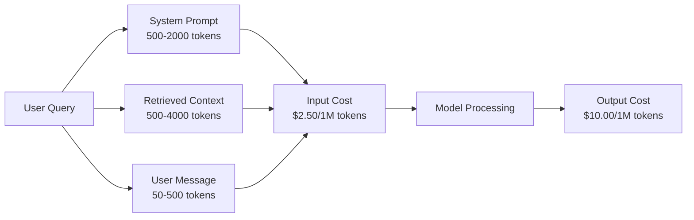
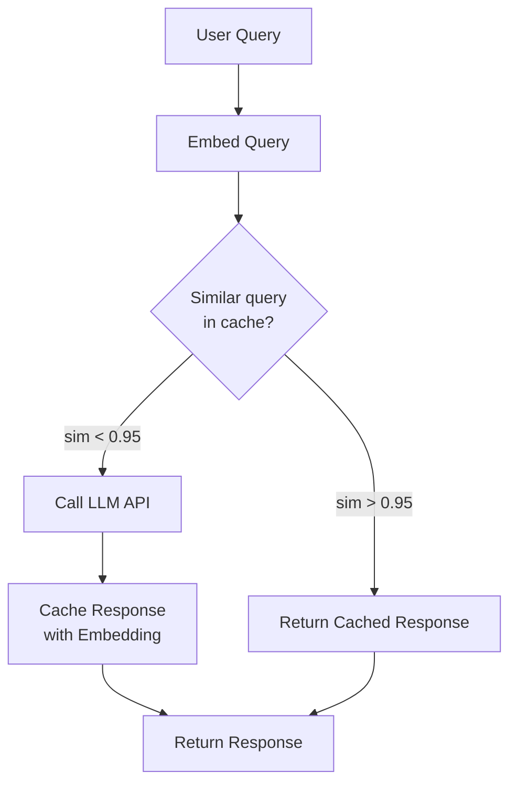
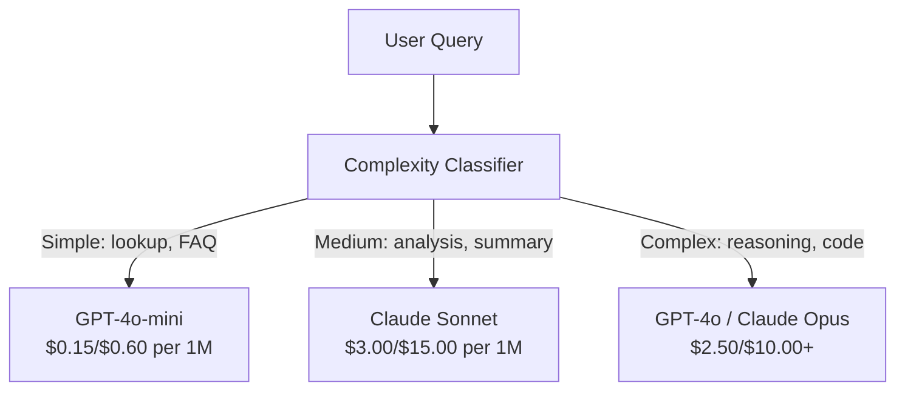

# 快取、速率限制與成本最佳化

> 大多數 AI 新創公司並非死於模型品質低下，而是死於糟糕的單位經濟效益。單次 GPT-4o 呼叫僅需數美分的一小部分。但一萬名使用者每天發起十次查詢，光是輸入 token 的成本就高達 $250——這還是在你向使用者收取任何一毛錢之前。那些能存活下來的團隊，無一不是將每一次 API 呼叫視為實質的金融交易，而非理所當然的函式調用。

**Type:** Build
**Languages:** Python
**Prerequisites:** Phase 11 Lesson 09 (Function Calling)
**Time:** ~45 minutes
**Related:** Phase 11 · 15 (Prompt Caching) — this lesson covers application-layer caching (semantic cache, exact hash cache, model routing). Lesson 15 covers provider-layer prompt caching (Anthropic cache_control, OpenAI automatic, Gemini CachedContent). Combine both for 50-95% cost reduction.

## Learning Objectives｜學習目標

- 實作語意快取，直接從快取回應重複或語意相似的查詢，而非反覆發起昂貴的 API 呼叫
- 精確計算跨各提供者的單次請求成本，並實作具備 token 感知能力的速率限制與預算警報
- 建構包含 prompt 壓縮、模型路由（昂貴模型 vs 平價模型）與回應快取的成本最佳化層
- 針對不同查詢類型設計結合精確比對、語意相似度與前綴快取的分層快取策略

## The Problem｜問題

你建置了一款 RAG 聊天機器人。它運作得非常出色，使用者讚不絕口。

隨後，帳單送達了。

以官方費率為例，GPT-5 costs $5 per million input tokens and $15 per million output. Claude Opus 4.7 costs $15 input / $75 output. Gemini 3 Pro costs $1.25 input / $5 output. GPT-5-mini is $0.25/$2.（即 GPT-5 每百萬輸入 5 美元、輸出 15 美元；Claude Opus 4.7 輸入 15 美元、輸出 75 美元；Gemini 3 Pro 輸入 1.25 美元、輸出 5 美元；GPT-5-mini 為 0.25/2 美元）。以下列出的價格僅供參考說明；實務上請務必隨時查閱各提供者官方最新定價頁面。

以下是足以拖垮新創公司的殘酷算數：

- 每日活躍使用者（DAU）：10,000 人
- 每位使用者每天發起 10 次查詢
- 每次查詢消耗 1,000 個輸入 token（系統提示 + 脈絡文件 + 使用者訊息）
- 每次回應生成 500 個輸出 token

**每日輸入成本：** 10,000 x 10 x 1,000 / 1,000,000 x $2.50 = **$250/day**
**每日輸出成本：** 10,000 x 10 x 500 / 1,000,000 x $10.00 = **$500/day**
**每月總額：** **$22,500/month**

這僅僅是純 LLM API 的花費。再加上 embedding 向量化、向量資料庫代管與雲端基礎設施，這款聊天機器人每個月將吞噬超過 $30,000/month。

最殘酷的真相在於：在這些查詢中，有高達 40% 到 60% 根本是高度重複的內容。使用者總是用微幅相異的文字詢問完全相同的問題。你的系統提示——在每一次請求中都完全一致——卻每一次都被原價反覆計費；RAG 檢索出的背景文件，也在不同使用者詢問同類話題時被不斷重複搬運與計費。

你在為大量毫無意義的重複計算支付全額高價。

## The Concept｜核心概念

### LLM 呼叫的成本結構拆解

每一次 API 呼叫皆包含五項成本組成：



系統提示是無聲的財務殺手。一個包含 1,500 個 token 的系統提示在每一次請求中隨行發送，光是這個前綴成本就高達 $3.75 per million requests just for that prefix. At 100K requests per day, that is $375/day -- $11,250/month（每百萬次請求需消耗 3.75 美元，每天 10 萬次請求相當於每日 375 美元、每月 11,250 美元），全浪費在永遠不變的靜態文字上。

### 提供者端快取：原廠折扣優惠

至 2026 年，三大主流提供者皆已原生支援提供者端的 Prompt 快取，但底層機制各有不同。深度剖析請參閱 Phase 11 · 15。

| 提供者 | 運作機制 | 折扣幅度 | 最低快取門檻 | 快取存活時間 |
|----------|-----------|----------|---------|----------------|
| Anthropic | 明確的 cache_control 標記 | 快取命中享 90% 折扣（寫入時需額外加收 25%） | 1,024 tokens (Sonnet/Opus), 2,048 (Haiku) | 預設 5 分鐘；可延長至 1 小時（需付 2 倍寫入溢價） |
| OpenAI | 自動前綴比對匹配 | 快取命中享 50% 折扣 | 1,024 tokens | 盡力而為保留至多 1 小時 |
| Google Gemini | 明確的 CachedContent API | 約 75% 成本縮減（另收儲存費） | 4,096 (Flash) / 32,768 (Pro) | 使用者可自訂 TTL 存活期 |

**Anthropic 的機制**是顯式的。你在 Prompt 中使用 `cache_control: {"type": "ephemeral"}` 宣告特定區塊。首次請求需支付 25% 的寫入溢價，隨後帶有相同前綴的請求皆能享有 90% 的極致折扣。一段 2,000 token 的系統提示平時需消耗 $0.005 normally costs $0.000625 on cache hits. Over 100K requests, that saves $437.50/day（快取命中時僅需 0.000625 美元；在 10 萬次請求規模下，每天能直接省下 437.50 美元）。

**OpenAI 的機制**是全自動的。任何與近期請求匹配的 Prompt 前綴皆能自動享有 50% 的折扣，無需在程式碼中加入任何標記。其權衡在於：折扣幅度較低、控制度較弱，但整合成本為零。

### 語意快取：自訂智慧快取層

原廠提供者快取僅對完全字面一致的前綴生效。而語意快取（Semantic Cache）則能搞定更棘手的情境：文字不同但語意相同的查詢。

「What is the return policy?」（退貨政策是什麼？）與「How do I return an item?」（我該如何退貨？）是截然不同的字串，但其核心意圖完全一致。語意快取為兩者生成 embedding、計算餘弦相似度，當相似度超過門檻（通常設定在 0.92 到 0.95 之間）時，直接回傳快取庫存的回應。



Embedding 的運算成本極度低廉。OpenAI 的 text-embedding-3-small 每百萬 token 僅收費 $0.02。與呼叫完整大型語言模型相比，檢查語意快取的開銷微乎其微。

### 精確快取：雜湊與直接命中

對於確定性的呼叫（temperature=0、相同模型、相同 prompt），精確快取更為直接且運算極快。直接對完整 prompt 進行雜湊，查詢快取，命中則立刻回傳。

這在以下情境表現完美：
- 系統提示 + 固定脈絡 + 字面完全相同的使用者提問
- 帶有固定工具定義的函式呼叫
- 同一份文件被反覆處理多次的批次分析工作流

### 速率限制：保衛財務預算防線

速率限制絕非僅是維護公平性，更是關乎生死存亡的防護罩。

**權杖桶演算法（Token bucket algorithm）：** 每個使用者擁有一個容量為 N 的虛擬水桶，每秒以速率 R 自動補滿權杖。每次請求自桶中扣除相應數量的 token；若水桶耗盡，請求將遭到拒絕。這既允許合理的瞬間突發流量（一口氣用光整個水桶），又在時間維度上嚴格限制平均調用頻率。

**使用者分級配額：** 依使用者方案設定每日／每月 token 配額上限：

| 方案層級 | 每日 Token 配額 | 每分鐘最大請求次數 | 支援存取的模型 |
|------|------------------|------------------|-------------|
| 免費版（Free） | 50,000 | 10 | 僅限 GPT-4o-mini |
| 專業版（Pro） | 500,000 | 60 | GPT-4o, Claude Sonnet |
| 企業版（Enterprise） | 5,000,000 | 300 | 全量頂級模型 |

### 模型路由：因題制宜，將成本降至最低

絕非所有問題都值得動用最頂級的 GPT-4o。

「你們幾點打烊？」這類簡單事實問答，根本不需要動用 $10/M-output model. GPT-4o-mini at $0.60/M output（每百萬輸出收費 10 美元的旗艦模型，每百萬輸出僅收 0.60 美元的 GPT-4o-mini 就能完美勝任）。收費 $1.25/M output 的 Claude Haiku 同樣能輕鬆處理。透過輕量分類器，將簡單問題路由至平價模型，僅在遭遇複雜邏輯時才放行至昂貴模型。



經過良好校準的路由器，光是在模型調用成本上就能單獨省下 40% 到 70%。

### 成本追蹤：清晰洞悉資金流向

無法度量，便無從最佳化。將每一次 API 呼叫詳實記錄：

- 時間戳記
- 模型名稱
- 輸入 token 數
- 輸出 token 數
- 延遲時間（ms）
- 計算出的實質費用（$）
- 使用者 ID
- 快取命中／未命中狀態
- 請求業務分類

這些真實日誌能精確揭示哪些功能最為燒錢、哪些使用者是重度消耗者，以及快取機制在何處產生了最大的槓桿效益。

### 批次處理：享受大量批發折扣

OpenAI 的 Batch API 針對非即時任務提供高達 50% 的對折折扣優惠。你送出包含多達 50,000 個請求的批次檔案，系統保證在 24 小時內回傳運算結果。

適用批次處理的情境：
- 夜間文件非同步向量化
- 大規模離線文字分類
- 模型評估與回歸測試套件執行
- 資料豐富化與清洗管線

不適用情境：需要即時與使用者對話互動的在線服務。

### 預算警報與熔斷機制

熔斷器（Circuit breaker）會在花費逼近安全上限時主動切斷開銷。缺乏熔斷機制時，程式碼中的一處無限迴圈 bug 或惡意濫用，能在數小時內將你整個月的預算燃燒殆盡。

設定三道漸進防線：
1. **警告防線（Warning）**（消耗達預算 70%）：發出系統警報通知管理員
2. **限流防線（Throttle）**（消耗達預算 85%）：自動將所有請求降級導向平價平價模型
3. **強制熔斷（Stop）**（消耗達預算 95%）：全面拒絕外部新請求，僅允許讀取快取庫存資料

### 最佳化技術堆疊

請依循以下順序由淺入深落實。每一層效益皆能在前一層的基礎上進行複合疊加：

| 堆疊層級 | 核心技術 | 典型節省比例 | 實作難易度 |
|-------|-----------|----------------|----------------------|
| 1 | 原廠 Prompt 快取 | 30-50% | 極低（僅需加入快取標記） |
| 2 | 精確雜湊快取 | 10-20% | 極低（雜湊字典） |
| 3 | 語意智慧快取 | 15-30% | 中等（向量化與相似度比對） |
| 4 | 智慧模型路由 | 40-70% | 中等（意圖分類器） |
| 5 | 權杖桶速率限制 | 防範超支崩潰 | 低（權杖桶實作） |
| 6 | Prompt 精準壓縮 | 10-30% | 中等（精煉重構指令） |
| 7 | 批次處理 API | 符合條件享 50% | 低（Batch API） |

一套導入了第 1 至第 5 層架構的 RAG 應用程式，通常能將每月花費從原本的 $22,500/month to $4,000-6,000/month（每月從 22,500 美元斷崖式壓制至 4,000 到 6,000 美元）。這正是無謂燒乾營運資金與建立可持續獲利商業模式之間的本質分水嶺。

### 真實節省效益：最佳化前後對比

以下為服務 10,000 DAU 的實際 RAG 聊天機器人前後數字對照：

| 營運指標 | 最佳化前 | 最佳化後 | 效益提升 |
|--------|--------------------|--------------------|---------|
| 每月 LLM API 費用 | $22,500 | $5,200 | 節省 77% |
| 平均單次查詢成本 | $0.0075 | $0.0017 | 節省 77% |
| 整體快取命中率 | 0% | 52% | -- |
| 導流至平價模型比例 | 0% | 65% | -- |
| P95 響應延遲 | 2,800ms | 900ms（快取命中僅 50ms） | 提速 68% |
| 每月 Embedding 衍生開銷 | $0 | $180 | （新增的基礎成本） |
| 每月實際總支出 | $22,500 | $5,380 | 淨節省 76% |

為語意快取引入的 embedding 向量化成本（每月約 $180/month），在系統上線運作後的第一個小時內，便已被省下來的龐大 LLM API 費用全額回收。

```figure
semantic-cache
```

## Build It｜動手實作

### 步驟 1：成本計算器

實作一套內建各大模型最新計費規則的精準 token 成本計算器。

```python
import hashlib
import time
import json
import math
from dataclasses import dataclass, field


MODEL_PRICING = {
    "gpt-4o": {"input": 2.50, "output": 10.00, "cached_input": 1.25},
    "gpt-4o-mini": {"input": 0.15, "output": 0.60, "cached_input": 0.075},
    "gpt-4.1": {"input": 2.00, "output": 8.00, "cached_input": 0.50},
    "gpt-4.1-mini": {"input": 0.40, "output": 1.60, "cached_input": 0.10},
    "gpt-4.1-nano": {"input": 0.10, "output": 0.40, "cached_input": 0.025},
    "o3": {"input": 2.00, "output": 8.00, "cached_input": 0.50},
    "o3-mini": {"input": 1.10, "output": 4.40, "cached_input": 0.55},
    "o4-mini": {"input": 1.10, "output": 4.40, "cached_input": 0.275},
    "claude-opus-4": {"input": 15.00, "output": 75.00, "cached_input": 1.50},
    "claude-sonnet-4": {"input": 3.00, "output": 15.00, "cached_input": 0.30},
    "claude-haiku-3.5": {"input": 0.80, "output": 4.00, "cached_input": 0.08},
    "gemini-2.5-pro": {"input": 1.25, "output": 10.00, "cached_input": 0.3125},
    "gemini-2.5-flash": {"input": 0.15, "output": 0.60, "cached_input": 0.0375},
}


def calculate_cost(model, input_tokens, output_tokens, cached_input_tokens=0):
    if model not in MODEL_PRICING:
        return {"error": f"Unknown model: {model}"}
    pricing = MODEL_PRICING[model]
    non_cached = input_tokens - cached_input_tokens
    input_cost = (non_cached / 1_000_000) * pricing["input"]
    cached_cost = (cached_input_tokens / 1_000_000) * pricing["cached_input"]
    output_cost = (output_tokens / 1_000_000) * pricing["output"]
    total = input_cost + cached_cost + output_cost
    return {
        "model": model,
        "input_tokens": input_tokens,
        "output_tokens": output_tokens,
        "cached_input_tokens": cached_input_tokens,
        "input_cost": round(input_cost, 6),
        "cached_input_cost": round(cached_cost, 6),
        "output_cost": round(output_cost, 6),
        "total_cost": round(total, 6),
    }
```

### 步驟 2：精確快取

對完整 Prompt 進行 SHA-256 雜湊，直接從記憶體回傳完全一致請求的快取結果。

```python
class ExactCache:
    def __init__(self, max_size=1000, ttl_seconds=3600):
        self.cache = {}
        self.max_size = max_size
        self.ttl = ttl_seconds
        self.hits = 0
        self.misses = 0

    def _hash(self, model, messages, temperature):
        key_data = json.dumps({"model": model, "messages": messages, "temperature": temperature}, sort_keys=True)
        return hashlib.sha256(key_data.encode()).hexdigest()

    def get(self, model, messages, temperature=0.0):
        if temperature > 0:
            self.misses += 1
            return None
        key = self._hash(model, messages, temperature)
        if key in self.cache:
            entry = self.cache[key]
            if time.time() - entry["timestamp"] < self.ttl:
                self.hits += 1
                entry["access_count"] += 1
                return entry["response"]
            del self.cache[key]
        self.misses += 1
        return None

    def put(self, model, messages, temperature, response):
        if temperature > 0:
            return
        if len(self.cache) >= self.max_size:
            oldest_key = min(self.cache, key=lambda k: self.cache[k]["timestamp"])
            del self.cache[oldest_key]
        key = self._hash(model, messages, temperature)
        self.cache[key] = {
            "response": response,
            "timestamp": time.time(),
            "access_count": 1,
        }

    def stats(self):
        total = self.hits + self.misses
        return {
            "hits": self.hits,
            "misses": self.misses,
            "hit_rate": round(self.hits / total, 4) if total > 0 else 0,
            "cache_size": len(self.cache),
        }
```

### 步驟 3：語意快取

為查詢生成向量，當空間餘弦相似度跨越門檻時直接回傳快取內容。

```python
def simple_embed(text):
    words = text.lower().split()
    vocab = {}
    for w in words:
        vocab[w] = vocab.get(w, 0) + 1
    norm = math.sqrt(sum(v * v for v in vocab.values()))
    if norm == 0:
        return {}
    return {k: v / norm for k, v in vocab.items()}


def cosine_similarity(a, b):
    if not a or not b:
        return 0.0
    all_keys = set(a) | set(b)
    dot = sum(a.get(k, 0) * b.get(k, 0) for k in all_keys)
    return dot


class SemanticCache:
    def __init__(self, similarity_threshold=0.85, max_size=500, ttl_seconds=3600):
        self.entries = []
        self.threshold = similarity_threshold
        self.max_size = max_size
        self.ttl = ttl_seconds
        self.hits = 0
        self.misses = 0

    def get(self, query):
        query_embedding = simple_embed(query)
        now = time.time()
        best_match = None
        best_sim = 0.0
        for entry in self.entries:
            if now - entry["timestamp"] > self.ttl:
                continue
            sim = cosine_similarity(query_embedding, entry["embedding"])
            if sim > best_sim:
                best_sim = sim
                best_match = entry
        if best_match and best_sim >= self.threshold:
            self.hits += 1
            best_match["access_count"] += 1
            return {"response": best_match["response"], "similarity": round(best_sim, 4), "original_query": best_match["query"]}
        self.misses += 1
        return None

    def put(self, query, response):
        if len(self.entries) >= self.max_size:
            self.entries.sort(key=lambda e: e["timestamp"])
            self.entries.pop(0)
        self.entries.append({
            "query": query,
            "embedding": simple_embed(query),
            "response": response,
            "timestamp": time.time(),
            "access_count": 1,
        })

    def stats(self):
        total = self.hits + self.misses
        return {
            "hits": self.hits,
            "misses": self.misses,
            "hit_rate": round(self.hits / total, 4) if total > 0 else 0,
            "cache_size": len(self.entries),
        }
```

### 步驟 4：速率限制器

實作帶有分級配額管理的權杖桶速率限制器。

```python
class TokenBucketRateLimiter:
    def __init__(self):
        self.buckets = {}
        self.tiers = {
            "free": {"capacity": 50_000, "refill_rate": 500, "max_requests_per_min": 10},
            "pro": {"capacity": 500_000, "refill_rate": 5_000, "max_requests_per_min": 60},
            "enterprise": {"capacity": 5_000_000, "refill_rate": 50_000, "max_requests_per_min": 300},
        }

    def _get_bucket(self, user_id, tier="free"):
        if user_id not in self.buckets:
            tier_config = self.tiers.get(tier, self.tiers["free"])
            self.buckets[user_id] = {
                "tokens": tier_config["capacity"],
                "capacity": tier_config["capacity"],
                "refill_rate": tier_config["refill_rate"],
                "last_refill": time.time(),
                "request_timestamps": [],
                "max_rpm": tier_config["max_requests_per_min"],
                "tier": tier,
                "total_tokens_used": 0,
            }
        return self.buckets[user_id]

    def _refill(self, bucket):
        now = time.time()
        elapsed = now - bucket["last_refill"]
        refill = int(elapsed * bucket["refill_rate"])
        if refill > 0:
            bucket["tokens"] = min(bucket["capacity"], bucket["tokens"] + refill)
            bucket["last_refill"] = now

    def check(self, user_id, tokens_needed, tier="free"):
        bucket = self._get_bucket(user_id, tier)
        self._refill(bucket)
        now = time.time()
        bucket["request_timestamps"] = [t for t in bucket["request_timestamps"] if now - t < 60]
        if len(bucket["request_timestamps"]) >= bucket["max_rpm"]:
            return {"allowed": False, "reason": "rate_limit", "retry_after_seconds": 60 - (now - bucket["request_timestamps"][0])}
        if bucket["tokens"] < tokens_needed:
            deficit = tokens_needed - bucket["tokens"]
            wait = deficit / bucket["refill_rate"]
            return {"allowed": False, "reason": "token_limit", "tokens_available": bucket["tokens"], "retry_after_seconds": round(wait, 1)}
        return {"allowed": True, "tokens_available": bucket["tokens"]}

    def consume(self, user_id, tokens_used, tier="free"):
        bucket = self._get_bucket(user_id, tier)
        bucket["tokens"] -= tokens_used
        bucket["request_timestamps"].append(time.time())
        bucket["total_tokens_used"] += tokens_used

    def get_usage(self, user_id):
        if user_id not in self.buckets:
            return {"error": "User not found"}
        b = self.buckets[user_id]
        return {
            "user_id": user_id,
            "tier": b["tier"],
            "tokens_remaining": b["tokens"],
            "capacity": b["capacity"],
            "total_tokens_used": b["total_tokens_used"],
            "utilization": round(b["total_tokens_used"] / b["capacity"], 4) if b["capacity"] else 0,
        }
```

### 步驟 5：成本追蹤器

詳實記錄每一次 API 呼叫並即時計算累計花費。

```python
class CostTracker:
    def __init__(self, monthly_budget=1000.0):
        self.logs = []
        self.monthly_budget = monthly_budget
        self.alerts = []

    def log_call(self, model, input_tokens, output_tokens, cached_input_tokens=0, latency_ms=0, user_id="anonymous", cache_status="miss"):
        cost = calculate_cost(model, input_tokens, output_tokens, cached_input_tokens)
        entry = {
            "timestamp": time.time(),
            "model": model,
            "input_tokens": input_tokens,
            "output_tokens": output_tokens,
            "cached_input_tokens": cached_input_tokens,
            "latency_ms": latency_ms,
            "cost": cost["total_cost"],
            "user_id": user_id,
            "cache_status": cache_status,
        }
        self.logs.append(entry)
        self._check_budget()
        return entry

    def _check_budget(self):
        total = self.total_cost()
        pct = total / self.monthly_budget if self.monthly_budget > 0 else 0
        if pct >= 0.95 and not any(a["level"] == "stop" for a in self.alerts):
            self.alerts.append({"level": "stop", "message": f"Budget 95% consumed: ${total:.2f}/${self.monthly_budget:.2f}", "timestamp": time.time()})
        elif pct >= 0.85 and not any(a["level"] == "throttle" for a in self.alerts):
            self.alerts.append({"level": "throttle", "message": f"Budget 85% consumed: ${total:.2f}/${self.monthly_budget:.2f}", "timestamp": time.time()})
        elif pct >= 0.70 and not any(a["level"] == "warning" for a in self.alerts):
            self.alerts.append({"level": "warning", "message": f"Budget 70% consumed: ${total:.2f}/${self.monthly_budget:.2f}", "timestamp": time.time()})

    def total_cost(self):
        return round(sum(e["cost"] for e in self.logs), 6)

    def cost_by_model(self):
        by_model = {}
        for e in self.logs:
            m = e["model"]
            if m not in by_model:
                by_model[m] = {"calls": 0, "cost": 0, "input_tokens": 0, "output_tokens": 0}
            by_model[m]["calls"] += 1
            by_model[m]["cost"] = round(by_model[m]["cost"] + e["cost"], 6)
            by_model[m]["input_tokens"] += e["input_tokens"]
            by_model[m]["output_tokens"] += e["output_tokens"]
        return by_model

    def cache_savings(self):
        cache_hits = [e for e in self.logs if e["cache_status"] == "hit"]
        if not cache_hits:
            return {"saved": 0, "cache_hits": 0}
        saved = 0
        for e in cache_hits:
            full_cost = calculate_cost(e["model"], e["input_tokens"], e["output_tokens"])
            saved += full_cost["total_cost"]
        return {"saved": round(saved, 4), "cache_hits": len(cache_hits)}

    def summary(self):
        if not self.logs:
            return {"total_calls": 0, "total_cost": 0}
        total_latency = sum(e["latency_ms"] for e in self.logs)
        cache_hits = sum(1 for e in self.logs if e["cache_status"] == "hit")
        return {
            "total_calls": len(self.logs),
            "total_cost": self.total_cost(),
            "avg_cost_per_call": round(self.total_cost() / len(self.logs), 6),
            "avg_latency_ms": round(total_latency / len(self.logs), 1),
            "cache_hit_rate": round(cache_hits / len(self.logs), 4),
            "cost_by_model": self.cost_by_model(),
            "cache_savings": self.cache_savings(),
            "budget_remaining": round(self.monthly_budget - self.total_cost(), 2),
            "budget_utilization": round(self.total_cost() / self.monthly_budget, 4) if self.monthly_budget > 0 else 0,
            "alerts": self.alerts,
        }
```

### 步驟 6：模型路由器

將查詢自動路由至能夠勝任該任務的最經濟模型。

```python
SIMPLE_KEYWORDS = ["what time", "hours", "address", "phone", "price", "return policy", "hello", "hi", "thanks", "yes", "no"]
COMPLEX_KEYWORDS = ["analyze", "compare", "explain why", "write code", "debug", "architect", "design", "trade-off", "evaluate"]


def classify_complexity(query):
    q = query.lower()
    if len(q.split()) <= 5 or any(kw in q for kw in SIMPLE_KEYWORDS):
        return "simple"
    if any(kw in q for kw in COMPLEX_KEYWORDS):
        return "complex"
    return "medium"


def route_model(query, tier="pro"):
    complexity = classify_complexity(query)
    routing_table = {
        "simple": {"free": "gpt-4.1-nano", "pro": "gpt-4o-mini", "enterprise": "gpt-4o-mini"},
        "medium": {"free": "gpt-4o-mini", "pro": "claude-sonnet-4", "enterprise": "claude-sonnet-4"},
        "complex": {"free": "gpt-4o-mini", "pro": "gpt-4o", "enterprise": "claude-opus-4"},
    }
    model = routing_table[complexity].get(tier, "gpt-4o-mini")
    return {"query": query, "complexity": complexity, "model": model, "tier": tier}
```

### 步驟 7：執行實戰展示

```python
def simulate_llm_call(model, query):
    input_tokens = len(query.split()) * 4 + 500
    output_tokens = 150 + (len(query.split()) * 2)
    latency = 200 + (output_tokens * 2)
    return {
        "model": model,
        "response": f"[Simulated {model} response to: {query[:50]}...]",
        "input_tokens": input_tokens,
        "output_tokens": output_tokens,
        "latency_ms": latency,
    }


def run_demo():
    print("=" * 60)
    print("  Caching, Rate Limiting & Cost Optimization Demo")
    print("=" * 60)

    print("\n--- Model Pricing ---")
    for model, pricing in list(MODEL_PRICING.items())[:6]:
        cost_1k = calculate_cost(model, 1000, 500)
        print(f"  {model}: ${cost_1k['total_cost']:.6f} per 1K in + 500 out")

    print("\n--- Cost Comparison: 100K Requests ---")
    for model in ["gpt-4o", "gpt-4o-mini", "claude-sonnet-4", "claude-haiku-3.5"]:
        cost = calculate_cost(model, 1000 * 100_000, 500 * 100_000)
        print(f"  {model}: ${cost['total_cost']:.2f}")

    print("\n--- Anthropic Cache Savings ---")
    no_cache = calculate_cost("claude-sonnet-4", 2000, 500, 0)
    with_cache = calculate_cost("claude-sonnet-4", 2000, 500, 1500)
    saving = no_cache["total_cost"] - with_cache["total_cost"]
    print(f"  Without cache: ${no_cache['total_cost']:.6f}")
    print(f"  With 1500 cached tokens: ${with_cache['total_cost']:.6f}")
    print(f"  Savings per call: ${saving:.6f} ({saving/no_cache['total_cost']*100:.1f}%)")

    exact_cache = ExactCache(max_size=100, ttl_seconds=300)
    semantic_cache = SemanticCache(similarity_threshold=0.75, max_size=100)
    rate_limiter = TokenBucketRateLimiter()
    tracker = CostTracker(monthly_budget=100.0)

    print("\n--- Exact Cache ---")
    messages_1 = [{"role": "user", "content": "What is the return policy?"}]
    result = exact_cache.get("gpt-4o-mini", messages_1, 0.0)
    print(f"  First lookup: {'HIT' if result else 'MISS'}")
    exact_cache.put("gpt-4o-mini", messages_1, 0.0, "You can return items within 30 days.")
    result = exact_cache.get("gpt-4o-mini", messages_1, 0.0)
    print(f"  Second lookup: {'HIT' if result else 'MISS'} -> {result}")
    result = exact_cache.get("gpt-4o-mini", messages_1, 0.7)
    print(f"  With temp=0.7: {'HIT' if result else 'MISS (non-deterministic, skip cache)'}")
    print(f"  Stats: {exact_cache.stats()}")

    print("\n--- Semantic Cache ---")
    test_queries = [
        ("What is the return policy?", "Items can be returned within 30 days with receipt."),
        ("How do I return an item?", None),
        ("What are your store hours?", "We are open 9am-9pm Monday through Saturday."),
        ("When does the store open?", None),
        ("Tell me about quantum computing", "Quantum computers use qubits..."),
        ("Explain quantum mechanics", None),
    ]
    for query, response in test_queries:
        cached = semantic_cache.get(query)
        if cached:
            print(f"  '{query[:40]}' -> CACHE HIT (sim={cached['similarity']}, original='{cached['original_query'][:40]}')")
        elif response:
            semantic_cache.put(query, response)
            print(f"  '{query[:40]}' -> MISS (stored)")
        else:
            print(f"  '{query[:40]}' -> MISS (no match)")
    print(f"  Stats: {semantic_cache.stats()}")

    print("\n--- Rate Limiting ---")
    for i in range(12):
        check = rate_limiter.check("user_1", 1000, "free")
        if check["allowed"]:
            rate_limiter.consume("user_1", 1000, "free")
        status = "OK" if check["allowed"] else f"BLOCKED ({check['reason']})"
        if i < 5 or not check["allowed"]:
            print(f"  Request {i+1}: {status}")
    print(f"  Usage: {rate_limiter.get_usage('user_1')}")

    print("\n--- Model Routing ---")
    routing_queries = [
        "What time do you close?",
        "Summarize this quarterly earnings report",
        "Analyze the trade-offs between microservices and monoliths",
        "Hello",
        "Write code for a binary search tree with deletion",
    ]
    for q in routing_queries:
        route = route_model(q, "pro")
        print(f"  '{q[:50]}' -> {route['model']} ({route['complexity']})")

    print("\n--- Full Pipeline: Before vs After Optimization ---")
    queries = [
        "What is the return policy?",
        "How do I return something?",
        "What are your hours?",
        "When do you open?",
        "Explain the difference between TCP and UDP",
        "Compare TCP vs UDP protocols",
        "Hello",
        "What is your phone number?",
        "Write a Python function to sort a list",
        "Analyze the pros and cons of serverless architecture",
    ]

    print("\n  [Before: no caching, single model (gpt-4o)]")
    tracker_before = CostTracker(monthly_budget=1000.0)
    for q in queries:
        result = simulate_llm_call("gpt-4o", q)
        tracker_before.log_call("gpt-4o", result["input_tokens"], result["output_tokens"], latency_ms=result["latency_ms"], cache_status="miss")
    before = tracker_before.summary()
    print(f"  Total cost: ${before['total_cost']:.6f}")
    print(f"  Avg cost/call: ${before['avg_cost_per_call']:.6f}")
    print(f"  Avg latency: {before['avg_latency_ms']}ms")

    print("\n  [After: caching + routing + rate limiting]")
    exact_c = ExactCache()
    semantic_c = SemanticCache(similarity_threshold=0.75)
    tracker_after = CostTracker(monthly_budget=1000.0)

    for q in queries:
        messages = [{"role": "user", "content": q}]
        cached = exact_c.get("gpt-4o", messages, 0.0)
        if cached:
            tracker_after.log_call("gpt-4o-mini", 0, 0, latency_ms=5, cache_status="hit")
            continue
        sem_cached = semantic_c.get(q)
        if sem_cached:
            tracker_after.log_call("gpt-4o-mini", 0, 0, latency_ms=15, cache_status="hit")
            continue
        route = route_model(q)
        result = simulate_llm_call(route["model"], q)
        tracker_after.log_call(route["model"], result["input_tokens"], result["output_tokens"], latency_ms=result["latency_ms"], cache_status="miss")
        exact_c.put(route["model"], messages, 0.0, result["response"])
        semantic_c.put(q, result["response"])

    after = tracker_after.summary()
    print(f"  Total cost: ${after['total_cost']:.6f}")
    print(f"  Avg cost/call: ${after['avg_cost_per_call']:.6f}")
    print(f"  Avg latency: {after['avg_latency_ms']}ms")
    print(f"  Cache hit rate: {after['cache_hit_rate']:.0%}")

    if before["total_cost"] > 0:
        savings_pct = (1 - after["total_cost"] / before["total_cost"]) * 100
        print(f"\n  SAVINGS: {savings_pct:.1f}% cost reduction")
        print(f"  Latency improvement: {(1 - after['avg_latency_ms'] / before['avg_latency_ms']) * 100:.1f}% faster")

    print("\n--- Budget Alerts Demo ---")
    alert_tracker = CostTracker(monthly_budget=0.01)
    for i in range(5):
        alert_tracker.log_call("gpt-4o", 5000, 2000, latency_ms=500)
    print(f"  Total spent: ${alert_tracker.total_cost():.6f} / ${alert_tracker.monthly_budget}")
    for alert in alert_tracker.alerts:
        print(f"  ALERT [{alert['level'].upper()}]: {alert['message']}")

    print("\n--- Cost Breakdown by Model ---")
    multi_tracker = CostTracker(monthly_budget=500.0)
    for _ in range(50):
        multi_tracker.log_call("gpt-4o-mini", 800, 200, latency_ms=150)
    for _ in range(30):
        multi_tracker.log_call("claude-sonnet-4", 1500, 500, latency_ms=400)
    for _ in range(10):
        multi_tracker.log_call("gpt-4o", 2000, 800, latency_ms=600)
    for _ in range(10):
        multi_tracker.log_call("claude-opus-4", 3000, 1000, latency_ms=1200)
    breakdown = multi_tracker.cost_by_model()
    for model, data in sorted(breakdown.items(), key=lambda x: x[1]["cost"], reverse=True):
        print(f"  {model}: {data['calls']} calls, ${data['cost']:.6f}, {data['input_tokens']:,} in / {data['output_tokens']:,} out")
    print(f"  Total: ${multi_tracker.total_cost():.6f}")

    print("\n" + "=" * 60)
    print("  Demo complete.")
    print("=" * 60)


if __name__ == "__main__":
    run_demo()
```

## Use It｜實際應用

### Anthropic Prompt 快取

```python
# import anthropic
#
# client = anthropic.Anthropic()
#
# response = client.messages.create(
#     model="claude-sonnet-5",
#     max_tokens=1024,
#     system=[
#         {
#             "type": "text",
#             "text": "You are a helpful customer support agent for Acme Corp...",
#             "cache_control": {"type": "ephemeral"},
#         }
#     ],
#     messages=[{"role": "user", "content": "What is the return policy?"}],
# )
#
# print(f"Input tokens: {response.usage.input_tokens}")
# print(f"Cache creation tokens: {response.usage.cache_creation_input_tokens}")
# print(f"Cache read tokens: {response.usage.cache_read_input_tokens}")
```

首次呼叫寫入快取（需多付 25% 寫入溢價）。隨後帶有相同系統提示前綴的每一次呼叫，皆直接自快取讀取（享有 90% 巨大折扣）。快取存活時間為 5 分鐘，且在每次被命中時自動重設計時器。

### OpenAI 自動快取

```python
# from openai import OpenAI
#
# client = OpenAI()
#
# response = client.chat.completions.create(
#     model="gpt-4o",
#     messages=[
#         {"role": "system", "content": "You are a helpful customer support agent..."},
#         {"role": "user", "content": "What is the return policy?"},
#     ],
# )
#
# print(f"Prompt tokens: {response.usage.prompt_tokens}")
# print(f"Cached tokens: {response.usage.prompt_tokens_details.cached_tokens}")
# print(f"Completion tokens: {response.usage.completion_tokens}")
```

OpenAI 在背景全自動執行快取。任何長度達 1,024+ token 且與近期請求完全匹配的 Prompt 前綴，自動獲得 50% 折扣。無需更動任何程式碼——只需檢查回應中的 `prompt_tokens_details.cached_tokens` 欄位以確認快取命中狀態。

### OpenAI Batch API

```python
# import json
# from openai import OpenAI
#
# client = OpenAI()
#
# requests = []
# for i, query in enumerate(queries):
#     requests.append({
#         "custom_id": f"request-{i}",
#         "method": "POST",
#         "url": "/v1/chat/completions",
#         "body": {
#             "model": "gpt-4o-mini",
#             "messages": [{"role": "user", "content": query}],
#         },
#     })
#
# with open("batch_input.jsonl", "w") as f:
#     for r in requests:
#         f.write(json.dumps(r) + "\n")
#
# batch_file = client.files.create(file=open("batch_input.jsonl", "rb"), purpose="batch")
# batch = client.batches.create(input_file_id=batch_file.id, endpoint="/v1/chat/completions", completion_window="24h")
# print(f"Batch ID: {batch.id}, Status: {batch.status}")
```

Batch API 為所有 token 提供無條件的 50% 半價優惠。結果在 24 小時內傳回。極適合非即時負載：離線評估、資料標註、海量文件摘要等。

### 搭配 Redis 實作生產級語意快取

```python
# import redis
# import numpy as np
# from openai import OpenAI
#
# r = redis.Redis()
# client = OpenAI()
#
# def get_embedding(text):
#     response = client.embeddings.create(model="text-embedding-3-small", input=text)
#     return response.data[0].embedding
#
# def semantic_cache_lookup(query, threshold=0.95):
#     query_emb = np.array(get_embedding(query))
#     keys = r.keys("cache:emb:*")
#     best_sim, best_key = 0, None
#     for key in keys:
#         stored_emb = np.frombuffer(r.get(key), dtype=np.float32)
#         sim = np.dot(query_emb, stored_emb) / (np.linalg.norm(query_emb) * np.linalg.norm(stored_emb))
#         if sim > best_sim:
#             best_sim, best_key = sim, key
#     if best_sim >= threshold and best_key:
#         response_key = best_key.decode().replace("cache:emb:", "cache:resp:")
#         return r.get(response_key).decode()
#     return None
```

在正式環境中，請將上述線性掃描替換為專業向量索引（Redis Vector Search、Pinecone 或 pgvector）。線性掃描在 <1,000 筆資料時堪用；超過此規模後，請採用 ANN（近似最近鄰）演算法實現 O(log n) 的極速檢索。

## Ship It｜交付成果

本課產出 `outputs/prompt-cost-optimizer.md`——一個可重複使用的 Prompt 範本，用以分析你的 LLM 應用程式架構並提出包含具體節省估算的精準成本最佳化方案。

同時產出 `outputs/skill-cost-patterns.md`——一套為你的應用場景挑選最適快取策略、速率限制組態與模型路由規則的決策指引手冊。

## Exercises｜練習

1. **為語意快取實作 LRU 淘汰機制**。將原本「淘汰最舊」的策略替換為「最近最少使用（Least-Recently-Used）」。追蹤每筆快取的最後存取時間，在快取額滿時淘汰最久未被存取的資料。在 100 次連續查詢中比對兩種策略的命中率差異。

2. **打造費用預測工具**。基於實際 API 呼叫日誌（the CostTracker logs），計算過去 7 天的移動平均值以推估整月總支出。考量工作日與週末的週期性流量差異。若預估月支出超額超過 20%，主動觸發財務警報。

3. **實作分層語意快取**。設定兩道相似度門檻：0.98 用於高信心度命中（直接回傳），0.90 用於中信心度命中（附帶免責標註：「參考過往類似問答……」）。追蹤每次命中所屬的層級，並測量使用者滿意度的實質落差。

4. **打造基於向量的模型路由器**。將基於關鍵字的啟發式分類器替換為基於 embedding 的分類器。為 50 個帶標籤的查詢樣本（簡單／中等／複雜）生成向量，新查詢藉由比對最近鄰樣本完成分類。在 20 個測試案例上驗證分類準確率。

5. **實作帶有漸進降級防線的熔斷器**。預算消耗達 70% 時記錄警告；達 85% 時自動將全量流量降級導流至平價模型（gpt-4o-mini）；達 95% 時完全停用外部模型調用，僅提供快取庫存資料。在設定為 $1.00 的微型預算下模擬 1,000 次請求，驗證每道防線是否均能精準觸發。

## Key Terms｜關鍵術語

| 術語 | 常見說法 | 實際意義 |
|------|----------------|----------------------|
| Prompt 快取（Prompt caching） | 「快取系統提示」 | 提供者原廠層級的快取機制，重複的 Prompt 前綴享有高額折扣（Anthropic 達 90%，OpenAI 達 50%）——OpenAI 免改碼，Anthropic 需顯式標記 |
| 語意快取（Semantic caching） | 「智慧意圖快取」 | 將使用者問題向量化，比對與過往查詢的語意相似度，跨越門檻則直接回傳庫存解答——能精準捕捉字面不同但意圖完全相同的抽換詞句 |
| 精確快取（Exact caching） | 「雜湊命中快取」 | 對完整 Prompt（模型 + 訊息陣列 + 溫度）進行 SHA-256 雜湊，僅在輸入完全一模一樣時命中——僅適用於 temperature=0 的確定性呼叫 |
| 權杖桶（Token bucket） | 「速率限制器」 | 一種限流演算法，每個使用者擁有容量為 N 的虛擬水桶，每秒自動補充 R 個權杖——允許短暫的突發流量，同時嚴格控制平均消耗速率 |
| 模型路由（Model routing） | 「精打細算的省錢路由」 | 透過分類器將簡單問題分流給平價模型（GPT-4o-mini、Haiku），將複雜難題導向旗艦模型（GPT-4o、Opus）——單獨省下 40% 到 70% 的模型花費 |
| 成本追蹤（Cost tracking） | 「計費計量」 | 詳實記錄每一次 API 呼叫的模型、token 數、延遲、實質費用與使用者 ID，精確洞悉資金消耗分佈 |
| 熔斷器（Circuit breaker） | 「緊急斷路開關」 | 當累計花費逼近預算上限時，自動啟動系統降級保護（切換平價模型、僅限快取）或全面阻斷新請求的防線機制 |
| Batch API | 「批發批次折扣」 | OpenAI 針對非即時任務提供的非同步處理服務，享有 50% 對折折扣，送出至多 50,000 筆請求並於 24 小時內傳回結果 |
| Prompt 壓縮（Prompt compression） | 「Token 節食瘦身」 | 在保全核心語意的前提下重寫系統提示與脈絡文件，減少 token 佔用——更短的 Prompt 既省錢且通常表現更銳利 |
| 快取命中率（Cache hit rate） | 「快取命中效益」 | 由快取直接提供服務而非調用外部 LLM 的請求百分比——正式環境聊天機器人通常落在 40% 到 60%，成比例縮減總體開銷 |

## Further Reading｜延伸閱讀

- [Anthropic Prompt Caching Guide](https://docs.anthropic.com/en/docs/build-with-claude/prompt-caching) ——Anthropic 官方手冊，詳解顯式 cache_control 標記、定價與快取生命週期
- [OpenAI Prompt Caching](https://platform.openai.com/docs/guides/prompt-caching) ——OpenAI 自動快取機制、如何透過 usage 欄位驗證快取命中，以及前綴最低長度限制
- [OpenAI Batch API](https://platform.openai.com/docs/guides/batch) ——享受 50% 優惠的非同步批次處理、JSONL 格式規範、24 小時完成視窗與 5 萬次上限
- [GPTCache](https://github.com/zilliztech/GPTCache) ——開源語意快取函式庫，支援多種 embedding 後端、向量資料庫與淘汰策略
- [Martian Model Router](https://docs.withmartian.com) ——生產級模型路由器，能自動挑選足以勝任當前查詢的最平價模型
- [Not Diamond](https://www.notdiamond.ai) ——基於機器學習的模型路由服務，透過學習你的流量特徵動態在各家提供者間取得成本與品質的最佳平衡
- [Helicone](https://www.helicone.ai) ——以 Proxy 代理層形態提供成本追蹤、快取、速率限制與預算警報的知名 LLM 可觀測性平台
- [Dean & Barroso, "The Tail at Scale" (CACM 2013)](https://research.google/pubs/the-tail-at-scale/) ——延遲、吞吐、TTFT/TPOT 分位數與對沖請求經典論文；「挑選能滿足 P95 的最平價模型」背後的成本模型
- [Kwon et al., "Efficient Memory Management for Large Language Model Serving with PagedAttention" (SOSP 2023)](https://arxiv.org/abs/2309.06180) ——vLLM 奠基論文；剖析為何分頁 KV 快取與連續批次處理能在吞吐上超越傳統架構 24 倍，支撐「快取與成本」的底層基礎設施
- [Dao et al., "FlashAttention-2: Faster Attention with Better Parallelism and Work Partitioning" (ICLR 2024)](https://arxiv.org/abs/2307.08691) ——核心層級的硬體加速與成本縮減；請與推測解碼及 GQA 共同研讀以掌握完整的成本曲線全貌
