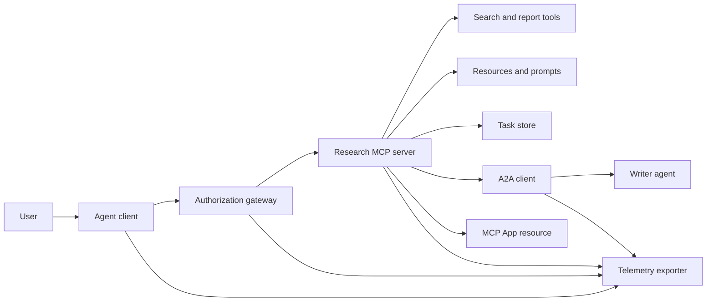
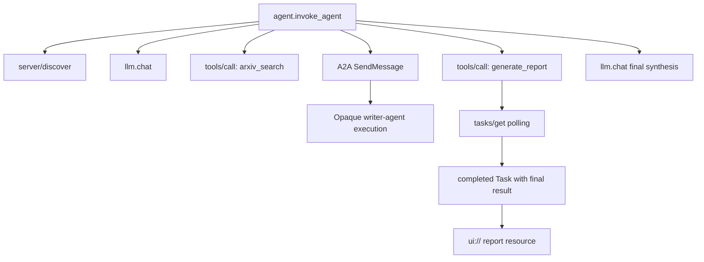
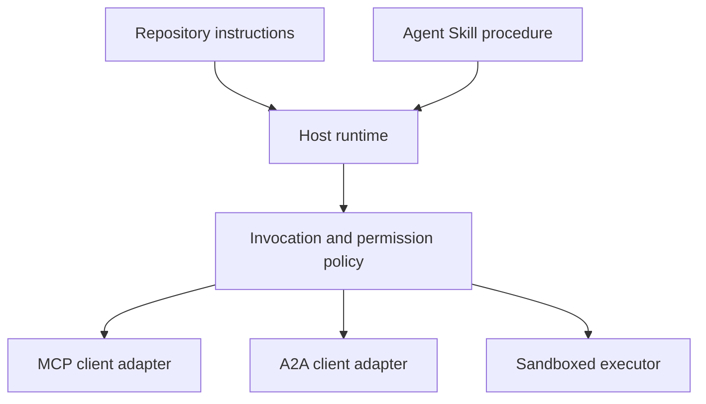

# 總結專題：無狀態工具生態系

> 一個生產級別的 agent 系統是由一組嚴密的系統邊界所構成，而非各種零散功能的隨意堆疊。本總結專題（Capstone）將清晰易讀的行程內模擬，與真實正式環境中所必備的協定用戶端、授權伺服器、沙盒環境及遙測匯出器明確切分。

**Type:** Build
**Languages:** Python (stdlib, in-process simulation)
**Prerequisites:** Phase 13 · 01 through 22, using MCP revision `2026-07-28`
**Time:** ~120 minutes

## Learning Objectives｜學習目標

- 將工具呼叫、任務型產物、委派協同、UI 資源、授權安全策略與鏈路追蹤記錄無縫串聯為單一完整業務流。
- 在每一個 MCP 請求中逐次傳遞協定版本、用戶端身分識別與能力宣告，堅決摒棄依賴底層連線 session 的舊有設計。
- 在使用前先探索伺服器，並透過官方標準的 Tasks 擴充功能驅動長時間任務。
- 嚴格區分「符合協定形態的模擬」與真正的 MCP、A2A、OAuth 或 OpenTelemetry 生產級實作。
- 將模擬中的每道架構邊界，逐一精確對映至真實正式環境中必須替換的實體元件。
- 嚴格維持 `AGENTS.md`、Agent Skill、執行時期配接器、Tools 與資安策略各自的法定職責邊界。
- 深入闡明哪些系統宣告可單憑本機輸出驗證，而哪些宣告必須透過真實的整合測試方能證實。

## The Problem｜問題

設計一套整合研究與報告產出的完整系統：使用者請求搜尋關於 agent 協定的學術論文；系統檢索論文目錄、委派外部撰寫 agent 進行摘要、彙整生成研究報告、回傳互動式 UI 資源，並忠實記錄貫穿全鏈路的分散式追蹤軌跡。

這短短一句話背後，隱藏著多個相互獨立的架構契約：

- 面向模型的工具 Schema；
- 無狀態請求封裝與伺服器探索契約；
- 針對操作者主體、權限範圍與工具身分的閘道器鑑權決策；
- 非同步長時間任務的作業契約；
- 跨 agent 委派通訊協定；
- 宿主環境通往應用程式的通訊橋樑；
- 分散式追蹤脈絡傳播與資料匯出；
- 可重複利用的標準作業程序。

`code/main.py` 透過常規的 Python 函式與字典結構，讓這些系統邊界一覽無遺。它不開啟實體網路傳輸層、不連線 arXiv、不執行真實 OAuth 換約、不呼叫遠端 A2A 伺服器、不渲染 MCP App，亦不對外發送遙測資料。這使得控制流程極易被檢視與除錯，同時避免了將教學模擬誤當作合規生產服務的危險心智模型。

## The Concept｜核心概念

### 目標架構



該架構是對公開協定模式的抽象概念性組合，絕非對任何商業產品私有內部實作的陳述。

### 目標追蹤鏈（Target Trace）



在真實實作中，每一次跨服務跳轉皆必須傳播 trace 脈絡。Span 名稱與屬性必須嚴格遵循所選埋點版本支援的 OpenTelemetry 語意約定。單純共享一個 trace ID，完全無法證明父子層級關係、匯出傳輸或後端攝取的正確性。

### 當前標準協定介面

請嚴格使用最新協定定義的方法名稱，切勿使用舊版草案中的過時廢棄名稱：

| 系統邊界 | 當前標準介面 | 本專題模擬的內容 |
|---|---|---|
| MCP 探索 | 強制必備的 `server/discover` | 直接回傳版本、能力與伺服器身分的內部函式 |
| MCP 請求脈絡 | 每次請求在 `params._meta` 攜帶版本、能力與用戶端身分 | 傳入每次模擬呼叫的全新請求後設資料 |
| MCP 工具呼叫 | `tools/call` | Python 內部函式直接分派 |
| MCP 任務輪詢 | `io.modelcontextprotocol/tasks` 搭配 `tasks/get` | 先回傳執行中 Handle，隨後回傳攜帶最終結果的已完成任務 |
| A2A 委派 | gRPC 與 JSON-RPC 中的 `SendMessage`；HTTP+JSON 中的 `POST /message:send` | 單一巢狀 span，無遠端網路連線與人工等待延遲 |
| MCP App 呼叫伺服器工具 | `app.callServerTool({ name, arguments })` | 純 HTML 字串，無實體動態通訊橋樑 |
| OAuth 授權 | 授權伺服器、受保護資源後設資料、受眾與權限範圍校驗 | 靜態 Token 查表與權限範圍成員包含性檢查 |
| OpenTelemetry | SDK、脈絡傳播器、匯出器以及收集器或後端平台 | 記憶體內部儲存的 span 字典結構 |

協定方法名稱只是最外層表象。正式環境的整合測試必須全面覆蓋真實線路傳輸上的序列化、認證失敗、主動取消、連線超時、失敗重試以及跨版本相容性。

### 無狀態 MCP 徹底改變整合邊界

`2026-07-28` 最新修訂版徹底廢除了協定層級的連線 session 與舊有的 `initialize` / `notifications/initialized` 握手流程，並同步移除了 `Mcp-Session-Id` 標頭。每一個獨立請求皆必須在 `_meta` 中攜帶命名空間欄位：

```json
{
  "io.modelcontextprotocol/protocolVersion": "2026-07-28",
  "io.modelcontextprotocol/clientCapabilities": {
    "extensions": {
      "io.modelcontextprotocol/tasks": {}
    }
  },
  "io.modelcontextprotocol/clientInfo": {
    "name": "capstone-client",
    "version": "1.0.0"
  }
}
```

伺服器端必須實作 `server/discover` 端點。常規工具結果使用 `resultType: "complete"`；非同步任務 handle 則使用 `resultType: "task"`。每個回傳結果皆應在 `_meta.io.modelcontextprotocol/serverInfo` 中明確標註伺服器身分。

Tasks 擴充功能僅定義了 `tasks/get`、`tasks/update` 與 `tasks/cancel`。工具可先回傳 `resultType: "task"`；而後續的 `tasks/get` 本身回傳 `resultType: "complete"`，且完成後的 `Task` 物件內部承載著最終輸出結果。舊草案中的 `tasks/result` 與 `tasks/list` 已非當前擴充功能的一部分。用戶端必須在可能接收到任務 handle 的同一個請求中，顯式宣告 `io.modelcontextprotocol/tasks` 能力。若未宣告，伺服器必須回傳 `-32021` 錯誤碼，並在 `requiredCapabilities` 中回傳缺漏的用戶端能力結構（包含 `extensions.io.modelcontextprotocol/tasks`）。

### 安全縱深防禦姿態

規劃的正式環境部署應落實深度縱深防禦：

- 在用戶端型別有需求時，落實搭配 PKCE 的 OAuth 授權；
- 對簽發的 Access Token 實施嚴格的資源與受眾鎖定（Audience Binding）；
- 在閘道器層級落實基於角色的存取控制（RBAC），嚴格核驗請求的工具與權限範圍；
- 上游第三方金鑰嚴格隔離於模型可見的上下文脈絡之外；
- 實施工具描述的鎖定雜湊清單（Pinned Hash Manifest）或經過嚴格審計；
- 針對不可信輸入、敏感資料與關鍵操作落實雙人覆核機制（Rule of Two）；
- 具備獨立的執行沙盒，其檔案系統、行程、網路、憑證與硬體資源配額完全在 skill 外部由宿主強制控管。

本課的程式碼僅實作靜態 Token、權限範圍比對與描述雜湊校驗。它旨在展示策略流程，而非作為資安防護的有效性驗證。

### Skills 負責規範作業程序，而非充當傳輸層

Agent Skill 能向執行時期環境指引如何執行這套研究流程、預期會遭遇哪些工具契約、應當保留哪些執行憑證，以及何時該停止。但它無法無中生有地建立 MCP 伺服器、憑空達成 A2A 相容性、自行賦予授權範圍，或建立安全沙盒。



當程序性指引引用了輔助檔案時，必須交付完整的 skill 實體目錄。本課這份較早期的單一檔案產物純屬教學大綱範本，絕非宿主環境能直接保留可移植套件的證據。第 24 至 27 課將完整建構並測試套件的完整生命週期。

### 課程產物後設資料是本地配接層

課程目錄與安裝工具將名為 `skill-*.md` 的扁平單一檔案識別為技能，但這是本儲存庫的內部慣例，而非 Agent Skills 官方可移植套件契約。其極簡的 frontmatter 解析器僅會讀取最頂層鍵值。因此，本課將可移植的識別欄位與課程專屬的目錄欄位保持在同一層級：

```yaml
---
name: ecosystem-blueprint
description: Produce a full Phase 13 ecosystem architecture for a product need.
version: "1.0.0"
phase: "13"
lesson: "23"
tags: [mcp, capstone, ecosystem, architecture, a2a, otel]
---
```

`name` 與 `description` 是可移植的身分識別欄位。`version`、`phase`、`lesson` 與 `tags` 則是本課程專屬的目錄擴充。課程解析器要求 `tags` 必須採單行陣列格式，以便 `--tag capstone` 能夠精確比對。

標準的可移植目錄 skill 可使用選填的 `metadata` 字典儲存字串型的擴充資料。但這並不代表 `metadata` 可以與本儲存庫的目錄 Schema 任意互換。若在單一檔案中將 `version` 或 `tags` 縮排巢狀寫在 `metadata` 底下，極簡解析器會直接略過這些縮排鍵，導致目錄記錄為空版本，且標籤篩選器將無法檢索到該產物。正式環境中的宿主應採用安全的 YAML 解析器並嚴格驗證自身文檔規範的 Schema。

### 模擬實作與正式環境的逐層對比

| 架構層級 | `code/main.py` 實作方式 | 正式環境替換方案 | 所需的驗證證據 |
|---|---|---|---|
| 服務探索 | `server_discover()` 搭配靜態 `TOOLS` | 先呼叫 `server/discover`，再呼叫具備快取的 `tools/list` | 線路傳輸日誌、確定性排序與 Schema 結構校驗 |
| 身分驗證 | 以 Token 為鍵值的靜態字典 | 完整的 OAuth 授權與受保護資源伺服器驗證 | 簽發者、受眾、權限範圍、過期時間與各類失敗測試 |
| 授權治理 | 權限範圍集合包含性比對 | 綁定操作者、工具、目標資源與租戶的閘道器策略 | 允許與拒絕的完整審計測試案例 |
| 論文檢索 | 寫死的靜態論文測試資料 | 真實的搜尋 API 或遠端 MCP 伺服器 | 來源真實性依據、相關性排序與網路異常測試 |
| 長時間任務 | 本地 Handle 搭配即時的 `tasks/get` | 持久化 `io.modelcontextprotocol/tasks` 儲存，支援 `tasks/get`、`tasks/update`、`tasks/cancel` 與 TTL | 狀態機轉移、中途輸入、任務取消與崩潰恢復測試 |
| 任務委派 | 人工暫停搭配巢狀 span | A2A 用戶端與遠端 Agent Card | 契約結構、逾時中斷、失敗重試與不透明黑箱測試 |
| 前端 App | 靜態 HTML 字串與 URI | MCP Apps 資源與實體 `App` 通訊橋樑 | CSP 策略、權限授權、工具呼叫與瀏覽器實測 |
| 遙測追蹤 | 記憶體內部串列儲存 | OTel SDK 與實體匯出器 | 收集器成功接收回執與 traceparent 脈絡斷言 |
| 沙盒隔離 | 無 | 宿主系統強制執行的隔離執行環境 | 沙盒逃逸、對外流量、機密保護與資源配額測試 |

此表格代表系統交接的關鍵邊界。本機測試通過，僅代表該模擬本身合乎邏輯。

### Phase 13 知識拼圖全覽

| 課程章節 | 核心架構貢獻 |
|---|---|
| 01–05 | 工具介面、呼叫機制、Schema 設計、結構化輸出與確定性校驗 |
| 06–14 | 無狀態 MCP 請求封裝、探索機制、傳輸層、資源、Prompt 範本、擴充功能與 Apps |
| 15–18 | 防投毒機制、OAuth 授權、閘道器、註冊表准入與正式環境身分治理 |
| 19 | A2A 跨 agent 訊息傳遞與任務委派 |
| 20 | OpenTelemetry GenAI 分散式追蹤架構設計 |
| 21 | 模型供應商智慧路由層 |
| 22 | 可移植 Skill 契約與執行時期邊界劃分 |

```figure
t3-capstone-chain
```

## Build It｜動手實作

運行行程內整合控端：

```bash
cd phases/13-tools-and-protocols/23-capstone-tool-ecosystem
python3 code/main.py
```

重點觀察以下六大特徵：

1. `server/discover` 明確宣告支援 `2026-07-28` 規範修訂版與 Tasks 擴充功能。
2. Alice 能順利讀取並生成報告，而 Bob 僅具備寫入權限的呼叫則被安全攔截拒絕。
3. 單次協調器運行中的所有本地 spans 皆共享同一個 trace ID，並精確記錄父層 span ID。
4. 報告生成之初呈現為任務 Handle；隨後 `tasks/get` 回傳帶有文字與 `ui://` 參考之最終結果的已完成任務。
5. 被委派的寫作 agent 內部推論過程維持完全不透明，協調器僅記錄邊界 span。
6. 終端輸出完全不聲稱發生了任何實體網路連線、OAuth 換約、遙測資料外發、瀏覽器渲染或沙盒隔離執行。

該腳本會執行兩次，因此會產出兩條根層級 trace。審計記錄為行程本地記憶體所有，在下次執行時自動重設。

## Use It｜實際應用

循序漸進地將各個模擬層逐一升級至正式環境：

1. 將 `server_discover()` 與靜態工具清單替換為真實的 `server/discover` 與 `tools/list` 網路呼叫。在每個請求中傳遞版本、身分與能力。
2. 將靜態 Token 替換為標準授權伺服器與受保護資源校驗器。
3. 實作標準的 `io.modelcontextprotocol/tasks` 擴充功能，並撰寫測試驗證 `tasks/get`、`tasks/update`、`tasks/cancel`、逾時中斷、TTL 與重啟恢復。切勿擅自新增已廢棄的 `tasks/result` 或 `tasks/list`。
4. 將委派 stub 替換為真實解析 Agent Card 並發送訊息的 A2A 用戶端。
5. 運用官方 SDK 打造前端 App，並透過 `app.callServerTool` 調用伺服器端工具。
6. 將 spans 匯出至測試收集器，並在接收端嚴格斷言父子層級脈絡。
7. 將工具與腳本的執行納入第 26 課定義的沙盒隔離契約中。
8. 將整個操作指引打包為完整的實體目錄套件，並通過第 27 課的發布檢核門檻。

每一次架構升級皆需要編寫跨越實體邊界的整合測試。在切換至實體網路線路時，切勿隨意刪除底層原有的策略邏輯測試。

## Ship It｜交付成果

本課產出 `outputs/skill-ecosystem-blueprint.md`，這是一份維持單一檔案架構的舊版課程產物。它要求撰寫一份涵蓋架構原語、安全性、任務委派、遙測追蹤、套件封裝與最嚴峻維運風險的一頁式架構設計藍圖。其頂層目錄欄位由儲存庫的實體目錄與安裝工具自動解析驗證。

由於它並非實體目錄套件，因此無法攜帶相依參考文件、腳本、資產或評測測試資料。當需要在本課程之外發布可重複利用的正式 skill 時，請務必採用第 22 課及第 24 至 27 課所傳授的標準套件格式。

## Exercises｜練習

1. 運行 `code/main.py`。將輸出內容中已獲證實的確定性事實，與仍需整合測試提供證據的正式環境承諾清晰剝離。
2. 新增第二個靜態後端，並為名稱相同的兩款工具定義命名衝突解決規則。隨後將兩個清單替換為真實的 `tools/list` 網路呼叫。
3. 將寫作 agent 的 stub 替換為 A2A 測試伺服器。記錄其 Agent Card、訊息請求、超時處理路徑與回傳的產物。
4. 新增能承受行程重啟的持久化任務儲存。證明用戶端能透過 `tasks/get` 順利恢復連線、遵循 `pollIntervalMs` 間隔，並在不依賴 `tasks/result` 的前提下讀取已完成任務的最終結果。
5. 打造一個極簡的 MCP App，並在具備嚴格 CSP 策略與明確權限宣告的瀏覽器環境中驗證 `app.callServerTool` 的運作。
6. 透過 OTel SDK 將模擬的 spans 匯出至本地收集器。在接收端斷言接收狀態、trace ID、父子關係與錯誤狀態碼。
7. 為全儲存庫維護規則撰寫 `AGENTS.md`，並為可復用的研究流程撰寫專屬的 skill 套件。深入闡明為何這兩份檔案皆無權賦予實體工具執行權限。

## Key Terms｜關鍵術語

| 術語 | 常見俗稱 | 實際工程意義 |
|---|---|---|
| Capstone | 「總結專題」 | 一次將模擬邊界與實體連線邊界清晰界定的階段性整合實踐 |
| Protocol-shaped simulation | 「基本等同於 MCP」 | 具備協定資料結構外觀、但未實作實體線路傳輸契約的本機資料與函式 |
| Tasks extension | 「長效工具呼叫」 | 具備持久化身分、輪詢、用戶端輸入、最終產物與取消語義的選用性 `io.modelcontextprotocol/tasks` 生命週期 |
| Opacity boundary | 「由另一個 Agent 全權處理」 | 呼叫端僅能觀察到公開介面與產物，無法窺探其私有推論與內部狀態 |
| Runtime adapter | 「Skill 整合橋樑」 | 將可移植程序指引對映至探索、呼叫、工具、策略與脈絡的宿主端程式碼 |
| Integration evidence | 「測試通過」 | 能確鑿證明實體系統邊界確實已被跨越的傳輸日誌、產物或接收端觀測證據 |

## Further Reading｜延伸閱讀

- [MCP specification 2026-07-28](https://modelcontextprotocol.io/specification/2026-07-28) ——涵蓋無狀態請求、服務發現、工具、授權與傳輸行為的官方規範
- [MCP 2026-07-28 key changes](https://modelcontextprotocol.io/specification/2026-07-28/changelog) ——連線 Session 廢除、逐請求後設資料、MRTR、擴充功能與廢止宣告彙整
- [MCP Tasks extension](https://tasks.extensions.modelcontextprotocol.io/specification/draft/tasks) ——`tasks/get`、`tasks/update`、`tasks/cancel` 以及由終態任務承載最終結果的標準草案
- [MCP Apps SDK](https://github.com/modelcontextprotocol/ext-apps/blob/main/docs/overview.md) ——`App` 核心與 `app.callServerTool` 開發指引
- [A2A protocol](https://a2a-protocol.org/latest/) ——Agent Cards、訊息傳遞、任務生命週期、產物與傳輸綁定權威標準
- [OpenTelemetry GenAI semantic conventions](https://opentelemetry.io/docs/specs/semconv/gen-ai/) ——追蹤鏈與屬性命名語意約定
- [Agent Skills specification](https://agentskills.io/specification) ——程序性操作指引層所採用的可移植套件標準規範
