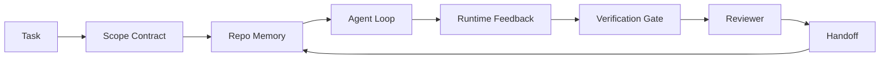

# Agent 工作台工程學：強大模型為何依然會失敗

> 光擁有強大的大模型是遠遠不夠的。高可靠性的 Agent 必須依賴完整的工作台（Workbench）：指引指令、狀態記憶、範疇契約、即時反饋、驗收關卡、獨立審核與階段移交。一旦抽離這些外圍防護，即便是最強的前沿旗艦模型，產出的成果依然脆弱到完全無法安全發布。

**Type:** Learn + Build
**Languages:** Python (stdlib)
**Prerequisites:** Phase 14 · 01 (Agent Loop), Phase 14 · 26 (Failure Modes)
**Time:** ~45 minutes

## Learning Objectives｜學習目標

- 將大模型本身的推理能力與實體工程執行的可靠性清晰剝離。
- 掌握決定 Agent 能否安全交付上線的七大工作台表面（Surfaces）。
- 在具體的程式碼庫任務中，深度對比純 Prompt 運行與工作台引導運行的實質差異。
- 產出一份失效模式診斷報告，將每項缺漏的工作台表面精準對映至其引發的具體系統症狀。

## The Problem｜問題

你將一款前沿頂級大模型放入真實的軟體儲存庫中，要求它新增輸入驗證功能。它一口氣開啟了四個檔案、寫出了看似無比正確的程式碼、宣布大功告成，隨後停止運行。你運行單元測試，發現兩項測試直接爆錯。第三個被修改的檔案根本與輸入驗證毫無相干。整個過程中完全沒有留下任何日誌記錄它當初做了何種假設、最初嘗試了什麼，或是還有哪些工作尚未完工。

這絕非大模型不懂 Python。而是大模型根本不懂「工程工作的本質」。它根本無從知曉究竟怎樣才算「完工」、它獲准修改哪些檔案、哪些測試具備最高驗收權威，以及下一個對話階段作業該如何無縫接手。

這不是大模型的 Bug，而是**工作台的 Bug（A workbench bug）**。圍繞在 Agent 周邊的外圍環境，缺失了將一次性的 One-shot 文字生成轉化為可靠、可斷點復原之軟體工程的關鍵拼圖。

## The Concept｜核心概念

工作台是在任務執行期間，將模型緊密包裹於其中的實體運作環境。它包含七大核心表面：

| 工作台表面 | 承載的核心資訊 | 缺漏時引發的典型失效 |
|---|---|---|
| Instructions | 啟動規則、嚴禁執行的紅線、完工定義（Definition of Done） | Agent 只能盲猜何謂「可發布」 |
| State | 當前任務、被修改檔案、阻礙卡點、下一步行動 | 每個階段作業皆從零重新摸索 |
| Scope | 允許存取的檔案、禁止修改的檔案、驗收合格標準 | 編輯改動蔓延滲透至無關程式碼中 |
| Feedback | 捕獲進迴圈的實體指令輸出結果 | Agent 在 400 報錯下自稱成功 |
| Verification | 單元測試、程式碼檢查 Linter、冒煙測試、範疇檢查 | 「看似正確」的瑕疵程式碼混入 main |
| Review | 轉換為不同角色視角的獨立二次審查 | 開發者自己給自己的作業打滿分 |
| Handoff | 修改了什麼、為何修改、尚餘哪些工作未完成 | 下一個階段作業被迫重新探索一切 |

工作台完全獨立於模型本身。你可以隨意替換底層模型，同時完整保留這些工作台表面；但你絕無法抽離這些表面而依然奢望維持系統的可靠性。



這個控制閉環直接錨定於儲存庫中的狀態檔案，而非脆弱易失的對話歷史。聊天紀錄是暫態揮發的；而程式碼儲存庫才是唯一的權威事實來源（System of Record）。

### 工作台 vs Prompt 工程

Prompt 工程僅告訴模型「在當前回合你期望得到什麼」。而工作台則規範了模型「跨多個回合與跨多個對話階段作業該如何推進實體工程」。絕大多數看似 Agent 失敗的案例，本質上皆是披著 Prompt 工程外衣的工作台缺失。

### 工作台 vs 上層框架

框架為你提供了執行時期環境（如 LangGraph、AutoGen、Agents SDK）。而工作台則是在該執行時期內部，賦予 Agent 一個條理分明的作業場所。兩者皆不可或缺。本專題模組聚焦於後者。

### 回歸分散式系統原語，而非盲從廠商名詞

目前業界圍繞「控端工程學（Harness Engineering）」充斥著海量討論：Addy Osmani、OpenAI、Anthropic、LangChain、Martin Fowler、MongoDB、HumanLayer、Augment Code、Thoughtworks，以及 Hacker News 上絡繹不絕的熱議。各方對於控端的具體邊界、範疇與術語爭論不休。我們完全無需捲入這場名詞爭辯。這七大表面僅屬於外層的使用者體驗（UX）；在每個工作台的底層，支撐它的始終是任何高可靠後端系統皆必須依賴的分散式系統基礎原語。

抽離「Agent」這個酷炫標籤：一次 Agent 運行，本質上正是跨越時間、行程與機器的分散式運算。要確保其可靠，所依賴的正是任何正式環境系統幾十年來始終需要的經典原語。

| 分散式系統原語 | 核心本質 | 在 Agent 系統中承載的角色 |
|---|---|---|
| Function | 強型別處理常式。純函式為佳。擁有輸入與輸出。 | 工具呼叫、規則檢查、驗證步驟、大模型推論調用 |
| Worker | 擁有一個或多個函式與生命週期的長效實體行程 | 建置者、審核者、驗證者、MCP 伺服器 |
| Trigger | 調用特定函式的事件來源 | 迴圈 Tick 定時器、HTTP 請求、佇列訊息、Cron、檔案變更、掛鉤 |
| Runtime | 決定何者在何處運行、擁有何種超時與資源配額的實體邊界 | Claude Code 行程、LangGraph 執行時期、容器工作環境 |
| HTTP / RPC | 呼叫端與工作者之間的實體線路協定 | 工具呼叫協定、MCP 請求、大模型 API |
| Queue | 觸發器與工作者之間的持久化緩衝區；背壓、重試、冪等性 | 任務看板、反饋日誌、審核收件匣 |
| Session persistence | 跨越系統崩潰、重啟與模型切換依然倖存的持久化狀態 | `agent_state.json`、檢查點、鍵值儲存庫、儲存庫檔案本身 |
| Authorization policy | 規範誰獲准以何種權限範疇調用何種函式 | 允許／禁止檔案清單、審批授權邊界、MCP 能力清單 |

將七大工作台表面一一精確映射至這些基礎原語：

- **Instructions**——安全策略 + 函式後設資料。規則即檢查函式。入口導航文件（`AGENTS.md`）即綁定於執行時期啟動階段的安全策略。
- **State**——階段作業持久化。執行時期在每一步讀取的鍵值儲存。無論實體是檔案、KV 還是資料庫；關鍵在於持久化語義，而非底層儲存引擎。
- **Scope**——任務層級的授權策略。允許／禁止的檔案 Glob 路徑即存取控制清單（ACL）；必備的審批即權限格網。
- **Feedback**——寫入佇列的調用日誌。每次 Shell 命令執行皆是一筆持久化、可重播復原的客觀記錄。
- **Verification**——確定性函式。依輸入產出確定性結果；在任務關閉時觸發；實施安全預設失敗阻斷（Fail closed）。
- **Review**——獨立的 Worker 行程。對建置產物擁有唯讀授權，對審核報告擁有唯寫授權。
- **Handoff**——由階段作業結束觸發器所發布的持久化記錄；供下一次階段作業的啟動觸發器讀取。

Agent 迴圈本質上就是一個標準的 Worker 行程：消費事件（使用者訊息、工具結果、定時器 Tick）、調用函式（大模型推論、工具執行）、寫入持久化記錄（狀態、反饋），並發射觸發事件（驗收、審核、移交）。毫無玄學可言；其結構與傳統的非同步任務處理器（Job Processor）完全一模一樣。

### 業界流行名詞與基礎原語對照表

流行社群與廠商名詞皆能還原為這八大原語：

| 廠商或社群流行名詞 | 實際工程本質 |
|---|---|
| Ralph Loop（Claude Code / Codex）——在 Agent 試圖過早結束時將原始意圖重新注入全新視窗 | 一個觸發器將任務重新排入佇列並給予乾淨脈絡；階段作業持久化攜帶目標向前推進 |
| Plan / Execute / Verify（PEV 三段式） | 三個獨立 Worker，各自承擔單一角色，透過狀態與佇列在各階段間通訊 |
| 控制平面與運算平面分離（Harness-compute separation，OpenAI 2026） | 重新包裝分散式系統中的控制平面（Control-plane）與資料平面（Data-plane） |
| Open Agent Passport（OAP，2026 年 3 月）——在執行前對工具呼叫進行宣告式策略簽名審計 | 由動作前置 Worker 所強制執行的授權策略，附帶具備數位簽名的審計佇列 |
| Guides and Sensors（Thoughtworks）——前饋規則 + 反饋可觀測性 | 授權策略 + 確定性驗證函式 + 可觀測性追蹤鏈 |
| 漸進式脈絡壓縮，5 階段（Claude Code 逆向工程，2026 年 4 月） | 一個狀態管理 Worker，如同 Cron 定時巡檢階段作業持久化儲存以維持預算 |
| Hooks / Middleware 中介軟體——攔截模型與工具調用 | 包裹於執行時期調用路徑周圍的觸發器與函式組合 |
| 具備漸進揭露的 Markdown Skills | 一個函式註冊表，其函式後設資料僅在需要時即時動態載入脈絡中 |
| 沙盒隔離 Agent（Codex / Sandcastle / Vercel Sandbox） | 運算平面：一個具備隔離檔案系統、網路與生命週期的實體執行時期 |
| MCP 伺服器 | 透過穩定 RPC 對外暴露函式的工作者，以能力清單作為授權憑證 |

這張表中的每一項，皆是 Agent 社群在重新發明分散式系統中早已存在了數十年的經典原語並冠以時髦的新名稱。

### 客觀實測證據怎麼說

「控端架構重於模型本身」這一論斷如今已具備確鑿的業界量化數字支撐，這亦是反駁「只需坐等更聰明的大模型」的唯一理性論據：

- **Terminal Bench 2.0**：採用完全相同的模型，僅僅調整了外圍控端架構，一款寫程式 agent 便從 30 名開外一舉躍升至全球第 5 名（LangChain，*Anatomy of an Agent Harness*）。
- **Vercel**：大膽刪除了其 agent 中 80% 的多餘工具，任務成功率反而自 80% 戲劇性飆升至 100%（MongoDB 案例研究）。
- **Harvey**：法律專業 agent 單純透過控端工程最佳化，任務準確率直接翻倍（MongoDB 案例研究）。
- **88% 的企業級 AI Agent 專案無法成功邁向正式環境**：其失敗高度集中於執行時期架構，而非模型推理能力（preprints.org，*Harness Engineering for Language Agents*，2026 年 3 月）。
- **2025 年多框架實測研究**：三款主流開源框架的平均任務完成率僅約 50%；在長脈絡情境下，WebAgent 的完成率更自 40-50% 崩塌至 10% 以下，元兇全數是死迴圈與目標遺忘。

核心結論絕非「控端能永遠戰勝大模型」——模型隨時間確實會吸收部分控端技巧。核心結論在於：**在當下，最具決定性的關鍵工程全數圍繞在大模型周邊，而非模型內部；而承載這一切的基石，正是任何高可靠生產系統幾十年來始終需要的經典分散式原語。**

### 廠商文宣的盲區與不足

這是我們完全無需客套的事實真相：

- LangChain 的 *Anatomy of an Agent Harness* 列舉了十一個元件——prompts、工具、hooks、沙盒、編排、記憶體、skills、子 agent 以及一個運行「呆板迴圈」的執行時期。它完全未提及佇列、作為部署單元的工作者、觸發器語義、作為獨立關注點的階段作業持久化，或授權策略。它把控端視為一個供你設定的配置物件，而非一套需要你部署的工程系統。
- Addy Osmani 的 *Agent Harness Engineering* 提出了 `Agent = Model + Harness` 公式與棘輪演進模式，但並未具體說明控端究竟由何種基礎架構構成。讀起來更像是一種宣示立場，而非可落地的技術規範。
- Anthropic 與 OpenAI 在工作台表面上走得最深，但依然受限於自家的專屬執行時期環境。2026 年 4 月 Agents SDK 發布的「控制與運算分離」公告，是廠商首次顯式背書控制平面與資料平面的切分——但這本就是經典的分散式原語思想，絕非全新發明。
- agentic_harness 一書將控端視為純配置物件（Jaymin West 的 *Agentic Engineering* 第 6 章），其最強有力的論點是「控端是 Agentic 系統中的首要安全邊界」——這不過是授權策略的另一種換湯不換藥的表述。
- Hacker News 上的熱門討論亦反覆回到同一個結論。2026 年 4 月的熱門討論 *The agent harness belongs outside the sandbox* 主張控端應當「更像一個獨立於所有事物之外的 Hypervisor，依據脈絡與使用者對存取進行授權」。這同樣是在重申授權策略應當作為獨立平面的分散式思想。

你完全無需反對上述任何觀點便能輕易發現其中的盲區：它們是在對一套早已存在的系統進行使用者體驗（UX）層面的重新包裝。而我們則是在從無到有建構這套系統。當底層系統建構正確時，七大工作台表面會自然而然地從分散式原語中湧現出來；當底層建構錯誤時，任憑你如何精心潤飾 `AGENTS.md`，也無法彌補系統中缺失的佇列緩衝。

因此，當你在其他地方聽到「控端工程學」時，請隨時將其還原為經典原語。Prompts 與規則就是策略與函式；鷹架就是執行時期；護欄就是授權與驗證；Hooks 就是觸發器；記憶體就是階段作業持久化；Ralph Loop 就是重新排隊；子 agent 就是工作者；沙盒就是運算平面。術語日新月異；工程本質歷久彌新。工作台是面向 Agent 的作業表面；而控端——在經歷無數廠商名詞洗禮後依然存活的真正本質——就是函式、工作者、觸發器、執行時期、佇列、持久化與授權策略在底層的嚴密咬合。

```figure
wb-seven-surfaces
```

## Build It｜動手實作

`code/main.py` 將同一個小型程式碼庫任務運行兩次：第一次採用純 Prompt 方式；第二次則完整接入七大工作台表面。完全相同的模型、完全相同的任務。腳本會統計失敗運行中具體缺漏了哪些表面，並產出失效模式診斷報告。

該儲存庫任務刻意保持小巧：為單一檔案的 FastAPI 風格處理常式新增輸入驗證，並撰寫一個通過的測試。

運行實驗：

```
python3 code/main.py
```

輸出包含：兩次運行的對照日誌、總結純 Prompt 運行的 `failure_modes.json` 報告，以及工作台運行的通過裁決。

該 Agent 是一個極簡的規則模擬器；本課的重點在於**工作台表面**，而非模型本身。在後續課程中，你將親手把每個表面打造成真實、可重複利用的工程產物。

## Use It｜實際應用

在真實工程實踐中，這七大表面早已無處不在：

- **Claude Code、Codex、Cursor**：`AGENTS.md` 與 `CLAUDE.md` 即指引指令表面；斜線指令即範疇契約；Hooks 即驗證關卡。
- **LangGraph、OpenAI Agents SDK**：檢查點與階段作業儲存庫即狀態記憶表面；委派移交即階段移交表面。
- **真實儲存庫的 CI 管線**：測試、Lint 與型別檢查即驗證關卡；PR 範本即階段移交；CODEOWNERS 即獨立審核。

工作台工程學的本質，正是將這些表面顯式化、標準化與可復用化，而非讓每個團隊在黑暗中反覆摸索重新發明輪子。

## Ship It｜交付成果

`outputs/skill-workbench-audit.md` 是一項可移植的審查技能。它能對現有的任何程式碼儲存庫進行深度掃描，逐一核驗七大工作台表面，並精確標註哪些缺漏、哪些殘缺、哪些健康。將其放置於任何 Agent 專案周邊，它能清晰指引下一步應當優先修復什麼。

## Exercises｜練習

1. 挑選一個你目前運行 Agent 的真實專案。為七大表面分別打分：0 分（缺失）、1 分（殘缺）、2 分（健全）。你目前最脆弱的表面為何？
2. 擴充 `main.py`，使純 Prompt 運行人為產出一次虛假的「成功」宣告。驗證外圍的驗收關卡能否精準捕獲該欺騙行為。
3. 為你自己的產品規劃第八個潛在工作台表面。提出完整的架構論證，證明它為何無法被收斂歸納至既有的七大表面中。
4. 使用另一個會隨機產生多餘檔案寫入的模擬 Agent 重新執行腳本。觀察哪道表面會最先攔截該越權操作？
5. 將第 26 課講述的五大業界高頻失效模式對映至七大表面。哪道表面專門負責吸收哪種失效模式？

## Key Terms｜關鍵術語

| 術語 | 常見俗稱 | 實際工程意義 |
|---|---|---|
| Workbench | 「專案配置」 | 圍繞在大模型周邊、確保工程執行具備高可靠性的一整套系統表面 |
| Surface | 「設定檔或腳本」 | Agent 在每前回合中必須嚴格讀取或寫入的具名、機器可讀介面 |
| System of record | 「任務筆記」 | 當聊天紀錄被壓縮或遺失時，Agent 唯一視為最高客觀真理的實體檔案 |
| Definition of done | 「驗收標準」 | 一份客觀、背後具備實體檔案檢核依據、Agent 完全無法捏造的完工清單 |
| Workbench audit | 「儲存庫就緒檢查」 | 在正式啟動工程作業前，對七大表面完整性進行的自動化前置掃描 |

## Further Reading｜延伸閱讀

請將以下文獻視為客觀參考資料點，而非不可撼動的權威。每篇文獻皆僅覆蓋了局部體系。在決定是否採納前，請始終將每個概念還原為基礎原語（函式、工作者、觸發器、執行時期、HTTP/RPC、佇列、持久化、授權策略）。

各大廠商視角：

- [Addy Osmani, Agent Harness Engineering](https://addyosmani.com/blog/agent-harness-engineering/) ——`Agent = Model + Harness` 核心公式與棘輪演進模式；偏重理念闡述
- [LangChain, The Anatomy of an Agent Harness](https://blog.langchain.com/the-anatomy-of-an-agent-harness/) ——列舉十一個元件：prompts、工具、hooks、編排、沙盒、記憶體、skills、子 agent、執行時期；未涵蓋佇列、部署架構與授權
- [OpenAI, Harness engineering: leveraging Codex in an agent-first world](https://openai.com/index/harness-engineering/) ——Codex 團隊圍繞其專屬執行時期的外圍表面實踐
- [OpenAI, Unrolling the Codex agent loop](https://openai.com/index/unrolling-the-codex-agent-loop/) ——將 Agent 迴圈還原為函式呼叫 `while` 迴圈的解析
- [Anthropic, Effective harnesses for long-running agents](https://www.anthropic.com/engineering/effective-harnesses-for-long-running-agents) ——特定執行時期內長路徑任務的工作台表面
- [Anthropic, Harness design for long-running application development](https://www.anthropic.com/engineering/harness-design-long-running-apps) ——長路徑應用程式開發的設計實踐筆記
- [LangChain Deep Agents harness capabilities](https://docs.langchain.com/oss/python/deepagents/harness) ——執行時期配置表面文檔

一線從業者具備實用細節的深度解析：

- [Martin Fowler / Birgitta Böckeler, Harness engineering for coding agent users](https://martinfowler.com/articles/harness-engineering.html) ——Guides（前饋規則）+ Sensors（反饋感測）；最乾淨俐落的控制論視角
- [HumanLayer, Skill Issue: Harness Engineering for Coding Agents](https://www.humanlayer.dev/blog/skill-issue-harness-engineering-for-coding-agents) ——「這不是模型能力問題，這是系統配置問題」
- [MongoDB, The Agent Harness: Why the LLM Is the Smallest Part of Your Agent System](https://www.mongodb.com/company/blog/technical/agent-harness-why-llm-is-smallest-part-of-your-agent-system) ——客觀實測戰報：Vercel 80% 躍升至 100%、Harvey 準確率翻倍、Terminal Bench 進入全球前五
- [Augment Code, Harness Engineering for AI Coding Agents](https://www.augmentcode.com/guides/harness-engineering-ai-coding-agents) ——以約束為核心的逐步實踐指南
- [Sequoia podcast, Harrison Chase on Context Engineering Long-Horizon Agents](https://sequoiacap.com/podcast/context-engineering-our-way-to-long-horizon-agents-langchains-harrison-chase/) ——執行時期架構重要性遠高於模型參數之訪談

書籍、學術論文與開源參考實作：

- [Jaymin West, Agentic Engineering — Chapter 6: Harnesses](https://www.jayminwest.com/agentic-engineering-book/6-harnesses) ——專著論述，將控端視為 Agentic 系統的首要安全邊界
- [preprints.org, Harness Engineering for Language Agents (March 2026)](https://www.preprints.org/manuscript/202603.1756) ——學術視角下的控制／代理／執行時期架構
- [walkinglabs/awesome-harness-engineering](https://github.com/walkinglabs/awesome-harness-engineering) ——涵蓋脈絡、評測、可觀測性與編排的精選閱讀清單
- [ai-boost/awesome-harness-engineering](https://github.com/ai-boost/awesome-harness-engineering) ——另一份精選清單（工具、Evals、記憶體、MCP、權限）
- [HKUDS/OpenHarness](https://github.com/HKUDS/OpenHarness) ——內建個人 Agent 的開源控端實作

值得一讀的 Hacker News 深度討論（重點觀察分歧點，而非共識）：

- [HN: Effective harnesses for long-running agents](https://news.ycombinator.com/item?id=46081704)
- [HN: Improving 15 LLMs at Coding in One Afternoon. Only the Harness Changed](https://news.ycombinator.com/item?id=46988596)
- [HN: The agent harness belongs outside the sandbox](https://news.ycombinator.com/item?id=47990675) ——主張授權策略應當作為獨立平面的深刻討論

本課程體系內部的相互參照：

- Phase 14 · 23——OpenTelemetry GenAI 語意約定：感測器（Sensors）文獻所指向的可觀測性層
- Phase 14 · 26——失效模式總覽：七大工作台表面所專門負責吸收防禦的故障類別
- Phase 14 · 27——Prompt 注入防禦：位於授權策略原語處的關鍵安全防線
- Phase 14 · 29——生產級執行時期（佇列、事件、排程）：本課所述各項原語在實體部署中的落腳點
