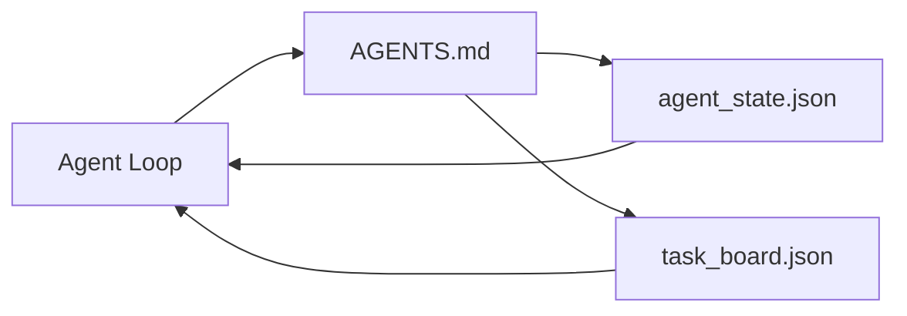

# 極簡 Agent 工作台

> 最小可行的實用工作台僅需三個核心檔案：一個根目錄指引路由器（Router）、一個狀態檔案（State），以及一個任務看板（Task Board）。其他所有進階架構皆在此基礎上層層疊加。若一個程式碼儲存庫連這三個檔案都無法承載，任何頂級大模型都無法挽救它。

**Type:** Build
**Languages:** Python (stdlib)
**Prerequisites:** Phase 14 · 31 (Why Capable Models Still Fail)
**Time:** ~45 minutes

## Learning Objectives｜學習目標

- 定義構成最小可行工作台（Minimum Viable Workbench）的三大核心檔案。
- 深入解釋為何精簡的根目錄路由器遠勝於冗長單一的龐大 `AGENTS.md`。
- 打造一套 Agent 在每前回合主動讀取、在結束時寫入的持久化狀態檔案。
- 打造一套能在完全脫離聊天歷史紀錄的前提下、跨多個階段作業持續存續的任務看板。

## The Problem｜問題

多數團隊在搭建工作台時，往往習慣寫出一份長達 3,000 行的臃腫 `AGENTS.md` 便宣稱大功告成。然而大模型載入它後，會直接忽略那些無法被摘要消化的段落，並依然在原本就容易崩潰的相同系統表面上反覆失敗。

你真正需要的是截然相反的設計：一個極簡的根目錄檔案，僅在真正需要時引導 Agent 深入閱讀特定專項文檔；一份讓 Agent 在行動前閱讀、在行動後寫入的持久化狀態檔案；以及一個清晰標註何者進行中、何者受阻、何者待處理的任務看板。

三個檔案。各司其職。每個檔案皆具備足夠的機器可讀性，利於日後無縫升級為功能完備的成熟系統。

## The Concept｜核心概念



### AGENTS.md 是路由器，而非操作手冊

一份優秀的 `AGENTS.md` 應當力求短小精悍。它僅負責將 Agent 精準引導至：

- 狀態檔案（你目前身處何方）；
- 任務看板（目前尚餘哪些待辦事項）；
- 更深層的專項規則（存放於 `docs/agent-rules.md` 下）；
- 實體驗收指令（如何確鑿驗證工作成果是否合規）。

任何更長篇的說明皆應沉澱於深層專項文檔中，僅在需要時按需載入。冗長的操作手冊往往被模型無視；精簡的路由器才能被模型嚴格遵守。

### agent_state.json 是唯一的權威事實來源

狀態檔案承載：當前活動任務 ID、已修改的檔案清單、所做的前提假設、遇到的阻礙卡點，以及下一步的具體行動。Agent 在每個對話回合主動讀取它；下一個階段作業亦透過讀取它來無縫接手，而非重播冗長的對話歷史。

狀態之所以必須儲存為實體檔案，是因為聊天歷史極度不可靠。階段作業隨時會中斷；對話隨時會被截斷壓縮；而實體檔案永遠完好如初。

### task_board.json 是任務佇列

任務看板承載所有標註為 `todo | in_progress | done | blocked` 的任務條目。當狀態為空時，它是 Agent 提取新工作的佇列；當你想確認 Agent 是否處於正軌時，它亦是你檢驗進度的核心看盤。

看板上的每項任務皆包含唯一 ID、目標描述、責任歸屬（`builder`、`reviewer` 或 `human`）以及明確的驗收合格標準。看板刻意保持小巧：一旦條目超出一面螢幕的容量，代表你面臨的是任務拆解規劃問題，而非看板本身的問題。

### 三個檔案是系統底線，而非能力上限

後續課程將追加範疇契約、反饋執行器、驗收關卡、審核者檢核清單與階段移交封包。本課的三個檔案，正是所有這些進階表面共同預設的底層基石。

```figure
wb-three-files
```

## Build It｜動手實作

`code/main.py` 在一個空儲存庫中寫入極簡工作台，並演示單次 Agent 回合如何運作：

1. 讀取 `agent_state.json`；
2. 若狀態為空，自 `task_board.json` 提取下一個待辦任務；
3. 修改範疇內的一個檔案；
4. 寫回更新後的狀態。

運行實驗：

```
python3 code/main.py
```

腳本會在自身同級目錄下建立 `workdir/`、生成這三個檔案、運行一個回合，並印出 Diff 變更。再次運行它，親眼見證第二次回合如何無縫自第一次回合的中斷處精準接手。

## Use It｜實際應用

在各大生產級 Agent 產品內部，完全相同的這三個檔案只是以不同的命名風格存在：

- **Claude Code**：以 `AGENTS.md` 或 `CLAUDE.md` 作為路由器，以 `.claude/state.json` 風格的儲存庫維護狀態，以 Hooks 串接看板。
- **Codex / Cursor**：以工作區規則（Workspace Rules）作為路由器，以 Session Memory 維護狀態，以聊天側邊欄中的排程任務作為看板。
- **自建 Python Agent**：直接使用你剛剛親手編寫的這三個實體檔案。

名稱隨環境而變；架構本質始終不變。

## Production patterns in the wild｜真實世界中的生產級模式

當疊加以下三種進階模式時，極簡工作台能無畏地直面大型 Monorepo 儲存庫的複雜考驗。它們彼此獨立；依據你程式碼庫的真實需求按需採納：

**巢狀 `AGENTS.md` 與就近優先（nearest-wins）原則**：OpenAI 在其核心儲存庫中部署了高達 88 個 `AGENTS.md` 檔案，每個子元件目錄各配置一份。Codex、Cursor、Claude Code 與 Copilot 在執行時皆會自當前編輯的檔案出發，一路向上遞迴至儲存庫根目錄，並沿途拼接所遇到的每份 `AGENTS.md`。子目錄檔案能對根目錄檔案進行針對性擴充。Codex 額外支援 `AGENTS.override.md` 以實施完全覆寫；但覆寫機制屬於 Codex 特化特徵，在跨工具協同中應盡量避免。Augment Code 的實測結果給出了關鍵指引：一份優秀的 `AGENTS.md` 能帶來宛如「從 Haiku 升級至 Opus」般的巨大品質飛躍；而一份糟糕的文件，其表現甚至不如完全沒有文件。

**果斷拒絕看似覆蓋全面的反模式**：相互衝突的指引會暗中迫使 Agent 自互動模式退化為貪婪盲目模式（ICLR 2026 AMBIG-SWE 實測：任務解決率自 48.8% 崩塌至 28%）；必須為優先級編號標註順序，切勿扁平堆疊。缺乏可執行指令的空洞風格規範（如「請遵循 Google Python 風格指南」）只會誘導 Agent 自行捏造合規性；務必為每條風格規則綁定精確的 Lint 驗收指令。先寫長篇風格再寫驗收指令會徹底掩蓋關鍵驗證路徑；必須指令在先、風格在後。寫給人類閱讀而非寫給 Agent 會白白浪費寶貴的上下文預算；簡短精煉才是核心美德。

**跨工具符號連結（Symlinks）**：單一根目錄檔案搭配符號連結（`ln -s AGENTS.md CLAUDE.md`、`ln -s AGENTS.md .github/copilot-instructions.md`、`ln -s AGENTS.md .cursorrules`），使每個 AI 撰寫程式碼工具皆緊密錨定於同一權威事實來源。Nx 的 `nx ai-setup` 工具便能透過單一配置，自動在 Claude Code、Cursor、Copilot、Gemini、Codex 與 OpenCode 之間完成全自動同步。

## Ship It｜交付成果

`outputs/skill-minimal-workbench.md` 能為任何全新程式碼庫產出標準的三檔案工作台：精準切合專案特徵的 `AGENTS.md` 路由器、包含必備鍵值的 `agent_state.json`，以及預填了當前待辦任務的 `task_board.json`。

## Exercises｜練習

1. 為 `agent_state.json` 新增 `last_run` 時間戳記。若該檔案距離上次更新已超過 24 小時，除非有人類工程師顯式確認，否則堅決拒絕啟動。
2. 為任務看板新增 `priority` 優先級欄位，並修改任務提取邏輯，使其始終優先提取最高優先級的 `todo` 條目。
3. 將 `task_board.json` 遷移為 JSON Lines 格式（每行一個獨立任務），以利於在 Git 版本控制中獲得乾淨俐落的 Diff 差異。
4. 撰寫一個 `lint_workbench.py` 檢查腳本：若 `AGENTS.md` 超過 80 行或引用了不存在的實體檔案，強制報錯失敗。
5. 深入思考：若必須從這三個檔案中遺失其中一個，哪一個的損失最為慘重？提出完整的架構論證。

## Key Terms｜關鍵術語

| 術語 | 常見俗稱 | 實際工程意義 |
|---|---|---|
| Router | `AGENTS.md` | 引導 Agent 深入閱讀特定專項文檔與檔案的精簡根目錄檔案 |
| State file | 「工作筆記」 | 機器可讀的實體狀態記錄，記錄 Agent 身處何方，每輪強制讀寫 |
| Task board | 「任務待辦看板」 | 記錄工作狀態、責任指派與驗收標準的 JSON 任務佇列 |
| System of record | 「最高事實來源」 | 當聊天歷史被截斷或遺失時，工作台唯一視為法定權威的實體檔案 |

## Further Reading｜延伸閱讀

- [agents.md — the open spec](https://agents.md/) ——獲 Cursor、Codex、Claude Code、Copilot、Gemini、OpenCode 共同採納的開放標準
- [Augment Code, A good AGENTS.md is a model upgrade](https://www.augmentcode.com/blog/how-to-write-good-agents-dot-md-files) ——優秀設定檔帶來的大模型跨級飛躍實測
- [Blake Crosley, AGENTS.md Patterns: What Actually Changes Agent Behavior](https://blakecrosley.com/blog/agents-md-patterns) ——實證檢驗究竟哪些模式能實質改變行為
- [Datadog Frontend, Steering AI Agents in Monorepos with AGENTS.md](https://dev.to/datadog-frontend-dev/steering-ai-agents-in-monorepos-with-agentsmd-13g0) ——大型 Monorepo 巢狀就近優先實踐
- [Nx Blog, Teach Your AI Agent How to Work in a Monorepo](https://nx.dev/blog/nx-ai-agent-skills) ——跨六大工具的單一來源自動化配置
- [The Prompt Shelf, AGENTS.md Best Practices: Structure, Scope, and Real Examples](https://thepromptshelf.dev/blog/agents-md-best-practices/) ——章節排版與架構最佳實務
- [Anthropic, Claude Code subagents](https://code.claude.com/docs/en/sub-agents) ——子 agent 官方規範
- Phase 14 · 31——本極簡架構所專門負責吸收防禦的核心失效模式
- Phase 14 · 34——本課所提前預覽的持久化狀態 Schema 規範
