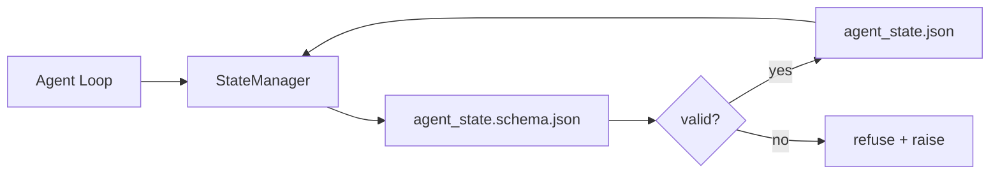

# 儲存庫記憶體與持久化狀態

> 聊天紀錄是暫態揮發的；而儲存庫才是持久長青的。工作台將 Agent 狀態儲存於納入版本控制的實體檔案中，使下一個階段作業、下一個 Agent 以及未來的審核者皆能讀取完全相同的權威事實來源。

**Type:** Build
**Languages:** Python (stdlib + `jsonschema` optional)
**Prerequisites:** Phase 14 · 32 (Minimal Workbench)
**Time:** ~60 minutes

## Learning Objectives｜學習目標

- 明確劃分哪些資訊屬於儲存庫記憶體，哪些資訊僅屬於暫態聊天歷史。
- 為 `agent_state.json` 與 `task_board.json` 撰寫嚴格的 JSON Schema 契約。
- 實作狀態管理器（State Manager），具備載入、校驗、變更以及原子寫入持久化狀態的能力。
- 利用 Schema 在錯誤寫入損壞工作台之前，果斷攔截並拒絕無效資料。

## The Problem｜問題

Agent 結束了一個對話階段作業，視窗隨之關閉。當下一個階段作業開啟並詢問「該從哪裡開始」時，大模型往往表示「讓我先檢查檔案」，隨後讀取了過時的舊筆記，重新做了早已完工的工作。更糟糕的是，它甚至會自作主張重寫一個已完工的檔案——僅僅因為沒有任何記錄告訴它該檔案已經驗收通過。

工作台的解法是**儲存庫記憶體（Repo Memory）**：狀態以 JSON 格式持久化存於儲存庫中，在嚴格的 Schema 約束下進行原子寫入，且對 Git 程式碼審查高度友善。聊天對話僅是暫態的即時串流；而儲存庫才是唯一的最高事實來源（System of Record）。

## The Concept｜核心概念



### 哪些資訊屬於儲存庫記憶體

| 屬於儲存庫記憶體 | 絕不屬於儲存庫記憶體 |
|---|---|
| 活動中的任務 ID | 原始的長篇聊天對話日誌 |
| 當前階段作業修改的檔案清單 | Token 層級的底層推理軌跡 |
| Agent 當初確立的前提假設 | 「使用者看起來有些沮喪」等主觀情緒 |
| 當前卡住的阻礙事項 | 大模型抽樣生成的候選文字 |
| 下一步的具體行動方針 | 廠商特定的私有模型 ID |

檢驗的黃金標準在於**持久化實用性**：三個月後在 CI 重跑時，這段資訊是否依然具備實質價值？若是，歸入儲存庫記憶體；若否，歸入遙測日誌。

### Schema 優先的狀態管理（Schema-first state）

JSON Schema 是不可動搖的資料契約。若缺乏 Schema，每個 Agent 皆會隨意捏造全新欄位，每個審核者皆被迫學習不同的資料格式，而每條 CI 腳本皆必須為相容歷史版本寫滿醜陋的特化例外。有了 Schema，一次錯誤的寫入便會直接被系統堅決拒絕。

Schema 明確規範：

- 必填的鍵名清單；
- 允許的 `status` 狀態列舉值；
- 嚴格禁止的無效值（例如禁止陣列為 `null`）；
- 正則表達式格式約束（例如任務 ID 必須符合 `T-\d{3,}`）；
- 支援平滑架構遷移的版本號欄位。

### 原子寫入（Atomic writes）

狀態寫入必須能承受局部系統崩潰的考驗：先將內容寫入暫存檔、呼叫 fsync 強制刷入實體磁碟，隨後透過原子性重新命名（Rename）覆寫目標檔案。狀態檔案是最高權威來源；一份寫入到一半損壞的殘缺檔案，遠比完全沒有檔案更加致命。

### 狀態版本遷移（Migrations）

當 Schema 發生版本變更時，必須在發布 Schema 升級的同時附帶遷移腳本。狀態檔案攜帶 `schema_version` 欄位；管理器若遇到無法自動遷移的未知舊版本，堅決拒絕讀取載入。

```figure
wb-state-persist
```

## Build It｜動手實作

`code/main.py` 實作了以下核心架構：

- `agent_state.schema.json` 與 `task_board.schema.json`；
- 純標準函式庫的輕量校驗器（支援 JSON Schema 的 required、type、enum、pattern、items 子集）；
- `StateManager.load`、`StateManager.update` 與 `StateManager.commit`，內建暫存檔加原子覆寫寫入機制；
- 演示狀態變更、持久化存檔、重新讀取，並確鑿證明往返資料的一致性。

運行實驗：

```
python3 code/main.py
```

腳本會在自身目錄下寫入 `workdir/agent_state.json` 與 `workdir/task_board.json`、跨兩個回合進行狀態變更，並在每步印出經過校驗的實體狀態。

## Production patterns in the wild｜真實世界中的生產級模式

四大實戰模式將教學玩具提升為足以承受多 Agent 大型 Monorepo 考驗的生產級架構：

**原子性暫存覆寫（Temp-and-rename）絕非可選項目**：2026 年 3 月 Hive 專案的一起嚴重 Bug 報告清晰暴露了該失效模式：`state.json` 採用 `write_text()` 直接寫入且例外被中途吞沒。不完整的局部寫入導致後續階段作業在損壞的狀態下靜默復原，引發了災難性後果。唯一的正確解法始終是：在目標檔案的同一目錄下透過 `tempfile.mkstemp` 建立暫存檔、寫入內容、執行 `fsync` 刷盤，隨後調用 `os.replace`（在 POSIX 與 Windows 上皆具備原子覆寫保證）。本課的 `atomic_write` 正是完全依此實作。

**為所有非冪等工具呼叫配置冪等鍵**：若 Agent 在呼叫工具後、但尚未完成檢查點存檔前夕遭遇系統崩潰，重啟恢復會盲目重試該工具呼叫。對於讀取操作無害；但對於寄送郵件、資料庫寫入或檔案上傳則極其危險。標準模式：在執行工具前，先將工具呼叫 ID 記錄至 `pending_calls.jsonl` 中。在重試時檢查該 ID；若已存在，直接略過呼叫並使用快取的結果。Anthropic 與 LangChain 在 2026 年的指引中皆強調了此點；LangGraph 的檢查點亦基於完全相同的原因持久化保存待處理寫入。

**將龐大產物從核心狀態中剝離**：切勿將 CSV 表格、長篇對話紀錄或生成的程式碼檔案塞入 `agent_state.json` 內部。應當將產物保存為獨立實體檔案（或上傳至物件儲存），而在狀態中僅保留其路徑字串。確保檢查點始終輕巧快速，而產物可獨立自然增長。

**審計採用事件溯源（Event Sourcing），復原採用快照（Snapshots）**：在每次狀態變更時追加寫入事件日誌（`state.events.jsonl`）；定時將當前狀態快照存檔至 `state.json`。中斷復原時先讀取最新快照，隨後回放該快照時間戳記之後的所有事件。這會消耗稍微多一點的磁碟空間，但賦予了你逐字逐句重現 Agent 過往決策鏈的能力——在排查長路徑任務時不可或缺。這與 Postgres 底層 WAL 的運作原理完全一致。

**嚴格落實 Schema 遷移或果斷拒絕載入**：整數型的 `schema_version` 是最高契約。當管理器遇到無法辨識的未知版本時，堅決拒絕讀取。在 Schema 升級時同步提供遷移腳本；確保 `tools/migrate_state.py` 在每次啟動時皆能冪等執行。

## Use It｜實際應用

在正式環境中：

- **LangGraph 檢查點儲存器**：相同的理念，不同的儲存實作。檢查點將圖狀態持久化至 SQLite、Postgres 或自訂後端。當檢查點中斷且你需要手動查閱狀態時，本課的 Schema 是唯一的標準依據。
- **Letta 記憶體區塊**：具備結構化 Schema 的持久化區塊（第 14 · 08 課）。完全相同的嚴格規範，專門服務於長時效人設。
- **OpenAI Agents SDK 階段作業儲存**：可插拔的後端架構，原生感知 Schema。本課的狀態檔案正是其本地檔案後端的標準形態。

## Ship It｜交付成果

`outputs/skill-state-schema.md` 能為特定專案產出成對的 JSON Schema 契約（狀態 + 看板）、內建原子寫入的 Python `StateManager`，以及標準的架構遷移鷹架，確保下一次 Schema 升級絕不損壞既有工作台。

## Exercises｜練習

1. 為系統新增 `last_human_touch` 人工編輯時間戳記。在人類工程師手動修改該檔案後的 5 秒內，堅決拒絕 Agent 的任何覆寫寫入。
2. 擴充校驗器以支援 `oneOf`：使任務既可定義為建置任務，亦可定義為審核任務，且兩者具備截然不同的必填欄位。
3. 新增 `schema_version` 欄位，並撰寫從 v1 升級至 v2 的遷移腳本（將 `blockers` 重新命名為 `risks`）。
4. 將底層儲存後端自本地檔案遷移為 SQLite 資料庫，同時維持 `StateManager` 的外部調用介面完全不變。
5. 讓兩個 Agent 針對同一個狀態檔案發起間隔僅 50 毫秒的並發寫入競爭。分析哪些環節會出錯，以及原子重新命名機制如何保障系統免於崩潰。

## Key Terms｜關鍵術語

| 術語 | 常見俗稱 | 實際工程意義 |
|---|---|---|
| Repo memory | 「筆記檔案」 | 儲存於儲存庫中、納入版本控管且受 Schema 約束的實體狀態檔案 |
| Schema-first | 「校驗輸入」 | 在寫入程式碼前預先定義好資料契約，堅決拒絕資料結構漂移 |
| Atomic write | 「直接覆寫改名」 | 先寫入暫存檔、fsync 刷盤、再原子重新命名，確保局部崩潰不損壞檔案 |
| Migration | 「架構版本升級」 | 將 vN 版本狀態平滑轉換為 v(N+1) 版本的自動化遷移腳本 |
| System of record | 「最高權威事實」 | 當聊天對話紀錄被截斷遺失時，工作台唯一視為法定權威的實體產物 |

## Further Reading｜延伸閱讀

- [JSON Schema specification](https://json-schema.org/specification.html) ——JSON Schema 官方權威技術規範
- [LangGraph checkpointers](https://langchain-ai.github.io/langgraph/concepts/persistence/) ——檢查點持久化概念指南
- [Letta memory blocks](https://docs.letta.com/v1-sdk/memory/memory-blocks) ——記憶體區塊結構指南
- [Fast.io, AI Agent State Checkpointing: A Practical Guide](https://fast.io/resources/ai-agent-state-checkpointing/) ——Schema 優先的狀態檢查點與冪等性實踐
- [Fast.io, AI Agent Workflow State Persistence: Best Practices 2026](https://fast.io/resources/ai-agent-workflow-state-persistence/) ——並發控制、TTL 與事件溯源實戰
- [Hive Issue #6263 — non-atomic state.json writes silently ignored](https://github.com/aden-hive/hive/issues/6263) ——真實開源專案中非原子寫入的血淋淋教訓
- [eunomia, Checkpoint/Restore Systems in AI Agents](https://eunomia.dev/blog/2025/05/11/checkpointrestore-systems-evolution-techniques-and-applications-in-ai-agents/) ——借鏡作業系統檢查點復原機制的演進史
- [Indium, 7 State Persistence Strategies for Long-Running AI Agents in 2026](https://www.indium.tech/blog/7-state-persistence-strategies-ai-agents-2026/) ——長任務狀態持久化七大策略
- [Microsoft Agent Framework, Compaction](https://learn.microsoft.com/en-us/agent-framework/agents/conversations/compaction) ——微軟官方檢查點壓縮管理
- Phase 14 · 08——記憶體區塊與睡眠期運算架構
- Phase 14 · 32——本課 Schema 規範所依託的極簡三檔案工作台
- Phase 14 · 40——直接依據該 Schema 規範進行讀取的階段移交封包
