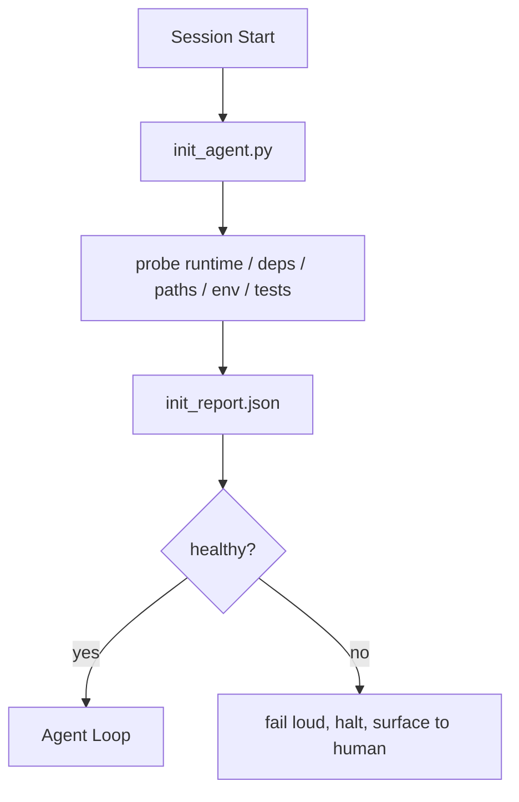

# Agent 初始化腳本

> 每個從零冷啟動的對話階段作業，皆在被迫支付高昂的認知稅。Agent 在反覆讀取相同的檔案、嘗試相同的探測，並重新摸索相同的路徑。一套初始化腳本只需支付一次這筆代價，並將所有標準答案持久化寫入狀態中。

**Type:** Build
**Languages:** Python (stdlib)
**Prerequisites:** Phase 14 · 32 (Minimal Workbench), Phase 14 · 34 (Repo Memory)
**Time:** ~45 minutes

## Learning Objectives｜學習目標

- 識別 Agent 在每個階段作業中絕對不應當重複摸索的基礎工作。
- 打造一套確定性的初始化腳本，精準探測執行時期、相依套件與儲存庫健康度。
- 將探針檢測結果持久化存檔，使 Agent 在啟動時能直接讀取結果而非盲目重新執行檢查。
- 確保在初始化失敗時能夠高調報錯、快速中斷，並提供單一集中的排查入口。

## The Problem｜問題

開啟一個全新的對話階段作業。Agent 開始盲猜目前的 Python 版本。盲猜該調用哪條測試指令。連續五次呼叫列舉儲存庫根目錄以尋找程式碼進入點。試圖匯入一個根本未安裝的第三方套件。甚至無奈開口向使用者詢問設定檔存放在哪裡。等到它終於要開始進行實質程式碼編輯時，上萬個 Token 早已白白浪費在原本只需一支腳本即可搞定的前置引導工作上。

解法是一支專門的初始化腳本：在 Agent 展開任何行動之前優先運行，並產出一份 `init_report.json`，供 Agent 在啟動時直接讀取。

## The Concept｜核心概念



### 初始化腳本所探測的核心維度

| 探針項目 | 為何至關重要 |
|---|---|
| 執行時期版本 | 錯誤的 Python 或 Node 版本會引發隱性的跨版本不相容缺陷 |
| 相依套件可用性 | 稍後因缺失套件而報錯中斷的成本，十倍於在啟動當下及早發現 |
| 測試執行指令 | Agent 必須知曉該如何自我驗證；若測試指令缺失，工作台處於損壞狀態 |
| 儲存庫關鍵路徑 | 硬編碼路徑隨時間漂移；在啟動時解析一次並精準鎖定 |
| 環境變數宣告 | 缺失 `OPENAI_API_KEY` 屬於環境配置問題，絕非執行時期的未解之謎 |
| 狀態與看板新鮮度 | 繼承自前次崩潰階段作業的過時舊狀態是極度危險的安全隱患 |
| 最後已知良好 Commit | 為階段作業結束時的移交 Diff 差異提供基準錨定點 |

### 明確報錯、快速中斷、集中排查

任何探針檢測失敗，皆意味著立即中斷流程並向人類工程師回報。絕不可抱持「讓 Agent 自己想辦法搞定」的僥倖心理。初始化的核心本質，正是當工作台處於損壞狀態時堅決拒絕啟動。

### 冪等性保證（Idempotent）

連續執行兩次。除了時間戳記更新之外，第二次執行產出的結果應當完全一致。具備冪等性，方能讓你安心地將該腳本整合至 CI 管線、生命週期掛鉤或任務前置斜線指令中。

### 初始化腳本 vs 啟動前置規則

規則（第 33 課）規範了採取行動前必須滿足何種前提；而初始化腳本則是確鑿建立這些規則能否被實質檢查的底層工具。缺乏初始化的規則會淪為空洞的「請格外小心」；而缺乏規則的初始化則只是一場粉飾太平的失敗。

```figure
wb-init-probes
```

## Build It｜動手實作

`code/main.py` 實作了標準的 `init_agent.py`：

- 五大探針：Python 版本、透過 `importlib.util.find_spec` 核對清單相依項、測試指令可解析性、必備環境變數、狀態檔案新鮮度。
- 每個探針皆回傳 `(name, status, detail)` 標準三元組。
- 腳本輸出完整的 `init_report.json`，若任何阻斷級別（block）的探針失敗，直接以非零結束碼退出。

運行實驗：

```
python3 code/main.py
```

腳本會印出探針檢驗表格、寫入 `init_report.json`，在正常路徑下以狀態碼 0 退出，或在檢測失敗時以非零狀態碼退出並列舉失敗項目。

## Production patterns in the wild｜真實世界中的生產級模式

三大實戰模式將真正實用的初始化腳本，與形式主義的擺設程式碼徹底區分開來：

**錨定最後已知良好 Commit（LKG Commit）**：將當前的 Commit 與上次成功合併時寫入的 `LKG` 基準檔案進行比對。若 Diff 差異超出了預算上限（預設為 50 個檔案），堅決拒絕啟動，並要求人類工程師批准全新基準線。這正是 Cloudflare 在其 AI 程式碼審查架構中界定審核 Agent 邊界的核心手段：每個審查階段作業皆緊密錨定於相同的最後已知良好狀態，徹底杜絕跨階段作業的漂移滾雪球效應。

**帶有 TTL 有效期的鎖定檔案**：在初次探針檢測成功後寫入 `prereqs.lock`。後續運行在 N 小時內（預設 24 小時）直接信任該鎖定檔案，並主動略過耗時沉重的深度探測。初始化腳本優先讀取鎖定檔；若狀態新鮮且相依清單雜湊未變，直接短路放行。這與 Docker 的映像檔層快取機制完全一致：冪等探測 + 內容雜湊 = 快速略過。

**在即時熱路徑上嚴禁聯網、嚴禁調用大模型、杜絕驚喜**：初始化探針是確定性的底層水暖工程。企圖調用大模型去分類錯誤、或存取外部服務去檢查軟體授權的探針，根本不是探針，而是一套複雜的工作流程。若任何探針在 Dry-run 預演模式下耗時超過 3 秒，應將其視為工作台異味（Smell），要麼將其移出初始化環節，要麼強制對其結果實施快取。

## Use It｜實際應用

在正式環境中：

- **Claude Code 掛鉤**：透過 `pre-task` 掛鉤調用初始化腳本，若失敗則堅決拒絕啟動 Agent。
- **GitHub Actions**：設立 `setup-agent` 工作任務執行初始化腳本；後續的 Agent 任務嚴格相依於該前置任務。
- **Docker 進入點**：Agent 容器在執行 Agent 執行時期主行程前，優先運行初始化腳本；遭遇失敗時即時輸出錯誤日誌。

初始化腳本具備極高的可移植性，因為它完全不依賴於任何特定的專屬上層框架。Bash、Make 或任務執行檔皆能輕鬆將其包裝調度。

## Ship It｜交付成果

`outputs/skill-init-script.md` 能針對特定專案進行自動化分析，將前置引導工作梳理為標準探針，並產出專屬的 `init_agent.py` 以及在任何 Agent 步驟執行前強制運行的 CI 自動化工作流程。

## Exercises｜練習

1. 新增一個比對當前 Commit 與最後已知良好 Commit 的探針：若變更檔案超過 50 個，堅決拒絕啟動。
2. 擴充腳本以寫入 `prereqs.lock` 鎖定檔案，若該鎖定檔案建立時間超過 7 天，強制要求重新探測。
3. 為腳本新增 `--fix` 自動修復旗標：能自動安裝缺失的開發相依套件，但在未經確認前絕不擅自修改正式環境依賴。
4. 將探針定義自硬編碼函式遷移為宣告式 YAML 註冊表。深入評估此架構轉變的利弊取捨。
5. 為每個探針配置執行時間預算。任何運行耗時超過 3 秒的探針皆應被標註為系統異味。

## Key Terms｜關鍵術語

| 術語 | 常見俗稱 | 實際工程意義 |
|---|---|---|
| Probe | 「環境探針」 | 回傳 `(name, status, detail)` 的確定性環境檢測函式 |
| Init report | 「環境診斷報告」 | 與狀態檔案存放在一起、記錄所有探針檢測結果的標準 JSON 檔案 |
| Idempotent | 「具備冪等性」 | 連續執行兩次產出的報告除了時間戳記外完全一致 |
| Fail loud | 「高調報錯」 | 遇到異常立即終止並呈報人類，絕不靜默掩蓋或盲目降級 |
| Setup tax | 「冷啟動開銷」 | Agent 在每個對話階段作業中重複摸索顯而易見之環境事實所白白浪費的 Token |

## Further Reading｜延伸閱讀

- [Anthropic, Effective harnesses for long-running agents](https://www.anthropic.com/engineering/effective-harnesses-for-long-running-agents) ——長時段 Agent 控端環境初始化指南
- [GitHub Actions, composite actions for setup](https://docs.github.com/en/actions/sharing-automations/creating-actions/creating-a-composite-action) ——組合式設定動作指南
- [microservices.io, GenAI dev platform: guardrails](https://microservices.io/post/architecture/2026/03/09/genai-development-platform-part-1-development-guardrails.html) ——將 Pre-commit 與 CI 檢查作為初始化防線
- [Augment Code, How to Build Your AGENTS.md (2026)](https://www.augmentcode.com/guides/how-to-build-agents-md) ——初始化預期管理
- [Codex Blog, Codex CLI Context Compaction](https://codex.danielvaughan.com/2026/03/31/codex-cli-context-compaction-architecture/) ——階段作業啟動時的初始化感知
- Phase 14 · 33——本腳本所支援的實體操作規則集
- Phase 14 · 34——本腳本所負責播種的持久化狀態檔案
- Phase 14 · 38——直接消費本初始化報告的自動化驗收關卡
- Phase 14 · 40——直接引用本初始化報告之最後已知良好狀態的階段移交封包
