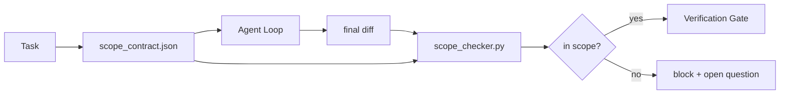

# 範疇契約與任務邊界

> 大模型自身根本不知道工作的終點在何處。範疇契約（Scope Contract）是一份逐任務維護的專屬檔案，明確界定工作的起點、終點，以及在發生越界時該如何安全復原。該契約將「嚴格維持在範疇之內」從一句虛無飄渺的願望，轉化為一項確定性的硬性檢查。

**Type:** Build
**Languages:** Python (stdlib)
**Prerequisites:** Phase 14 · 32 (Minimal Workbench), Phase 14 · 33 (Rules as Constraints)
**Time:** ~50 minutes

## Learning Objectives｜學習目標

- 撰寫一份 Agent 在任務開始時主動讀取、驗收器在任務結束時嚴格審查的範疇契約。
- 明確規範允許修改的檔案清單、絕對禁止碰觸的檔案清單、驗收合格標準、回滾方案與審批邊界。
- 實作範疇檢查器（Scope Checker），將 Git Diff 差異與契約進行比對，精準標記越界違規。
- 使「範疇蔓延（Scope Creep）」變得清晰可見、全自動偵測且易於程式碼審查。

## The Problem｜問題

Agent 天生具備「範疇蔓延」的頑疾。原本交辦的任務僅是「修復登入頁面 Bug」。然而最終產出的 Git Diff 卻涵蓋了登入路由、郵件發送輔助函式、資料庫驅動程式、README 文件以及正式發布腳本。在執行的當下，Agent 為每一次檔案修改皆能給出看似無比合理的動聽藉口；但將它們疊加在一起，這項改動早已與最初經過審查批准的任務面目全非。

範疇蔓延是 Agent 系統中最常被低估的隱性失效模式，因為 Agent 在每一步皆在以「良善的意圖」自圓其說。解法絕非寫一段語氣更嚴厲的 prompt。解法是在實體磁碟上確立一份白紙黑字的契約，記錄最初的承諾，並透過確定性的自動化檢查對照最終結果。

## The Concept｜核心概念



### 範疇契約的核心欄位

| 欄位名稱 | 核心架構用途 |
|---|---|
| `task_id` | 關聯至任務看板上的特定任務 ID |
| `goal` | 審核者能快速驗證的一句話核心目標 |
| `allowed_files` | Agent 獲准寫入與修改的檔案 Glob 萬用字元清單 |
| `forbidden_files` | Agent 即便意外亦絕對嚴禁碰觸的檔案 Glob 清單 |
| `acceptance_criteria` | 確鑿證明任務已完工的測試指令或斷言條款 |
| `rollback_plan` | 當必須強制中止時，維運工程師可直接執行的一段復原指引 |
| `approvals_required` | 超出當前範疇、強制要求人類顯式審批的高危險操作 |

一份缺乏 `forbidden_files` 的契約是殘缺不全的。明確劃定「禁止空間」佔據了整份契約一半的防禦價值。

### 採用 Glob 萬用字元，而非死板的絕對路徑

真實的程式碼庫隨時會重構檔案。將契約綁定於 Glob 規則（如 `app/**/*.py`、`tests/test_signup*.py`），確保跨階段作業的常規重構不致使既有契約頻繁失效。

### 回滾復原是範疇的不可分割部分

明確列舉回滾方案，逼迫契約撰寫者提前深入思考「哪些環節可能出錯」。一份完全無法安全復原的契約，根本不應當獲得批准。

### 範疇檢查本質上是 Diff 差異審查

Agent 產出 Git Diff。檢查器讀取該 Diff、允許的 Globs、禁止的 Globs 以及所有執行過的驗收指令。任何一處違規皆會轉化為具備標籤的結構化缺陷，供後續驗收關卡果斷拒絕。

### 範疇的兩大高度層次：功能清單 vs 任務契約

範疇契約負責約束單一具體任務。但它並未約束整個專案的全域邊界。一個 Agent 完全可以在登入修復任務的契約內守規矩，隨後在下一個回合，自作主張決定專案還需要一個個人設定頁面、一個深色模式切換開關，以及一套重寫的路由器。任務契約從未被賦予審查「何種工作屬於專案全域範疇」的權限，它僅僅檢查「哪些檔案屬於當前任務的範疇」。

這第二層高度需要自身的專屬原語：Agent 在階段作業啟動時讀取的 `feature_list.json`。它是將專案待辦清單（Backlog）具象化為機器可讀的有序實體檔案。Agent 嚴格挑選一項 `status` 為 `todo` 的功能，將其 `id` 寫入當前活動的範疇契約中，且**嚴禁在同一階段作業中同時啟動第二項功能**。「單次僅專注於單一功能」不再是 prompt 中一句任由 Agent 自我合理化略過的軟性道德叮囑，而是白紙黑字寫在磁碟上的數值，以及由關卡強制捍衛的硬性不變量。

```json
{
  "project": "knowledge-base",
  "active": "import-pdf",
  "features": [
    { "id": "import-pdf",   "status": "in_progress", "goal": "import a PDF into the library",        "done_when": "pytest tests/test_import.py && a sample PDF appears in the library view" },
    { "id": "full-text-search", "status": "todo",     "goal": "search document text and rank hits",   "done_when": "query returns ranked results with snippets" },
    { "id": "cite-answers", "status": "todo",         "goal": "answers carry source citations",        "done_when": "every answer renders at least one clickable citation" }
  ]
}
```

| 欄位名稱 | 核心架構用途 |
|---|---|
| `active` | 當前階段作業唯一獲准碰觸的功能 ID；為空代表需挑選一項並設定 |
| `features[].id` | 穩定的 Slug 代號，供範疇契約的 `task_id` 指向 |
| `features[].status` | `todo`、`in_progress`、`done`、`blocked`；同一時間僅允許一項為 `in_progress` |
| `features[].goal` | 審核者能快速驗證的一句話目標 |
| `features[].done_when` | 能將 `in_progress` 狀態翻轉為 `done` 的驗收合格條款 |

兩項關鍵規則使這份清單具備實質工程約束力：首先，不變量「至多僅允許一項處於 `in_progress`」本身便是一項啟動前置檢查（第 33 課）：若清單中同時存在兩項進行中任務，階段作業堅決拒絕啟動，直到人類介入仲裁為止。其次，功能清單是實體檔案而非聊天訊息，聊天紀錄會滾出脈絡視窗，而實體檔案能在跨階段作業與跨 Agent 間持久化存續。階段移交模組（第 40 課）會在完工後自動將該功能狀態寫回 `done`，確保下一個階段作業開啟時面對的是完全精確的看板，而非重新推導殘餘待辦。

契約與功能清單依**最小權限原則（Least Privilege）**進行複合：任務契約中的 `allowed_files` 必須嚴格收斂於活動功能所涵蓋的範疇之內，絕不可向外溢出。

```figure
wb-scope-bounce
```

## Build It｜動手實作

`code/main.py` 實作了以下核心架構：

- `scope_contract.json` 規格 Schema（支援 JSON Schema 的 Glob 陣列約束）；
- Diff 剖析器：將修改檔案清單與已執行指令清單轉化為 `RunSummary`；
- `scope_check`：對照契約回傳 `(violations, in_scope, off_scope)` 結構化判定；
- 兩次演示運行：一次嚴格守規矩，另一次發生範疇蔓延。檢查器精準標記出越界的具體檔案與根本原因。

運行實驗：

```
python3 code/main.py
```

輸出包含：契約定義、兩次運行的對照日誌、逐運行的裁決結果，以及儲存於同級目錄下的 `scope_report.json`。

## Production patterns in the wild｜真實世界中的生產級模式

一線從業者在實踐「規格最大化（specsmaxxing，即在調用 Agent 前以 YAML 嚴格確立範疇契約）」時報告：在完全不更換底層模型的前提下，Agent 陷入思維死胡同的機率在三週內自 52% 斷崖式下跌至 21%。發揮實質作用的是實體契約，而非模型本身。三大實戰模式確保了該架構優勢持久穩固：

**違規配額（Violation budgets），而非二元絕對中斷**：`agent-guardrails`（獲 Claude Code、Cursor、Windsurf、Codex 廣泛採用的開源合併卡點）為每項任務配置了 `violationBudget`：在配額內的輕微範疇偏離會作為警示（Warnings）呈現；唯有當超出配額上限時，合併卡點才會強制拒絕。搭配 `violationSeverity: "error" | "warning"`。該配額機制，正是能讓防禦卡點在真實團隊中平滑落地、而非因過於死板被開發團隊憤怒拔除的關鍵智慧。

**依路徑族群劃分嚴重性非對稱**：越界寫入 `docs/**` 通常判定為 `warn` 警示即可；而越界寫入 `scripts/**`、`migrations/**`、`config/prod/**` 則永遠必須判定為 `block` 阻斷。這種非對稱性必須直接寫在契約中，而非寫在執行時期裡，因為它高度取決於特定專案與具體任務特徵。

**時間與網路配額與檔案配額並重**：`time_budget_minutes` 欄位為掛鐘時間劃定硬上限；執行時期在超時後若未獲得重新審批授權，堅決拒絕繼續執行。主機名稱允許清單 `network_egress` 則能徹底防範 Agent 悄悄連線至無關的外部 API。這些同樣是範疇的關鍵維度；單純規範檔案 Globs 只是必要條件，絕非充分條件。

**多契約合併語義（最小權限原則）**：當多個範疇契約同時適用時（例如全專案通用契約疊加特定任務專屬契約），合併規則嚴格遵循最小權限：**取交集** `allowed_files`（雙方契約皆必須明確允許該路徑）、**取聯集** `forbidden_files`（任一方禁止即全面禁止）、`time_budget_minutes` 取最嚴格的最小值（min）、`approvals_required` 採累加合併。`network_egress` 為 `None` 代表未強制要求、`[]` 代表全面拒絕連網、`[...]` 為白名單清單；在合併時，`None` 服從另一方設定，兩個白名單清單取交集，且全面拒絕連網維持絕對最高優先級。在契約 Schema 中明確規範此邏輯，使多契約合併具備確定性且易於審查。

## Use It｜實際應用

在正式環境中：

- **Claude Code 斜線指令**：透過 `/scope` 指令建立契約並將其錨定為階段作業脈絡。子 agent 在採取任何行動前必須強制閱讀該契約。
- **GitHub Pull Requests**：將契約以 JSON 檔案形式附帶於 PR 描述或作為版本控制產物。CI 自動化管線針對合併 Diff 強制運行範疇檢查器。
- **LangGraph 中斷**：一旦檢測到範疇違規即時觸發中斷；中斷處理常式彈出提示詢問人類工程師：究竟是應當擴展契約，還是應當命令 Agent 退回修正。

契約與任務生命週期全程綁定。當任務正式關閉時，該契約歸檔存入 `outputs/scope/closed/`。

## Ship It｜交付成果

`outputs/skill-scope-contract.md` 能依據具體任務描述自動產出標準的範疇契約，以及在每次 Agent 產生 Diff 時於 CI 中強制執行的 Glob 感知檢查器。

## Exercises｜練習

1. 為契約新增 `network_egress` 欄位，列舉獲准連線的外部主機名稱。果斷拒絕觸碰其他未知主機的運行。
2. 擴充檢查器：對 `docs/**` 的越界實施軟性警告，對 `scripts/**` 的越界實施硬性阻斷。提出該非對稱性的架構論證。
3. 嘗試讓契約依據 `goal` 欄位透過靜態規則（不調用 LLM）自動推導 `allowed_files`。分析在遭遇第一個邊界案例時系統會在何處崩潰？
4. 新增 `time_budget_minutes`，當實體掛鐘時間超出上限時強制中止後續執行。
5. 針對同一份 Git Diff 同時運行兩份不同的契約。當兩者同時適用時，何種合併語義才是最安全的？

## Key Terms｜關鍵術語

| 術語 | 常見俗稱 | 實際工程意義 |
|---|---|---|
| Scope contract | 「任務邊界摘要」 | 逐任務維護的 JSON 檔案，列舉允許／禁止檔案、驗收合格條件與回滾指引 |
| Scope creep | 「越權範疇蔓延」 | 在單次任務中，非契約允許範圍內的檔案遭到了非預期修改 |
| Rollback plan | 「緊急復原指引」 | 當任務被迫強制中斷時，維運工程師可直接照著執行的一頁式復原手冊 |
| Approval boundary | 「審批卡點」 | 契約中明確列舉、強制要求人類工程師給予顯式授權的高危險操作 |
| Diff check | 「路徑合規審計」 | 將實體修改的檔案路徑與契約中的 Glob 規則進行嚴格數學比對 |

## Further Reading｜延伸閱讀

- [LangGraph human-in-the-loop interrupts](https://langchain-ai.github.io/langgraph/concepts/human_in_the_loop/) ——人在迴圈中斷機制官方手冊
- [OpenAI Agents SDK tool approval policies](https://platform.openai.com/docs/guides/agents-sdk) ——工具審批策略指南
- [logi-cmd/agent-guardrails](https://github.com/logi-cmd/agent-guardrails) ——合併卡點與範疇校驗開源實作：違規配額與嚴重性分級
- [Dev|Journal, Preventing AI Agent Configuration Drift with Agent Contract Testing](https://earezki.com/ai-news/2026-05-05-i-built-a-tiny-ci-tool-to-keep-ai-agent-configs-from-drifting-in-my-repo/) ——無外部相依性的 `--strict` 嚴格契約測試模式
- [Agentic Coding Is Not a Trap (production logs)](https://dev.to/jtorchia/agentic-coding-is-not-a-trap-i-answered-the-viral-hn-post-with-my-own-production-logs-33d9) ——specsmaxxing 實戰結果：迷航率自 52% 驟降至 21%
- [OpenCode permission globs](https://opencode.ai/docs/agents/) ——細粒度權限 Glob 範疇控制
- [Knostic, AI Coding Agent Security](https://www.knostic.ai/blog/ai-coding-agent-security) ——將範疇作為最小權限原則的核心一環
- [Augment Code, AI Spec Template](https://www.augmentcode.com/guides/ai-spec-template) ——三層邊界體系（必須／審批／嚴禁）
- Phase 14 · 27——與範疇鎖定相輔相成的 Prompt 注入防禦
- Phase 14 · 33——本契約在任務層級所具象化的實體操作規則集
- Phase 14 · 38——直接消費並核驗本範疇報告的自動化驗收關卡
