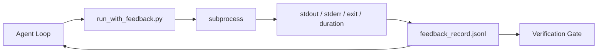

# 執行時期反饋迴圈

> 無法看見真實指令輸出結果的 Agent 只能憑空瞎猜。反饋執行器（Feedback Runner）將標準輸出 stdout、標準錯誤 stderr、結束狀態碼以及耗時時間精準捕獲為結構化記錄，供下一個對話回合讀取。如此一來，Agent 才能依據客觀真實事實採取行動，而非依據自身對事實的主觀幻想。

**Type:** Build
**Languages:** Python (stdlib)
**Prerequisites:** Phase 14 · 32 (Minimal Workbench), Phase 14 · 35 (Init Script)
**Time:** ~50 minutes

## Learning Objectives｜學習目標

- 深入區分執行時期即時反饋（Runtime Feedback）與維運遙測追蹤（Observability Telemetry）的本質差異。
- 打造一套反饋執行器，將 Shell 指令執行過程完整封裝並持久化寫入結構化記錄中。
- 實作確定性截斷機制（Deterministic Truncation），在日誌過大時仍確保迴圈嚴格維持在 Token 配額預算之內。
- 確立「缺失反饋則堅決拒絕推進流程」的硬性安全防線。

## The Problem｜問題

Agent 宣稱「現在開始運行單元測試」。下一條訊息則自信滿滿地表示「所有測試全數通過」。而殘酷的真相卻是：底層根本沒有運行任何測試。Agent 憑空捏造了輸出；或者它雖然發起了指令卻從未讀取結果；抑或是它讀取了結果卻悄悄將關鍵的報錯行截斷忽略了。

反饋執行器徹底消除了此道鴻溝。所有指令皆強制透過執行器發起。每筆記錄皆忠實攜帶：執行的精確指令、捕獲的 stdout 與 stderr、結束狀態碼、實體掛鐘耗時，以及 Agent 自行記錄的一行預期備註。Agent 在下一個對話回合主動讀取該記錄；驗收關卡在任務結束時對照該記錄進行嚴格驗收。

## The Concept｜核心概念



### 反饋記錄的核心欄位

| 欄位名稱 | 為何至關重要 |
|---|---|
| `command` | 精確的 argv 引數陣列，徹底消除 Shell 萬用字元展開的非預期驚喜 |
| `stdout_tail` | 最後 N 行標準輸出，實施確定性安全截斷 |
| `stderr_tail` | 最後 N 行標準錯誤，與標準輸出清晰分離 |
| `exit_code` | 最不可動搖、毫無歧義的成功／失敗判定信號 |
| `duration_ms` | 即時暴露緩慢卡頓的探針與失控死迴圈行程 |
| `started_at` | 供日後重播審計的標準時間戳記 |
| `agent_note` | Agent 在執行前針對自身預期所寫下的一行備註 |

### 確定性截斷機制（Deterministic Truncation）

一份高達 50 MB 的龐大日誌會瞬間摧毀整個上下文視窗。執行器在開頭與結尾實施確定性截斷，並在中間插入 `...truncated N lines...` 標記，確保相同的指令輸出永遠產出完全相同的記錄。不採用隨機抽樣；因為 Agent 最需要看見的關鍵核心資訊（最終錯誤代號、最終結算摘要）永遠沉澱於日誌末端。

### 即時反饋 vs 維運遙測

維運遙測（第 23 課，OTel GenAI 規範）面向的是人類維運團隊跨越宏觀時間軸審視全域運行狀況。而即時反饋則專門服務於當前運行的「下一個對話回合」。兩者雖然共享部分底層欄位，但存放在不同的實體檔案中，且具備完全不同的保留淘汰策略。

### 缺失反饋則堅決拒絕推進流程

若執行器在捕獲結束狀態碼之前發生內部錯誤，記錄會明確標註 `exit_code: null` 以及 `error: <reason>`。Agent 迴圈在此時必須堅決拒絕在 `null` 結束狀態下宣稱成功。沒有拿到明確的結束碼，就絕對不允許推進至下一步。

```figure
wb-feedback-loop
```

## Build It｜動手實作

`code/main.py` 實作了以下核心架構：

- `run_with_feedback(command, agent_note)`：封裝 `subprocess.run`、完整捕獲 stdout/stderr/exit/duration、實施確定性截斷，並追加寫入 `feedback_record.jsonl`；
- 輕量載入器：將 JSONL 串流解析為 Python 串列結構；
- 演示三次典型指令執行（成功、失敗、緩慢運行），並在終端印出每條指令的最新反饋記錄。

運行實驗：

```
python3 code/main.py
```

輸出會呈現追加至 `feedback_record.jsonl` 的三筆反饋記錄，並將最新結果逐行印出。在多次重跑時持續查看該檔案，親眼觀察迴圈如何有條不紊地累積客觀事實。

## Production patterns in the wild｜真實世界中的生產級模式

三大實戰模式確保了反饋執行器具備足夠的強度邁向正式環境：

**在寫入磁碟時即時抹除，而非在讀取時才脫敏**：任何觸及 stdout 或 stderr 的記錄皆可能意外洩漏機密憑證。執行器在將資料追加寫入 JSONL 檔案之前，強制執行正則脫敏過濾：抹除匹配 `^Bearer `、`password=`、`api[_-]?key=`、`AKIA[0-9A-Z]{16}`（AWS 金鑰）與 `xox[baprs]-`（Slack 權杖）的機密行。在讀取時才進行脫敏是極度危險的安全隱患；因為磁碟上的實體檔案才是攻擊者真正能竊取的目標。每季針對正式環境出現的最新金鑰格式，對脫敏規則進行嚴格審計與更新。

**落實檔案輪替歸檔，而非無限制寫入單一檔案**：為 `feedback_record.jsonl` 設定單檔 1 MB 的大小上限；一旦溢位，自動輪替為 `.1`、`.2` 並主動淘汰丟棄 `.5`。Agent 迴圈僅需讀取當前最新的活躍檔案，確保執行時期的記憶體與 I/O 開銷始終受控。CI 產物儲存庫則保留完整的輪替檔案全集。缺乏輪替機制會使該檔案在日後演變為每次載入時的效能死穴。

**引入父指令 ID 串聯重試鏈條**：每筆記錄皆獲配唯一的 `command_id`；重試操作則攜帶 `parent_command_id` 指向先前失敗的嘗試。審核人員的「失敗嘗試清單」（第 40 課）與驗收關卡的審計稽核皆能順著該鏈條完整追溯。若缺乏此鏈結，重試操作在日誌中會看似互不相干的獨立成功，徹底抹除了過往真實發生過的失敗歷史。

## Use It｜實際應用

在正式環境中：

- **Claude Code Bash 工具**：該工具原生已在底層捕獲 stdout、stderr、exit 與 duration。本課實作的執行器則是跨任何框架通用的標準化抽象版本。
- **LangGraph 節點**：將任何 Shell 節點包裹於該執行器中，確保客觀日誌完整持久化保留於狀態圖之外。
- **CI 自動化日誌**：將產出的 JSONL 直接傳輸至 CI 產物儲存庫中；審核人員無需重新執行對話即可完美重播復原任何歷史指令。

反饋執行器是一層極其輕薄的包裝器，因為它牢牢掌控了資料記錄的實體結構，使系統能無畏於未來的任何框架架構遷移。

## Ship It｜交付成果

`outputs/skill-feedback-runner.md` 能為特定專案產出專屬的 `run_with_feedback.py`，內建合理的截斷配額預算、與工作台無縫咬合的 JSONL 寫入器，以及供 Agent 在每前回合主動讀取的載入模組。

## Exercises｜練習

1. 為每筆記錄新增 `cwd` 工作目錄欄位，使在不同目錄下執行的相同指令具備清晰的區分度。
2. 新增 `redaction` 抹除過濾步驟，自動剔除匹配 `^Bearer ` 或 `password=` 的敏感行。在測試記錄上驗證其有效性。
3. 將 `feedback_record.jsonl` 總大小限制在 1 MB 上限並輪替為 `.1`、`.2` 檔案。提出該輪替保留策略的架構論證。
4. 新增 `parent_command_id` 欄位以視覺化重試鏈條：清晰追溯究竟是哪條指令產出了下一條指令所消費的輸入資料。
5. 將產出的 JSONL 導向終端微型 TUI 介面，高亮凸顯最新一次非零狀態碼的異常退出。分析 TUI 必須提供哪八項核心特徵方能真正對程式碼審查具備實質價值。

## Key Terms｜關鍵術語

| 術語 | 常見俗稱 | 實際工程意義 |
|---|---|---|
| Feedback record | 「指令運行日誌」 | 包含精確指令、輸出文字、結束碼與耗時的標準 JSONL 條目 |
| Tail truncation | 「日誌安全截斷」 | 確定性保留頭部與尾部資訊的截斷機制，確保不超出 Token 預算 |
| Refuse-on-null | 「無結束碼即阻斷」 | 當 `exit_code` 為 null 時，強制禁止 Agent 推進任何後續流程 |
| Agent note | 「預期備註」 | Agent 在實體讀取指令執行結果前所寫下的一行前置預測說明 |
| Telemetry split | 「雙軌日誌切分」 | 反饋日誌專供下次回合消費，遙測資料專供維運人員宏觀審查 |

## Further Reading｜延伸閱讀

- [OpenTelemetry GenAI semantic conventions](https://opentelemetry.io/docs/specs/semconv/gen-ai/) ——遙測維度的標準 Schema
- [Anthropic, Effective harnesses for long-running agents](https://www.anthropic.com/engineering/effective-harnesses-for-long-running-agents) ——長時段 Agent 控端環境指引
- [Guardrails AI x MLflow](https://guardrailsai.com/blog/guardrails-mlflow) ——將脫敏模式作為回歸測試的實踐手冊
- [Aport.io, Best AI Agent Guardrails 2026: Pre-Action Authorization](https://aport.io/blog/best-ai-agent-guardrails-2026-pre-action-authorization-compared/) ——動作執行前後的日誌捕獲對比
- [Andrii Furmanets, AI Agents in 2026: Practical Architecture](https://andriifurmanets.com/blogs/ai-agents-2026-practical-architecture-tools-memory-evals-guardrails) ——實用可觀測性架構解析
- Phase 14 · 23——遙測維度的 OTel GenAI 標準規範
- Phase 14 · 24——Agent 可觀測性專用平台（Langfuse、Phoenix、Opik）
- Phase 14 · 33——在宣稱完工前強制要求出示實體反饋的操作規則
- Phase 14 · 38——直接讀取並驗證該 JSONL 反饋日誌的自動化驗收關卡
