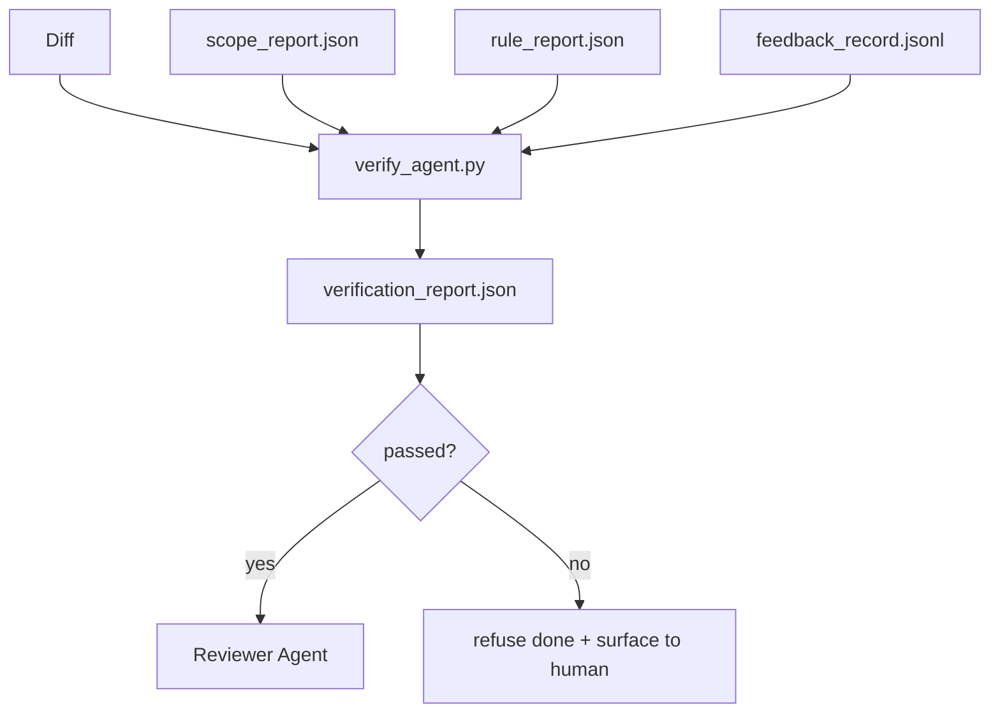

# 自動化驗收關卡（Verification Gates）

> Agent 絕對沒有自己給自己的工作成果打勾標記完工的特權。自動化驗收關卡（Verification Gate）嚴格讀取範疇契約、反饋日誌、規則報告與實體 Git Diff，並回答一個單一核心問題：該任務是否在客觀上真正完工？若驗收關卡判定未通過，無論聊天視窗中的模型語言多麼動聽自信，該任務皆被堅決判定為未完工。

**Type:** Build
**Languages:** Python (stdlib)
**Prerequisites:** Phase 14 · 33 (Rules), Phase 14 · 36 (Scope), Phase 14 · 37 (Feedback)
**Time:** ~55 minutes

## Learning Objectives｜學習目標

- 將驗收關卡定義為基於各項工作台產物（Artifacts）的確定性純函式。
- 綜合規則報告、範疇報告、反饋記錄與 Git Diff 差異，產出單一全域裁決。
- 輸出可供審核 Agent 與 CI 自動化管線共同解析消費的 `verification_report.json`。
- 確立最高原則：遭遇任何阻斷級別（block）的缺陷時，堅決拒絕標記任務完工，絕無例外。

## The Problem｜問題

Agent 宣告成功往往過於輕率。三種典型的欺騙性失效反覆出現：

- 「看似正確」：模型親自通讀了自己的 Git Diff，並主觀宣稱毫無瑕疵。
- 「測試通過」：言之鑿鑿自稱測試全數通過，然而底層根本沒有任何實體執行測試的客觀紀錄。
- 「符合驗收條件」：對驗收合格條件進行過度寬泛的主觀曲解，將「任何看起來差不多沾邊的產物」皆宣告為已完工。

工作台的硬性解法是**單一確定性驗收關卡**：讀取 Agent 先前產出的客觀產物並做出公正裁決。該關卡具備完全的確定性；該關卡受版本控制系統管理；該關卡直接接入 CI 管線。Agent 絕無任何空間能賄賂或繞過它。

## The Concept｜核心概念



### 驗收關卡所檢核的核心面向

| 檢核條款 | 客觀證據來源產物 | 嚴重性等級 |
|---|---|---|
| 所有驗收指令皆確實被實體執行過 | `feedback_record.jsonl` | block（阻斷） |
| 所有驗收指令皆以狀態碼 0 成功退出 | `feedback_record.jsonl` | block |
| 範疇檢查未包含任何絕對禁止寫入 | `scope_report.json` | block |
| 範疇檢查未包含任何越界額外寫入 | `scope_report.json` | block 或 warn |
| 所有阻斷級別規則檢查全數通過 | `rule_report.json` | block |
| 反饋日誌中絕不存在 `null` 結束狀態碼 | `feedback_record.jsonl` | block |
| 實際修改檔案與 `scope.allowed_files` 吻合 | 雙方交叉比對 | warn（警示） |

`warn` 警示會在最終裁決中標註瑕疵；而任何一筆 `block` 阻斷則會徹底禁止輸出 `passed: true`。

### 確定性驗收，而非機率性評分

驗收關卡面對完全相同的產物集合時，必須在每一次執行中產出百分之百相同的裁決結果。絕不允許在此處調用大模型裁判（LLM judges）。大模型裁判專屬於後續的審核者階段（第 39 課）——負責定性程式碼品質與架構風格，而非裁決客觀任務狀態。

### 單一報告路徑，確立唯一事實來源

關卡在任務結算時，針對每個任務統一輸出唯一的 `verification_report.json`，持久化存放於 `outputs/verification/<task_id>.json` 路徑下。CI 管線讀取完全相同的實體檔案。若存在多個路徑互異的驗收關卡，只會引發事實來源的分裂。

### 阻斷性缺陷絕不允許例外放行

阻斷級別（block）的缺陷，Agent 自身完全無權覆寫放行。唯有人類工程師能手動覆寫，且必須強制記錄 `override_reason`（覆寫原因）與 `overridden_by`（操作者使用者 ID）。此覆寫是一次具備數位簽名的責任變更，絕非 Agent 能自主做出的妥協決策。

```figure
wb-gate-sequence
```

## Build It｜動手實作

`code/main.py` 實作了以下核心架構：

- 針對每種輸入產物的載入器（本地全模擬實作，確保自包含獨立運行）；
- 純函式 `verify(task_id, artifacts) -> VerdictReport` 裁決引擎；
- 終端展示逐條檢核結果與最終通關／阻斷裁決的排版輸出；
- 涵蓋三種典型任務情境的實測演示：完美通關、範疇越界、缺失驗收指令執行。

運行實驗：

```
python3 code/main.py
```

輸出包含：三份各自獨立的裁決報告，並持久化儲存於腳本同級目錄下。

## Production patterns in the wild｜真實世界中的生產級模式

四大實戰模式將驗收關卡從「又一條繁瑣的程式碼檢查檢查」升格為「捍衛系統生死的最高防線」：

**縱深防禦，而非單一關卡**：Pre-commit 掛鉤 → CI 狀態檢查 → 工具執行前置授權掛鉤 → 合併前終審關卡。每道防線皆具備確定性，確保任何一層失守皆會被下一層即時捕獲。microservices.io 於 2026 年 3 月的實戰指南明確指出：Pre-commit 掛鉤具備不可繞過性，因為它與模型側的 Prompt 提示不同，它完全不依賴於 Agent 是否「自願遵守規則」。驗收關卡則穩穩鎮守於 CI 與合併前夕。

**確定性檢查負責客觀事實，大模型裁判僅負責定性語感**：Anthropic 於 2026 年提出的混合規範（Hybrid Norm）組合拳：可驗證的客觀獎勵（單元測試、Schema 校驗、結束狀態碼）回答「程式碼是否真正解決了問題？」；而大模型評分手冊則回答「程式碼是否可讀、優雅且符合設計模式？」。驗收關卡專職負責前者；審核 Agent（第 39 課）專職負責後者。兩者混為一談只會導致信號失真崩塌。

**簽名覆寫日誌，而非 Slack 聊天紀錄**：任何人工覆寫皆必須在 `outputs/verification/overrides.jsonl` 中寫入一筆具備時間戳記、缺陷代號、覆寫理由、簽名人員與當前 HEAD Commit 的結構化日誌。執行時期堅決拒絕任何缺乏實體簽名的口頭覆寫；審計追蹤直接納入 Git 版本控制。這是真正具備法律效力的授權策略與形式主義過場之間的本質分水嶺。

**測試覆蓋率底線作為一等公民檢核項**：以 `coverage_report.json` 輸入 `coverage_floor` 檢查（預設 80%）。若實測覆蓋率低於底線、或相較於前次合併基準下降超過 1 個百分點，關卡直接宣告失敗。若缺乏該項防禦，Agent 在遭遇測試報錯時往往會悄悄「直接刪除報錯的單元測試」，導致驗收報告表面全綠、實質程式碼裸奔。

**`--strict` 嚴格模式將所有警告直接晉級為阻斷**：面向發布 branch、發布阻斷 PR 或重大事故復盤時，`--strict` 旗標將每個 warn 警示直接提升為 hard-fail 阻斷。該旗標依 branch 策略按需啟用，而非作為全域預設，避免過度嚴苛扼殺了日常流暢開發。

## Use It｜實際應用

在正式環境中：

- **CI 自動化步驟**：`verify_agent` 任務對照 Agent 的最終產物全量執行關卡。branch 保護規則強制要求 `passed: true` 方獲准合併。
- **移交前置掛鉤**：Agent 執行時期在產出階段移交文件之前，強制調用驗收關卡。缺乏綠燈裁決，堅決不允許產生移交。
- **人工排查介入**：當 Agent 宣稱成功但人類工程師心生疑慮時，維運人員直接調閱該份結構化報告進行秒級診斷。

驗收關卡是整個工作台流程中最具決定性的核心樞紐。其他所有工作台表面，在架構上皆屬於其上游的資料供給端。

## Ship It｜交付成果

`outputs/skill-verification-gate.md` 能為特定專案量身打造驗收關卡：規範哪些驗收指令需接入、哪些規則屬於阻斷級別、哪些範疇越界允許容忍，以及手動覆寫審計日誌該如何持久化儲存。

## Exercises｜練習

1. 新增 `coverage_floor` 檢核項：測試指令必須產出覆蓋率報告且數值不得低於 80%。思考該底線應當由哪份產物承載？
2. 支援 `--strict` 模式，將所有 `warn` 警示直接提升為 `block` 阻斷。深入闡明在何種業務情境下嚴格模式才是正確的預設值。
3. 使關卡在輸出標準 JSON 之餘，同步產出一份簡明易讀的 Markdown 摘要。論證哪些關鍵欄位有資格被收錄至該摘要中。
4. 新增 `time_since_last_human_touch` 檢核項：任何在人類工程師最後鍵盤敲擊後 60 秒內被編輯的檔案，免於被判定為越界寫入。
5. 在你產品中真實的 Agent Git Diff 上運行該關卡。統計產出的缺陷中有多少是真實問題？又有多少屬於誤報雜訊？關卡應當在何處進一步調校收斂？

## Key Terms｜關鍵術語

| 術語 | 常見俗稱 | 實際工程意義 |
|---|---|---|
| Verification gate | 「阻斷卡點」 | 基於各項工作台產物、產出客觀通關／阻斷裁決的確定性純函式 |
| Block severity | 「強制阻斷缺陷」 | 徹底阻止輸出 `passed: true`、強制要求人類簽名覆寫的致命違規 |
| Override log | 「特批放行日誌」 | 包含覆寫理由與操作者 ID、經 Git 追蹤且可供審計的簽名放行日誌 |
| Acceptance command | 「驗收測試指令」 | 結束狀態碼為 0 即代表 `done` 之最高客觀事實的 Shell 指令 |
| One report path | 「單一權威報告路徑」 | `outputs/verification/<task_id>.json`，供 CI 與人類共同讀取的最高事實來源 |

## Further Reading｜延伸閱讀

- [Anthropic, Harness design for long-running application development](https://www.anthropic.com/engineering/harness-design-long-running-apps) ——長時段 Agent 控端設計指南
- [OpenAI Agents SDK guardrails](https://openai.github.io/openai-agents-python/guardrails/) ——安全護欄官方手冊
- [microservices.io, GenAI dev platform: guardrails](https://microservices.io/post/architecture/2026/03/09/genai-development-platform-part-1-development-guardrails.html) ——Pre-commit 與 CI 之間的縱深防禦實踐
- [ICMD, The 2026 Playbook for Agentic AI Ops](https://icmd.app/article/the-2026-playbook-for-agentic-ai-ops-guardrails-costs-and-reliability-at-scale-1776661990431) ——審批階梯與門檻治理手冊
- [Type-Checked Compliance: Deterministic Guardrails (arXiv 2604.01483)](https://arxiv.org/pdf/2604.01483) ——確定性關卡的極限形式化驗證研究
- [logi-cmd/agent-guardrails](https://github.com/logi-cmd/agent-guardrails) ——開源合併卡點規格：範疇驗證與變異測試
- [Guardrails AI x MLflow](https://guardrailsai.com/blog/guardrails-mlflow) ——確定性校驗器在 CI 中的落地實踐
- Phase 14 · 27——Prompt 注入防禦（驗收關卡的對抗性孿生防禦）
- Phase 14 · 36——本關卡所負責強制捍衛的範疇契約
- Phase 14 · 37——本關卡所負責評分驗收的反饋日誌
- Phase 14 · 39——本關卡正式放行後所移交的審核 Agent
