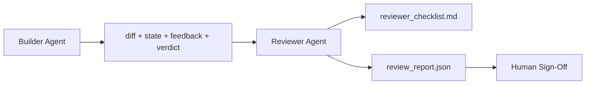

# 審核 Agent：將建置者與評分者徹底分離

> 寫出程式碼的 Agent 絕對不能親自給自己打分數。審核者（Reviewer）是第二個獨立的控制迴圈，擁有截然不同的系統 Prompt、截然不同的目標，並對建置者產出的所有產物僅具備唯讀權限。建置者與審核者之間的架構鴻溝，正是系統可靠性賴以生存的真正沃土。

**Type:** Build
**Languages:** Python (stdlib)
**Prerequisites:** Phase 14 · 38 (Verification Gate)
**Time:** ~55 minutes

## Learning Objectives｜學習目標

- 深入闡明為何同一個 Agent 在認知本質上無法可靠地自我審查。
- 打造一套審核 Agent 迴圈，完整消費建置者產出的客觀產物，並輸出結構化的審查報告。
- 編寫一套具備明確維度、而非憑主觀感覺打分的審核者標準評分表（Reviewer Rubric）。
- 將審核 Agent 接合至工作台體系中，使人類工程師的最終簽名確認始於一份嚴謹的書面產物，而非空白頁面。

## The Problem｜問題

你要求 Agent 修復一個 Bug。它修改了四個檔案、運行了測試，並宣稱大功告成。驗收關卡（第 38 課）確認了驗收指令確實執行過且範疇未超限，關卡亮起綠燈輸出 `passed: true`。你放心地合併了程式碼。然而兩天之後，你卻驚恐地發現：該修復在根本上修錯了 Bug 的另一半，甚至解決了完全不相干的問題。

驗收關卡是必要的，但它並不充分。審核者專門提出那些確定性驗收無法回答的深層問題：這項修改是否解決了真正的問題？它是否在未標註的情況下暗中擴大了範疇？它所做出的前提假設是否留存於可供審計的地方？它留下的工作台狀態是否足以讓下一個階段作業平滑接手？

## The Concept｜核心概念



### 審核者評分標準表（Reviewer Rubric）

涵蓋五大維度，每項評分 0 至 2 分。

| 評估維度 | 核心檢核問題 |
|---|---|
| Problem fit（問題切合度） | 該變更是否精準解決了最初交辦的任務，而非解決了一個相鄰的無關問題？ |
| Scope discipline（範疇紀律性） | 編輯改動是否嚴格收斂在契約內部，或者契約的擴展是深思熟慮且有據可查的？ |
| Assumptions（假設顯式化） | 所有隱性假設是否皆被白紙黑字寫在可供審查的文件中？ |
| Verification quality（驗收品質度） | 驗收指令是否真正證明了目標達成，抑或只是證明了一個縮水閹割版的目標？ |
| Handoff readiness（移交就緒度） | 下一個對話階段作業能否自當前狀態乾淨俐落地無縫接手？ |

滿分為 10 分。總分低於 7 分屬於軟性未通過（Soft fail）；總分低於 5 分則屬於硬性阻斷（Hard fail）。

### 審核者是角色分離，而非模型分離

你完全可以使用與建置者完全相同的底層大模型來運行審核者。這項架構紀律的精髓在於**角色的嚴密隔離**：截然不同的系統 Prompt、截然不同的輸入上下文脈絡，且對實體 Git Diff 堅決不具備寫入修改權限。系統姿態的根本轉變，直接帶來了信號品質的質的飛躍。

### 審核者絕對無權編輯 Git Diff

審核者閱讀 Diff、讀取狀態、審視反饋、覆核驗收裁決。它產出的是審查報告。它**絕不親自動手修改 Diff**。若報告指出「請修復此處瑕疵」，由下一個建置者回合負責實施修復；審核者隨後退回審核位。一旦角色混淆，兩者之間的防禦鴻溝將瞬間蕩然無存。

### 審核者評分手冊 vs 自動化驗收關卡

驗收關卡（第 38 課）專門核驗確定性的客觀事實：驗收指令是否執行過、規則是否全數通過、範疇是否被遵守。而審核者則專門做出質性判斷：方向是否正確、假設是否記錄在案、移交是否真正可用。兩者皆不可或缺。

```figure
wb-builder-marker
```

## Build It｜動手實作

`code/main.py` 實作了以下核心架構：

- `ReviewerInputs` 資料類別：完整打包審核者所需閱讀的各項產物；
- 評分標準打分器：每個維度配置一個專屬評分函式（教學中為確定性的模擬常式，正式環境會調用 LLM）；
- `review_report.json` 寫入器：輸出五項維度得分、總分與最終裁決（`pass`、`soft_fail`、`hard_fail`）；
- 兩次演示案例：一次乾淨俐落的合規變更，另一次為「測試通過、但修錯問題」的典型失效變更。

運行實驗：

```
python3 code/main.py
```

輸出包含：寫入磁碟的兩份審查報告，以及終端格式化呈現的維度評分表格。

## Production patterns in the wild｜真實世界中的生產級模式

客觀實測數字證明：Cloudflare 於 2026 年 4 月發布的 AI 程式碼審查系統實測顯示，其在 30 天內跨越 5,169 個儲存庫的 48,095 個 Merge Requests 中執行了 131,246 次審查運行。單次審查耗時中位數僅為 3 分 39 秒。在「審查協調器（Review Coordinator）」的指揮下，多達 7 個專業領域審核者（資安、效能、程式碼品質、文檔、發布管理、合規性、工程規範）並行發起審查，由協調器負責去重並判定嚴重性。頂級旗艦模型嚴格專供協調器使用；各專業領域專家則運行於更便宜的輕量模型層級。

四大實戰模式支撐了該架構在規模化場景下的穩健運作：

**專業專家池，而非單一龐大的全能審核者**：對於個人專案，單一包含 5 個維度的評分表足矣。一旦程式碼庫涉及資安敏感、極致效能與架構文檔等多個深水區表面，應當拆分為擁有多個小 Prompt 的專業專家。協調器負責去重；專家絕不需要通讀整本百科全書。這自然實現了模型層級的分流：輕量模型跑專家，旗艦模型跑協調器。

**消除偏見是系統架構需求，而非選配最佳化**：大模型裁判存在四種可預測的可靠偏見（Adnan Masood，2026 年 4 月）：位置偏見（Position bias，GPT-4 在 (A,B) 與 (B,A) 順序下有一致性缺失問題）、冗長偏見（Verbosity bias，傾向於為字數更多的囉嗦長文打高分）、自喜好偏見（偏愛同模型家族產出的內容）、權威偏見（過度迷信知名作者的引用）。緩解方案：同時評估正反兩種順序且僅在一致時採納；採用明確獎勵簡練文字的 1–4 分評分制；跨模型家族輪換裁判；在評分前強制剔除作者姓名後設資料。

**建立標準標定校準集，而非憑主觀感覺盲測**：維護一份包含 10 到 20 個歷史任務及其已知正確裁決的基準校準集。每當修改審核 Prompt 時，強制在該資料集上全量重跑。若與歷史真實結果的一致性低於 80%，該評分標準必須重新修訂後方獲准發布。

**與驗收關卡組成混合規範（Hybrid Norm）**：驗收關卡（第 38 課）全權負責客觀確定性檢查（指令是否執行過、測試是否通過、範疇是否守住）。審核者則專職負責語意質性檢查（方向是否正確、假設是否完備、移交是否可用）。Anthropic 於 2026 年的指引明確強調了此切分：切勿要求審核者重複去做驗收關卡早已證明的事情。

## Use It｜實際應用

在正式環境中：

- **Claude Code 子 Agent**：在建置者關閉任務後，自動啟動審核者子 agent。它會在 PR 上直接發表包含評分細項的評論。
- **OpenAI Agents SDK 委派移交**：建置者在任務完工時移交給審核者。審核者可帶著缺陷清單反手退回給建置者，或向上呈報給人類。
- **雙模型協同拍檔**：建置者運行於速度更快、成本更低的輕量模型；審核者則運行於推理更深、上下文更精煉的頂級旗艦模型。

審核者是當人類工程師無暇親自通讀每次微小變更時，工作台自主生長出的「第二雙眼睛」。

## Ship It｜交付成果

`outputs/skill-reviewer-agent.md` 能為特定專案量身產出審核者評分標準表、對接建置者產物的審核 Agent 骨架，以及與驗收關卡的串聯配置，確保人類審查始於一份結構化的書面報告，而非一片空白。

## Exercises｜練習

1. 針對你的垂直業務領域新增第六個專屬評分維度。提出架構論證，說明它為何無法被收斂歸納至既有的五大維度中。
2. 使用兩種截然不同的系統 Prompt（簡練風 vs 詳盡風）運行審核者。哪一種產出的報告更容易被人類工程師認真通讀？
3. 為每個評分維度新增 `confidence` 置信度欄位。當最低維度的置信度低於 0.6 時，堅決拒絕發布該審查報告。
4. 建立一份標定校準資料集：包含 10 個歷史任務及其已知正確的裁決。運行審核者進行對照，分析它在何處與歷史客觀事實產生了分歧。
5. 新增「要求出示更多證據」的互動機制：審核者在正式打分前，有權要求建置者補跑一項特定的單元測試。該如何設計退避機制以防陷入死迴圈？

## Key Terms｜關鍵術語

| 術語 | 常見俗稱 | 實際工程意義 |
|---|---|---|
| Reviewer rubric | 「審核檢查清單」 | 包含五個維度、每個維度評分 0 至 2 分且附帶具體問題的標準評分手冊 |
| Soft fail | 「需返工修改」 | 總分低於 7 分；建置者會收到缺陷清單並強制要求進行針對性修改 |
| Hard fail | 「直接駁回」 | 總分低於 5 分或任何單一維度得 0 分；流程立即中斷並呈報人類工程師 |
| Role separation | 「角色解耦」 | 相同的模型可以承擔兩種角色；關鍵在於完全隔離的 Prompt 姿態與輸入限制 |
| Confidence floor | 「低置信度不發布」 | 當評分標準對自身判斷缺乏足夠把握時，拒絕輸出草率的裁決結果 |

## Further Reading｜延伸閱讀

- [OpenAI Agents SDK handoffs](https://openai.github.io/openai-agents-python/handoffs/) ——委派移交架構指南
- [Anthropic Claude Code subagents](https://code.claude.com/docs/en/sub-agents) ——子 agent 協同模式手冊
- [Cloudflare, Orchestrating AI Code Review at Scale](https://blog.cloudflare.com/ai-code-review/) ——7 專家 + 協調者架構，30 天內 13 萬次運行實證
- [Agent-as-a-Judge: Evaluating Agents with Agents (OpenReview / ICLR)](https://openreview.net/forum?id=DeVm3YUnpj) ——DevAI 基準與 366 項階層式解法需求
- [Adnan Masood, Rubric-Based Evaluations and LLM-as-a-Judge](https://medium.com/@adnanmasood/rubric-based-evals-llm-as-a-judge-methodologies-and-empirical-validation-in-domain-context-71936b989e80) ——四類大模型裁判偏見及其消除對策
- [MLflow, LLM-as-a-Judge Evaluation](https://mlflow.org/llm-as-a-judge) ——建置者與評估者解耦之生產級工具
- [LangChain, How to Calibrate LLM-as-a-Judge with Human Corrections](https://www.langchain.com/articles/llm-as-a-judge) ——標定校準資料集工作流程
- [Evidently AI, LLM-as-a-judge: a complete guide](https://www.evidentlyai.com/llm-guide/llm-as-a-judge)
- [Arize, LLM as a Judge — Primer and Pre-Built Evaluators](https://arize.com/llm-as-a-judge/)
- Phase 14 · 05——Self-Refine 與 CRITIC（單 Agent 自我審查之基準線）
- Phase 14 · 30——評測驅動開發（標定校準資料集生成機制）
- Phase 14 · 38——審核者所依託閱讀的自動化驗收關卡
- Phase 14 · 40——直接消費本審查報告的階段移交封包
