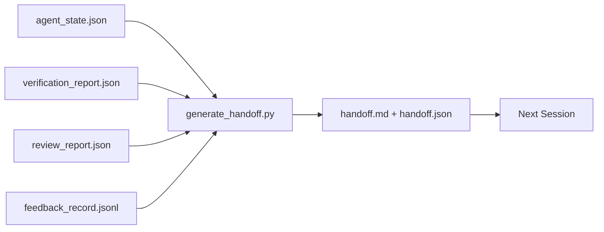

# 跨階段作業移交（Multi-Session Handoff）

> 當前的對話階段作業終將結束，但實體工程任務尚未完工。移交封包（Handoff Packet）是將「Agent 苦幹了一小時」轉化為「下一個階段作業在第一分鐘內即具備高效生產力」的關鍵產物。必須深思熟慮地主動建構它，絕非作為事後的隨性點綴。

**Type:** Build
**Languages:** Python (stdlib)
**Prerequisites:** Phase 14 · 34 (Repo Memory), Phase 14 · 38 (Verification), Phase 14 · 39 (Reviewer)
**Time:** ~50 minutes

## Learning Objectives｜學習目標

- 掌握每個移交封包皆不可或缺的七大必備核心欄位。
- 直接依據各項工作台產物自動生成移交封包，完全無需手動撰寫散文說明。
- 將龐大的反饋日誌精準修剪提煉為適合移交封包容量的精簡摘要。
- 確保下一個對話階段作業的第一步具備百分之百的確定性。

## The Problem｜問題

階段作業結束。Agent 自信地宣告「太棒了，我們取得了長足進展」。下一個階段作業開啟。全新進來的 Agent 迷茫地發問「我們之前停在哪裡？」。前一個 Agent 的記憶早已隨風而逝。新的 Agent 被迫重新摸索、重新執行完全相同的指令、向人類重新提出完全相同的問題，白白浪費了三十分鐘，僅僅為了找回前一個階段作業在最後三十秒內早已得出的結論。

一份糟糕的移交所帶來的代價，會在該任務的整個生命週期中被每個階段作業重複支付。唯一的解法是在階段作業結束時自動產出標準化封包：變更了什麼、為何變更、嘗試了什麼、哪裡失敗了、還剩什麼，以及下一次啟動時第一步該做什麼。

## The Concept｜核心概念



### 每個移交封包必備的七大核心欄位

| 欄位名稱 | 該欄位回答的核心問題 |
|---|---|
| `summary` | 用一段話精確概括本次階段作業完成了什麼 |
| `changed_files` | 一目了然的 Git 變更檔案清單 |
| `commands_run` | 究竟實體執行了哪些指令 |
| `failed_attempts` | 曾經嘗試了什麼，以及為何未能成功 |
| `open_risks` | 下一個階段作業可能遭遇的潛在風險及其嚴重性 |
| `next_action` | 下一個階段作業必須採取的第一個具體行動 |
| `verdict_pointer` | 指向驗收報告與審核報告的精確路徑指標 |

其中，`next_action` 承載著最高的系統權重。一份包含其他所有欄位、卻缺失 `next_action` 的文件，僅是一份被動的現狀報告，根本稱不上是真正的移交封包。

### 移交封包是自動生成的，而非人工手寫的

依賴人工撰寫的移交文件，在遇到繁重高壓的關鍵時刻必然會被遺漏跳過。生成器直接讀取各項工作台產物並自動產出封包。Agent 的唯一職責是將工作台維持在易於被生成器提煉總結的健康狀態，而非親自動手編寫大段摘要文字。

### 人類可讀與機器可讀的雙重形態

`handoff.md` 專供人類工程師快速通讀；而 `handoff.json` 則專供下一個 Agent 在啟動時直接機器載入。兩者全數衍生自完全相同的底層產物。若兩者產生歧義，以 JSON 內容為準。

### 反饋日誌精準修剪

完整的 `feedback_record.jsonl` 可能包含數百條詳細記錄。移交封包僅收錄最後 K 條記錄，加上所有以非零狀態碼退出的異常記錄。下一個階段作業若有需要可按需載入完整日誌，但移交封包本身必須保持精煉小巧。

### 留下乾淨的工作台狀態

移交封包負責描述工作；而乾淨的工作台狀態則確保工作具備真正的**可斷點續傳性（Resumable）**。兩者不可混為一談。若下一個階段作業一打開，面對的是改動到一半的散亂 Diff、Agent 遺留的暫存垃圾檔、孤立的 detached HEAD 狀態，以及在執行前就崩潰報錯的單元測試，那麼一份辭藻華麗的 `handoff.md` 將毫無價值。新的 Agent 將被迫把最初十分鐘浪費在替前任收拾爛攤子上，這種摩擦成本會在每個階段作業中層層累積。

因此，對話階段作業絕非在「功能看似可用」的當下結束，而是在「工作台處於易於被生成器提煉、且下一個階段作業能百分之百信任」的狀態下方獲准結束。清理善後是一個獨立的階段，在生成移交封包之前強制執行；它是一項硬性檢查，絕非憑良心的主觀習慣。

| 檢查面向 | 乾淨狀態的具體標準 | 為何殘留髒狀態會被強制阻斷 |
|---|---|---|
| Working tree（工作目錄） | 每個變更皆已建立 commit 或帶著明確註解暫存至 stash | 改到一半的殘留 Diff 會被下一個 Agent 誤判為刻意為之的半成品 |
| Temp artifacts（暫存產物） | 絕不殘留 `*.tmp`、暫存測試目錄、除錯 print 或大段被註解的廢棄程式碼 | 隨意散落的暫存檔會污染 Git Diff 與下一個 Agent 的心智模型 |
| Tests（單元測試） | 全數綠燈通過；若為紅燈，其失敗現象必須顯式記錄於 `open_risks` | 靜默報錯的單元測試是下一個階段作業極易踩入的致命陷阱 |
| Feature board（功能看板） | `feature_list.json` 的狀態真實反映客觀現狀（第 36 課） | 過時陳舊的看板會指引下一個 Agent 去做早已完工的重複工作 |
| Branch（Git branch） | 處於預期的正確 branch，嚴禁處於 detached HEAD 或孤兒 branch | 錯誤的 branch 會導致下一個階段作業的第一個 commit 寫入至錯誤位置 |

清理檢查常式會輸出包含各項阻斷問題的 `clean_state.json`；唯有當該清單為空時，移交生成器才獲准正式輸出封包。建構在髒亂工作目錄之上的移交封包根本不是移交，而是一場惡意甩鍋。這兩項產物相輔相成：清理證明了工作台是安全的，而移交則證明了下一個階段作業清楚知曉從何開始。

```figure
wb-handoff-packet
```

## Build It｜動手實作

`code/main.py` 實作了以下核心架構：

- 收集器：將狀態、驗收裁決、審查報告與反饋日誌匯總為單一 `WorkbenchSnapshot` 快照；
- `generate_handoff(snapshot) -> (markdown, payload)` 核心生成函式；
- 日誌過濾器：精準提取最後 K 條反饋與所有非零退出的異常記錄；
- 演示運行：在腳本同級目錄下自動生成 `handoff.md` 與 `handoff.json`。

運行實驗：

```
python3 code/main.py
```

輸出會呈現排版精美的移交文字，並在實體磁碟上同時寫入這兩份結構化檔案。

## Production patterns in the wild｜真實世界中的生產級模式

Codex CLI、Claude Code 與 OpenCode 各自實作了截然不同的上下文壓縮方案；而結構化的移交封包則優雅地跨越並凌駕於這三者之上：

**壓縮機制各異，但移交封包 Schema 保持永恆**：Codex CLI 的 POST /v1/responses/compact 採用伺服器端不透明的 AES 加密 Blob（針對 OpenAI 模型的極速路徑）；其本機回退方案則是將「移交摘要」作為 `_summary` 使用者角色訊息追加至上下文尾端。Claude Code 在視窗達到 95% 時執行五階段漸進式壓縮。OpenCode 則採用基於時間戳記的訊息隱藏搭配五標題 LLM 摘要。三種截然不同的底層機制，共同指向同一個核心需求：將壓縮後倖存下來的精華序列化為可移植的實體產物。移交封包正是該實體產物。

**開啟全新階段作業絕非單純上下文壓縮**：壓縮僅是延長當前階段作業壽命；而移交則是優雅乾淨地關閉當前階段作業，並啟動全新的乾淨階段作業。Hermes 專案 Issue #20372（2026 年 4 月）提出的論斷一針見血：當就地壓縮開始引發推理品質劣化時，Agent 應當主動產出精簡的移交封包、徹底終止當前階段作業，並在全新的乾淨脈絡中恢復執行。移交封包正是讓這種切換成本趨近於零的關鍵。常見的致命錯誤是一路死撐壓縮直到輸出徹底失控崩潰；正確的作法是提前規劃並主動觸發乾淨移交。

**每個 branch 與主題維持唯一活躍移交**：多 Agent 協同中最常見的故障，往往源自過時陳舊的移交檔案，而非模型能力缺陷。必須強制在封包中包含 `branch`、`last_known_good_commit`，以及一個 `status` 狀態為 `active | superseded | archived`。過時的移交被自動歸檔（archived）；唯有唯一標記為 active 的封包才獲准驅動下一個階段作業。這是單純筆記與實體狀態的本質分水嶺。

**在脈絡消耗達 50–75% 時即主動收尾，切勿死撐到 95% 撞牆**：一線實戰指引（CLAUDE.md + HANDOVER.md 模式）報告指出：當階段作業在脈絡預算消耗達 50–75% 時便主動進行移交收尾，系統穩定性最佳。在上下文脈絡完好無損時，封包生成器能精準提取事實；而在模型早已迷失方向時，產出的移交只會充斥幻覺。

## Use It｜實際應用

在正式環境中：

- **階段作業結束掛鉤**：當使用者在介面中關閉對話時，執行時期自動觸發生成器，將封包歸檔寫入 `outputs/handoff/<session_id>/`。
- **PR 描述範本**：生成器產出的 Markdown 文字可直接作為 GitHub PR 的標準描述主體。審核人員無需翻閱其他五個檔案即可完整掌握全局。
- **跨 Agent 異構交接**：使用 Claude Code 進行架構開發，使用 Codex 接手後續測試。結構化移交封包正是不同工具之間的通用世界語。

移交封包輕量、規整且生成成本極低。它所節省的排查時間，會在每個對話階段作業中產生巨大的複利效應。

## Ship It｜交付成果

`outputs/skill-handoff-generator.md` 能為特定專案自動產出專屬的移交生成器、階段作業結束掛鉤，以及下一個 Agent 啟動時直接讀取的標準 `handoff.json` Schema 契約。

## Exercises｜練習

1. 新增 `assumptions_to_validate` 欄位：將建置者記錄在案、但審核者評分未達 2 分的所有前提假設專門列舉出來。
2. 針對失敗運行與成功運行實施非對稱的日誌修剪策略：在任務失敗時保留更多詳細堆疊。提出該非對稱性的架構論證。
3. 新增「待向人類請教的疑點清單（Questions for the human）」。深入思考：何種等級的問題才具備資格被寫入正式封包，何種問題應當在對話中即時提出？
4. 確保移交生成器具備完全的冪等性：連續運行兩次必須產出完全相同的封包。為了維持該特性，底層哪些資料必須保持穩定？
5. 新增「下個階段作業必備前置條件」章節：嚴格列舉下一個 Agent 在採取任何行動前必須預先載入的具體產物路徑清單。

## Key Terms｜關鍵術語

| 術語 | 常見俗稱 | 實際工程意義 |
|---|---|---|
| Handoff packet | 「階段作業交接封包」 | 自動生成的實體產物，包含七大必備欄位，具備 Markdown 與 JSON 雙重形態 |
| Next action | 「下一步具體行動」 | 承載最高權重的核心欄位；下一個階段作業啟動時必須落實執行的第一步 |
| Feedback trim | 「日誌精簡摘要」 | 保留最後 K 條記錄加上所有異常退出記錄的確定性修剪機制 |
| Status report | 「現狀匯報」 | 缺少 `next_action` 的被動文件；僅具備資訊性，無法作為合格的移交封包 |
| Verdict pointer | 「驗收指標路徑」 | 指向驗收報告與審核報告的精確路徑，確立完整的來源追溯鏈 |

## Further Reading｜延伸閱讀

- [Anthropic, Effective harnesses for long-running agents](https://www.anthropic.com/engineering/effective-harnesses-for-long-running-agents) ——長時段 Agent 控端環境指引
- [OpenAI Agents SDK handoffs](https://openai.github.io/openai-agents-python/handoffs/) ——委派移交架構指南
- [Codex Blog, Codex CLI Context Compaction](https://codex.danielvaughan.com/2026/03/31/codex-cli-context-compaction-architecture/) ——上下文壓縮與本機回退機制
- [Justin3go, Shedding Heavy Memories: Context Compaction](https://justin3go.com/en/posts/2026/04/09-context-compaction-in-codex-claude-code-and-opencode) ——三大廠商壓縮機制橫向對比
- [JD Hodges, Claude Handoff Prompt: Keep Context Across Sessions](https://www.jdhodges.com/blog/ai-session-handoffs-keep-context-across-conversations/) ——實戰移交手冊，50–75% 預算原則
- [Mervin Praison, Managing Handoffs in Multi-Agent Coding Sessions](https://mer.vin/2026/04/managing-handoffs-in-multi-agent-coding-sessions-fresh-context-without-losing-continuity/) ——分散式系統視角下的移交治理
- [Hermes Issue #20372 — automatic fresh-session handoff](https://github.com/NousResearch/hermes-agent/issues/20372) ——全新階段作業移交實證
- [Hermes Issue #499 — Context Compaction Quality Overhaul](https://github.com/NousResearch/hermes-agent/issues/499) ——以移交為核心的 Prompt 設計
- [Microsoft Agent Framework, Compaction](https://learn.microsoft.com/en-us/agent-framework/agents/conversations/compaction) ——微軟官方壓縮機制
- [OpenCode, Context Management and Compaction](https://deepwiki.com/sst/opencode/2.4-context-management-and-compaction) ——脈絡治理
- [LangChain, Context Engineering for Agents](https://www.langchain.com/blog/context-engineering-for-agents) ——脈絡工程學
- Phase 14 · 34——本生成器所讀取的持久化狀態檔案
- Phase 14 · 38——本移交封包所精確指向的自動化驗收裁決
- Phase 14 · 39——本移交封包所打包封裝的獨立審查報告
