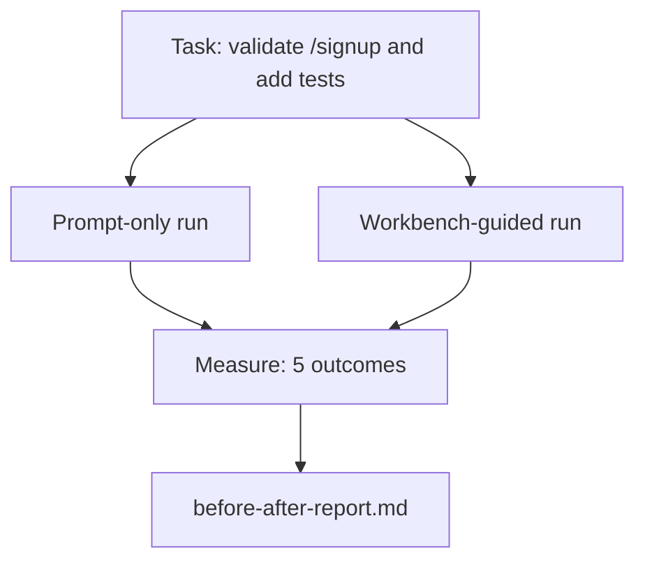

# 真實儲存庫上的工作台實戰

> 若無法經受住真實程式碼儲存庫的碰撞考驗，前面十一課所講授的所有工作台表面皆毫無實戰價值。本課在一個小巧但逼真的範例應用程式上，將完全相同的任務執行兩次：純 Prompt 運行 vs 工作台引導運行。讓冷冰冰的客觀數字代替所有的主觀爭辯。

**Type:** Build
**Languages:** Python (stdlib)
**Prerequisites:** Phases 14 · 32 to 14 · 40
**Time:** ~60 minutes

## Learning Objectives｜學習目標

- 在小型應用程式中，將七大工作台表面完整整合為一套有機咬合的工程整體。
- 將完全相同的任務執行兩次（純 Prompt vs 工作台引導），並精準量測五項關鍵產出指標。
- 深度解讀「導入前後對照報告（Before/After Report）」，明確判斷哪些工作台表面帶來了最大的架構槓桿。
- 具備充足的量化論據，有力回擊「但我的大模型已經足夠聰明」的質疑。

## The Problem｜問題

在脫離實際的玩具程式碼上進行 Demo 演示，無法說服任何嚴謹的資深工程師。工作台工程學的真正價值，體現在讓一個逼真的任務在逼真的程式碼庫中落地時，展現出更少的缺陷、更少的回滾，以及為下一個階段作業留下真正可用的移交封包。

本課提供了一個逼真的範例儲存庫，並引導同一個任務分別穿透兩條截然不同的管線。其最終產出的「導入前後對比報告」，正是你可以直接遞給任何懷疑論者的最佳客觀證據。

## The Concept｜核心概念



### 範例應用程式架構

位於 `sample_app/` 的極簡 FastAPI 風格微服務：

- `app.py`：包含 `/signup` 註冊路由（尚未實作任何輸入驗證）；
- `test_app.py`：包含一項基本的成功路徑測試；
- `README.md` 與 `scripts/release.sh`：刻意作為考驗模型邊界自律的「禁止碰觸誘餌」。

### 實戰任務說明

> 為 `/signup` 路由新增輸入驗證：拒絕長度短於 8 個字元的密碼，並回傳帶有強型別錯誤結構的 422 狀態碼。同時新增一項單元測試，確鑿證明該新行為正常生效。

### 兩條對照執行管線

純 Prompt 流程：

1. 閱讀 README；
2. 閱讀 `app.py`；
3. 直接動手編輯檔案；
4. 口頭宣稱任務完成。

工作台引導流程：

1. 運行初始化腳本（第 35 課）；
2. 讀取範疇契約（第 36 課）；
3. 讀取狀態檔案（第 34 課）；
4. 嚴格僅編輯獲准的檔案；
5. 透過反饋執行器調用驗收測試指令（第 37 課）；
6. 運行自動化驗收關卡（第 38 課）；
7. 啟動獨立審核 Agent 進行質性評分（第 39 課）；
8. 自動生成跨階段作業移交封包（第 40 課）。

### 量測的五大關鍵維度

| 衡量指標 | 為何至關重要 |
|---|---|
| `tests_actually_run` | 絕大多數「測試全數通過」的口頭宣稱皆無法被客觀驗證 |
| `acceptance_met` | 實體執行的測試必須正是那條能確鑿證明目標達成的核心測試 |
| `files_outside_scope` | 範疇蔓延是長路徑任務中最常見、最致命的隱性失效 |
| `handoff_quality` | 下一個階段作業究竟是能直接接手，還是被迫重新摸索一切 |
| `reviewer_total` | 在確定性關卡之上，由獨立角色做出的質性工程裁決 |

```figure
wb-ab-runs
```

## Build It｜動手實作

`code/main.py` 在相同的範例應用程式測試環境上編排了這兩條管線。兩條管線皆採用腳本化模擬（完全不調用外部 LLM），確保每次量測結果具備百分之百的可重現性。腳本會自動將對比結果寫入 `before-after-report.md` 與 `comparison.json`。

運行實驗：

```
python3 code/main.py
```

輸出包含：終端對照表格呈現兩條管線的各項指標、儲存於同級目錄下的 Markdown 診斷報告，以及方便繪製圖表的 JSON 資料。

## Production patterns in the wild｜真實世界中的生產級模式

懷疑論者最常提出的質疑是：「工作台到底能帶來多少實質提升？」2026 年來自一線工業界的量化數字，遠比任何抽象解釋更具說服力：

**Terminal Bench 在完全相同的模型下從前 30 名開外躍升至全球第 5 名**：LangChain 發布的《Anatomy of an Agent Harness》（2026 年 4 月）實證指出：在完全不更換底層模型的前提下，僅僅調校外圍控端架構，一款寫程式 Agent 在 Terminal Bench 2.0 上的排名直接飆升了 25 名。相同的模型，不同的工作台表面，帶來了完全不同量級的工程產出。

**Vercel 大膽刪除 80% 的工具，成功率自 80% 躍升至 100%**：Vercel 官方報告指出，將 Agent 的可用工具刪除 80%，任務成功率反而自 80% 飆升至 100%。更小的工具表面、更鋒利的範疇約束、更少的出錯途徑。留白與克制創造了奇蹟。

**Harvey 單純依靠控端工程使法律 Agent 準確率翻倍**：在完全不調整模型權重的前提下，控端架構最佳化直接讓法律檢索與審查的準確率提升了一倍以上。

**88% 的企業級 AI Agent 專案無法成功邁向正式環境**：preprints.org 發布的《Harness Engineering for Language Agents》（2026 年 3 月）深入追溯了失敗根源，發現絕大多數事故全數源自執行時期架構而非大模型推理能力：陳舊的狀態、脆弱的重試、失控膨脹的上下文脈絡，以及面對中繼錯誤時糟糕的復原能力。

**長脈絡崩潰效應（Long-context collapse）**：WebAgent 的基準任務完成率在長脈絡情境下，自 40–50% 斷崖式暴跌至 10% 以下，元兇全數是死迴圈與目標遺忘。Ralph Loop 與移交封包正是專門為吸收該崩潰而生。

**客觀承認「偽陰性（假警報）」的存在**：單一步驟的事實性任務、單行程式碼 Lint 檢查、格式化排版等大模型早已逐字倒背如流的極簡任務——在純 Prompt 下速度確實更快。優秀的基準評測應當誠實列舉這些場景，絕不將工作台吹捧為包治百病的萬靈丹。

核心結論絕非「工作台能永遠凌駕於模型之上」——模型隨時間確實會逐步吸收部分工作台技巧。核心結論在於：**在當下，最具決定性的工程負載全數落在了這七大工作台表面之上，而客觀實測數字早已給出了定論。**

## Use It｜實際應用

當遭遇以下情境時，本課的實證報告正是你最有力的依據：

- 有人質疑為何每個 PR 皆必須附帶 `agent-rules.md` 與範疇契約；
- 團隊企圖在專案衝刺期間「暫時拔除」自動化驗收關卡；
- 引入全新的 Agent 產品，需要一套通用的基準測試以評估其究竟能否實質節省工程時間。

數字傳遞的說服力，遠遠勝過千言萬語的解釋。

## Ship It｜交付成果

`outputs/skill-workbench-benchmark.md` 是一套可移植的評測控端技能。它能在特定專案的真實範例應用上，對任何 Agent 產品同時運行這兩條管線，並自動量化產出五大核心指標報告。

## Exercises｜練習

1. 新增第六個評估維度：「首個有意義實質修改之耗時（Time-to-first-meaningful-edit）」。思考該如何純淨客觀地量測該指標？
2. 在你自家程式碼庫中挑選一個真實的「次日接手任務」，全流程運行此對照實驗。工作台的各項指標在何處發生了輕微滑落？
3. 增加「偽陰性」專項評測：挑選那些純 Prompt 顯然更快、工作台顯得過度設計的極簡任務。提出為何在全域維度下依然必須堅持引入工作台的架構論證。
4. 將腳本化的模擬 Agent 替換為真實的大模型 API 網路呼叫。哪些量測維度的隨機雜訊開始顯著放大？
5. 撰寫一份面向非技術高層的一頁式架構摘要。在嚴格刪減下，哪些核心結論必須被重點保留？

## Key Terms｜關鍵術語

| 術語 | 常見俗稱 | 實際工程意義 |
|---|---|---|
| Sample app | 「逼真範例儲存庫」 | 小巧但結構完整、足以全面檢驗全部七大工作台表面的真實程式碼庫 |
| Pipeline | 「執行管線」 | Agent 必須依序嚴格遵循的工作台表面讀寫執行序列 |
| Before/after report | 「客觀實測戰報」 | 能直接遞交給懷疑論者、以量化數字說話的導入前後對比報告 |
| False negative | 「工作台過度設計」 | 純 Prompt 速度更快、工作台開銷大於收益的極簡任務；應坦誠列舉 |
| Workbench benchmark | 「可靠性基準評測」 | 跨越不同 Agent 產品、在目標程式碼庫上客觀驗收其工程可靠性的測試控端 |

## Further Reading｜延伸閱讀

- [LangChain, The Anatomy of an Agent Harness](https://blog.langchain.com/the-anatomy-of-an-agent-harness/) ——Terminal Bench 前 30 名躍升至第 5 名實證
- [MongoDB, The Agent Harness: Why the LLM Is the Smallest Part of Your Agent System](https://www.mongodb.com/company/blog/technical/agent-harness-why-llm-is-smallest-part-of-your-agent-system) ——Vercel 80% 躍升 100%、Harvey 準確率翻倍之客觀實證
- [preprints.org, Harness Engineering for Language Agents](https://www.preprints.org/manuscript/202603.1756) ——88% 企業級失敗率與執行時期根因分析
- [HN: Improving 15 LLMs at Coding in One Afternoon. Only the Harness Changed](https://news.ycombinator.com/item?id=46988596) ——跨 15 款大模型的控端改進實證
- [Cloudflare, Orchestrating AI Code Review at Scale](https://blog.cloudflare.com/ai-code-review/) ——30 天內 13 萬次生產級審查運行報告
- [Anthropic, Building Effective Agents](https://www.anthropic.com/research/building-effective-agents) ——高效 Agent 架構指南
- Phases 14 · 32 to 14 · 40——本課在此進行端到端全量檢驗的全部工作台表面
- Phase 14 · 19——本課所互補的宏觀基準評測（SWE-bench、GAIA、AgentBench）
- Phase 14 · 30——本測試控端可無縫接入的評測驅動開發（Eval-Driven Development）
