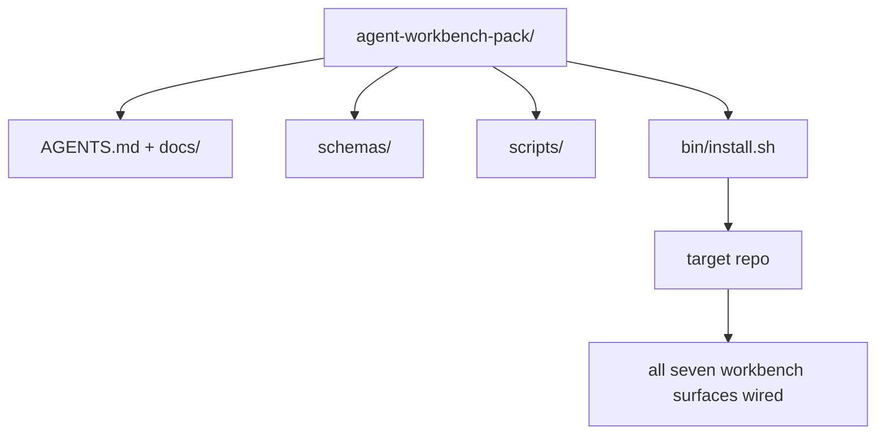

# 總結專題：交付可重複利用的 Agent 工作台整合包

> 本微專題（Mini-track）以一套可直接植入任何程式碼儲存庫的通用整合包作為完工終點。十一課所傳授的所有工作台表面，皆被高度濃縮壓縮至一個僅需 `cp -r` 即可開箱即用的實體目錄中，使你的 Agent 在隔天清晨便能穩定可靠地開工。本總結專題正是本課程體系最核心的旗艦產物。

**Type:** Build
**Languages:** Python (stdlib)
**Prerequisites:** Phases 14 · 31 to 14 · 41
**Time:** ~75 minutes

## Learning Objectives｜學習目標

- 將七大工作台表面打包封裝至單一即插即用的實體目錄中。
- 精確鎖定 Schemas、腳本與範本，使任何全新儲存庫皆能獲得已知良好的標準基準線。
- 打造單一安裝腳本，以冪等方式將整合包部署至目標儲存庫中。
- 清晰決策哪些內容應當納入整合包、哪些內容堅決排除，並為每項邊界決策提出論證。
- 在真實儲存庫中完成一次由 Agent 輔助的實體變更，並留存審核人員可完整重現的客觀證據。

## The Problem｜問題

散落於 Google 文件、過往聊天紀錄與三段半生不熟之腳本中的工作台，注定在每個季度被被迫重寫一次。唯一的救贖是一套具備版本控管的實體整合包：一個包含完整表面、Schemas、腳本以及一鍵安裝指令的標準化目錄。

本課結束時，你將在實體磁碟上交付 `outputs/agent-workbench-pack/` 以及一套能將其植入任何目標儲存庫的 `bin/install.sh` 安裝工具。

## The Concept｜核心概念



### 整合包實體目錄結構

```
outputs/agent-workbench-pack/
├── AGENTS.md
├── docs/
│   ├── agent-rules.md
│   ├── reliability-policy.md
│   ├── handoff-protocol.md
│   └── reviewer-rubric.md
├── schemas/
│   ├── agent_state.schema.json
│   ├── task_board.schema.json
│   └── scope_contract.schema.json
├── scripts/
│   ├── init_agent.py
│   ├── run_with_feedback.py
│   ├── verify_agent.py
│   └── generate_handoff.py
├── bin/
│   └── install.sh
└── README.md
```

### 哪些納入，哪些排除

納入整合包：

- 工作台表面 Schemas：它們是系統的最高契約。
- 上述四支核心腳本：它們構成了執行時期基石。
- 四份指引文檔：它們定義了實體規則與審核評分標準。

堅決排除在整合包之外：

- 專案特化任務：任務專屬於目標儲存庫的任務看板，絕不屬於通用整合包。
- 特定廠商的 SDK 呼叫：整合包完全維持框架無關性（Framework-agnostic）。
- 新人入職長篇大論：整合包與團隊既有的入職文檔並存，而非將其吞併。

### 安裝工具

輕量的 `bin/install.sh`（或 `bin/install.py`）：

1. 在未傳入 `--force` 時，堅決拒絕覆寫既有的整合包；
2. 將整合包完整複製至目標儲存庫；
3. 若存在 `.github/workflows/`，自動配置 CI 自動化管線；
4. 印出下一步行動指引：填寫任務看板、設定驗收測試指令、運行初始化腳本。

### 版本控管（Versioning）

整合包攜帶 `VERSION` 檔案。凡涉及 Schema 變更或需要資料遷移的腳本變更，強制升級主版本號（Major）；純文件修正升級修訂號（Patch）。目標儲存庫的 `agent_state.json` 記錄它是基於哪個整合包版本完成初始化的。

```figure
wb-pack-install
```

## Build It｜動手實作

`code/main.py` 將整合包組裝至本課同級目錄下的 `outputs/agent-workbench-pack/` 中，完整播種本微專題先前各課所建構的 Schemas、腳本與文檔。

運行實驗：

```
python3 code/main.py
```

腳本會複製並鎖定各項表面、寫入 README、在終端印出整合包目錄樹，並以狀態碼 0 退出。重複執行具備完全的冪等性。

## Production patterns in the wild｜真實世界中的生產級模式

一套整合包唯有在歷經 Fork 改造、版本更新與不友善的上游環境時依然屹立不倒，才具備真正的實戰價值。四大實戰模式支撐了這項工程承諾：

**`VERSION` 是硬性契約，而非行銷宣傳**：主版本號升級強制要求狀態遷移；次版本號升級強制要求重跑檢查器；修訂號升級僅限文檔修訂。安裝程式在每次安裝時會將 `.workbench-version` 寫入目標儲存庫；若目標檔案的鎖定版本與整合包的 `VERSION` 不符，`lint_pack.py` 堅決拒絕發布。這正是 `npm`、`Cargo` 與 `pyproject.toml` 能歷經十年浪潮依然穩固的根本原因；Agent 系統的規則毫無例外。

**跨工具分發的單一真實來源**：Nx 推出的 `nx ai-setup` 能透過單一配置，自動產出 `AGENTS.md`、`CLAUDE.md`、`.cursor/rules/`、`.github/copilot-instructions.md` 以及 MCP 伺服器。本整合包亦貫徹相同哲學：安裝程式建立標準符號連結（`ln -s AGENTS.md CLAUDE.md`），使單一權威來源能無縫輻射至所有 AI 撰寫程式碼工具。為支援某個特定工具而私自 Fork 分裂整合包是嚴重的反模式。

**在存在非平凡狀態時拒絕執行的 `uninstall.sh` 卸載工具**：卸載整合包絕不允許刪除使用者的 `agent_state.json`、`task_board.json` 或 `outputs/` 目錄。卸載程式僅移除 Schemas、腳本、文檔與 `AGENTS.md`（支援 `--keep-agents-md` 保留選項），且若狀態檔案存在任何未 commit 的改動時堅決拒絕執行。狀態屬於使用者；整合包絕不僭越擁有它。

**以 SkillKit 技能發布分發**：整合包作為 SkillKit 技能對外發布：一條 `skillkit install agent-workbench-pack` 即可跨 32 種以上 AI Agent 完成全自動部署。整合包儲存庫是唯一的事實來源；而 SkillKit 是高效的分發途徑。各廠商的私有鎖定被徹底打破，而七大核心工作台表面始終如一。

## Use It｜實際應用

整合包的三種主流落地方式：

- **直接作為實體目錄複製至儲存庫**：`cp -r outputs/agent-workbench-pack /path/to/repo`。
- **作為公開的 GitHub Template 儲存庫**：Fork 並客製化，透過 `VERSION` 嚴格約束漂移。
- **作為 SkillKit 技能**：無縫接入你的 Agent 產品，一條指令全自動鋪設。

整合包是標準配方；每次安裝皆是一份完美的實裝。

## Ship It｜交付成果

`outputs/skill-workbench-pack.md` 能為特定專案量身產出調校後的整合包：規則針對團隊歷史事故進行特化收斂、範疇 Globs 精確匹配目標儲存庫、審核維度擴充垂直領域的專屬評分項。

## Exercises｜練習

1. 思考哪份選填的第五份文檔最具備資格被正式收錄進標準整合包中。提出論證。
2. 將 Bash 安裝腳本改寫為具備 `--dry-run` 預演旗標的 Python 實作。深入對比兩者的人體工學差異。
3. 撰寫 `bin/uninstall.sh` 安全卸載腳本：當狀態檔案包含實質歷史記錄時堅決拒絕執行。何謂「非平凡實質歷史」的判定邊界？
4. 撰寫 `lint_pack.py`：當整合包內部實體檔案與 `VERSION` 定義產生漂移時強制報錯。將其整合進整合包自身儲存庫的 CI 中。
5. 撰寫一份將團隊「原本土法煉鋼自建之工作台」平滑遷移至本標準整合包的實戰操作手冊。如何規劃步驟以最小化停機維護時間？

## Career Practice: Prove One Repository Change｜職涯實戰驗證：證明一次實體儲存庫變更

打包演示僅能證明組裝器能順利運行並生成檔案。它完全無法證明你的 Agent 能否真正攻克全新的實戰任務、無法證明生成的檢查能否真正檢驗該任務，亦無法保證部署後的系統能正常運作。必須將這些宣告清晰切分。

在由你擁有或具備修改權限的真實儲存庫中，挑選一個小巧的真實任務。使用你目前已能存取的任意一款 AI 寫程式 agent。Bug 修復、邊界明確的功能新增，或是一項維運改善皆足以勝任；本實驗絕不要求安裝多款 agent。

在打包實驗之外，為本實戰預留一個獨立的工作時間。將後方連結的客觀證據範本複製至你自己的 `learning-artifacts/` 目錄下。保留儲存庫既有的範本與整合包作為權威參考資料。

### 1. 界定任務邊界並挑選自主層級

採用第 43 課的任務界定框架與第 44 課的證據計畫。忠實記錄起始 Commit 版本號、可被客觀觀測的目標、明確排除的非目標、獲准修改的路徑清單，以及最終驗收合格證據。明確指出究竟是哪位真實使用者或維運工程師需要這項新行為。

挑選工作模式：逐步引導模式、檢查點分段實作模式，或邊界受控的自主運行模式。提出為何當前的不確定性、操作後果與可逆性足以支撐該選擇的論證。一次小規模的本地重構所需的檢查點，自然遠少於對存取控制邏輯的關鍵修改。

設定實體掛鐘時間預算；若 agent 具備暴露介面，同步設定 Token 或花費上限。對於無法取得的量測資料，保持誠實的空缺記錄。為連續失敗、請求新權限、預算耗盡或未決的契約決策設定明確的終止條件；指明誰有權介入仲裁。

### 2. 準備最小可用的精實環境

精準檢索相關的實體實作、呼叫端程式碼、單元測試與本地操作指引。記錄為何每個來源皆有資格被載入上下文脈絡，以及哪項最新客觀證據能推翻過時的陳舊筆記。嚴禁預設將整個儲存庫無差別載入。

針對每個相關的擴充機制做出明確決策：Skill 提供可重複的作業程序；MCP 工具提供外部能力存取；Hook 執行確定性檢查；Plugin 封裝完整能力。唯有在任務確實需要時方可保留擴充，並恪守最小權限原則。

記錄一項被你果斷拒絕之提議擴充的上下文或維護代價。重新核驗一條過時的記憶或指引，並在客觀證據支撐下將其自你的學習者專屬設定中安全淘汰或替換。重新運行受影響的檢查，確鑿證明該項移除完全未遺失任何必要的系統約束。

### 3. 捕獲基準線（Baseline）並動手實作

在動手編輯前，運行最接近的既有檢查，展示所請求行為的當前真實狀態。完整留存執行的指令、Commit 版本號、回傳結果與證據存放路徑。即便某項功能尚未誕生，它依然具備基準線：忠實記錄當前觀察到的報錯回應或不支援的拋錯狀態。

放手讓 agent 在契約範疇內部動手實作。維護一份人工介入日誌（Intervention log），記錄每次手動糾偏、權限變更或計畫修訂的具體理由。向下委派是選填的；若確實有益，在引入新工作者前務必套用第 45 課的責任歸屬與整合契約。

### 4. 對客觀證據發起嚴格挑戰

挑選能直接觀測變更表面的檢驗手段。針對前端 UI，重新建置並在各目標解析度下檢查實體頁面體驗；針對後端 API，檢查 HTTP 請求與序列化後的 JSON 回應；針對 CLI 命令列，實跑建置後的指令並檢查退出狀態碼與標準輸出。挑選任務真正需要的檢查，並坦誠解釋其局限性。

獨立於 agent 的實作，依據任務契約白紙黑字寫下預期的客觀結果。在拋棄式副本中，人為引入一個特定的錯誤結果（例如故意接收非法參數，或刻意遺漏必填的回應欄位）。運行完全相同的驗收檢查：它**必須能因該錯誤而明確報錯失敗**！

若它在注入錯誤後依然維持綠燈，必須加強斷言或深化觀測，直到它具備實質檢驗力為止。隨後復原正確的實作，並確認檢查順利通過。將這兩份憑證同時保留。單純的語法錯誤或損壞的測試環境設定，絕不能算作成功偵測到了回歸退步。

對照最初的目標與獲准路徑，全面審查最終的 Git Diff（包含被修改的單元測試）。邀請同行或開啟獨立的審核者階段作業，在不直接修改實作的前提下，對最脆弱的證據發起針對性質疑挑戰。你始終承擔最終的工程裁決責任；另一個 agent 的口頭贊同絕不代表實體執行證據。

### 5. 預演正式維運與故障復原

在拋棄式本機或預備環境（Staging）中運行變更後的產物。將每次觀測明確標註為 `local`（本機）、`staging`（預備環境）或 `live`（正式環境），並附帶精確的 Commit 版本號或產物身分標識。本機預演僅能支撐本機層級的主張；本實驗絕不強制要求部署至線上正式環境。

挑選一個與該任務相關的故障信號、告警閾值、觀測時間視窗與責任人。解釋當跨越該閾值時系統應當如何應對。在預演環境中安全觸發該故障信號，並完整留存觀測到的日誌、指標或回應。

完整演練回滾至已知良好產物的復原流程，並確認既有行為已完全恢復如初。若牽涉持久化資料，將資料相容性納入考量；單純替換二進位程式往往無法逆轉資料結構的變更。誠實記錄任何你無法親手驗證的復原步驟。

### 6. 改進下一次執行並完成階段移交

將產出結果與基準線進行深度對照，包含實體耗時、可用用量統計與人工介入次數。單次任務僅能證明在該任務上發生了什麼，絕無法概括性證明「Agent 在普遍意義上變得更快或更可靠」。

運用第 46 課的方法論，將一次觀測到的人工糾偏實質升級為一項自動化測試、一道更嚴格的權限邊界、一條自動化腳本，或一個更清晰的範例。重新運行受影響的檢查。徹底清理所有臨時改動，留下乾淨明確的最終 branch、變更檔案清單、遺留風險與下一個階段作業的具體行動方針。

### 人工審查標準手冊（Manual Review Rubric）

由審核人員親自審查證據檔案，並至少完整重現最脆弱的那項驗收檢查。針對表格中的每一列，依據證據指標與具體理由，分別標註為 `demonstrated`（已展示）、`needs revision`（需修改）或 `unverified`（未驗證）。填滿的表單欄位或全綠的打包腳本，絕無法替代這些實地觀測。

| 審核維度 | 審核者應當重點質疑挑戰的證據 |
|---|---|
| 任務目標與自主層級 | 起始基準行為、邊界明確的目標、合理的權限申請、預算配額，以及具備可操作性的終止條件 |
| 脈絡與執行環境 | 相關的真實來源、獲准的工具存取權限，以及經過重新核驗的規則淘汰決策 |
| 實體驗收驗證 | 真實的變更前後對照行為，以及故意注入錯誤結果後同一檢查能否精準拒絕的實證 |
| 審核與維運演練 | 經過親自審查的 Git Diff、獨立的質疑反駁、帶有標籤的執行時期觀測，以及經過預演的復原流程 |
| 迭代改進與階段移交 | 一項經驗證的實質工程改進、誠實的局限性說明、乾淨的最終狀態，以及具備可重現性的下一步行動 |

在宣告任務正式完工前，必須解決所有 `needs revision` 審核意見。對於無法取得的證據，如實標註為 `unverified` 並相應收斂宣稱的邊界。這份作品集展現的是你在明確邊界任務上的工程素養與專業裁決力；它絕非任何形式的就業承諾或部署保證。

## Shipped Artifact｜交付產物

妥善保留可重複利用的整合包，以及你親手填寫完成的 [career-agent-evidence.md](https://github.com/rohitg00/ai-engineering-from-scratch/blob/main/phases/14-agent-engineering/42-agent-workbench-capstone/outputs/career-agent-evidence.md) 實證檔案。該範本將任務邊界、執行計畫、執行時期憑證、審核記錄、復原演練與階段移交無縫串聯為一份可供嚴格審查的完整工程案例研究。

## Key Terms｜關鍵術語

| 術語 | 常見俗稱 | 實際工程意義 |
|---|---|---|
| Workbench pack | 「工作台新手包」 | 包含全部七大工作台表面、納入版本控管的標準實體目錄 |
| Installer | 「一鍵部署腳本」 | 以冪等方式將整合包部署至目標儲存庫的 `bin/install.sh` 腳本 |
| Pack version | 「VERSION 檔案」 | 規範升級契約的檔案：重大變更升主版、文件修訂升補丁版 |
| Drop-in pack | 「複製即可開工」 | 在第一天無需對特定儲存庫進行繁複客製化即可直接運行的通用整合包 |
| Forkable template | 「GitHub 專案範本」 | 支援直接點選「Use this template」快速建立衍生專案的公開範本庫 |

## Further Reading｜延伸閱讀

- Phases 14 · 31 to 14 · 41——本整合包所完整收斂的所有底層工作台表面
- [SkillKit](https://github.com/rohitg00/skillkit) ——跨 32 種 AI Agent 一鍵安裝本技能的跨平台工具
- [Nx Blog, Teach Your AI Agent How to Work in a Monorepo](https://nx.dev/blog/nx-ai-agent-skills) ——跨六大工具的單一來源生成器
- [agents.md — the open spec](https://agents.md/) ——你的整合包路由器所必須實作的開放規範
- [HKUDS/OpenHarness](https://github.com/HKUDS/OpenHarness) ——同等整合包架構的開源參考實作
- [Augment Code, A good AGENTS.md is a model upgrade](https://www.augmentcode.com/blog/how-to-write-good-agents-dot-md-files) ——整合包指引文件品質標準
- [Anthropic, Effective harnesses for long-running agents](https://www.anthropic.com/engineering/effective-harnesses-for-long-running-agents)
- [Anthropic, Harness design for long-running application development](https://www.anthropic.com/engineering/harness-design-long-running-apps)
- Phase 14 · 30——直接消費本整合包驗收關卡的評測驅動開發體系
- Phase 14 · 41——本整合包所帶來顯著提升的對照基準評測實戰
