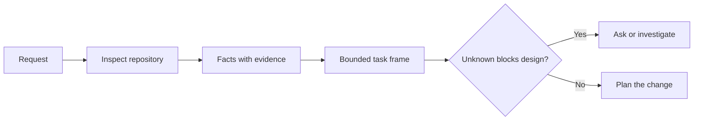

# 讓 Agent 動手寫程式前先界定任務框架

> 一款寫程式 Agent 能極速實作一個清晰明確的任務；它同樣能極速實作一個含糊不清的任務。兩者的執行速度完全相同；但背後所付出的代價卻有天壤之別。

**Type:** Learn + Build
**Languages:** Python (stdlib)
**Prerequisites:** Phase 14 lessons 31 and 36
**Time:** ~60 minutes

## Learning Objectives｜學習目標

- 在動手編輯檔案前，將模糊的使用者請求轉化為邊界清晰的任務框架（Task Frame）。
- 嚴格區分儲存庫客觀事實、主觀未驗證假設與未決問題。
- 明確界定獲准修改的路徑、絕對禁止碰觸的路徑，以及最終驗收憑證。
- 準確裁決前期的實體偵察何時已具備充足依據以正式啟動工程作業。

## 代價高昂的失敗（The Expensive Failure）

「新增防範重複 Email 註冊功能」聽起來極其具體，但實質上充滿漏洞：唯一性校驗究竟應當置於 API 路由層、領域服務層還是資料庫唯一條件約束？字串比對是否區分大小寫？既有系統對外暴露的重複錯誤結構究竟長什麼樣？是否獲准執行資料庫遷移（Migration）？哪項測試負責證明這項新行為？

一款能力出眾的 Agent 會用看似無比合理的選擇自動填補這些盲區。這正是最危險的情境：因為產出的實作程式碼可能結構極其優雅、單元測試全數通過，但本質上卻與既有系統格格不入。

因此，寫程式 Agent 展開工作的第一步，絕非直接動手改檔案。而是一份由儲存庫客觀事實所支撐的**任務框架（Task Frame）**。

## 任務框架的核心構成（The Task Frame）

一份實用的任務框架嚴格包含六大欄位：

| 欄位名稱 | 核心檢核問題 |
|---|---|
| Goal（目標） | 究竟何種可被客觀觀測的系統行為必須改變？ |
| Repository facts（儲存庫事實） | 你在程式碼、測試、設定檔或歷史記錄中具體核實了什麼？ |
| Allowed paths（允許路徑） | 變更獲准落在哪個路徑範圍內？ |
| Forbidden paths（禁止路徑） | 哪些檔案或目錄絕對嚴禁被碰觸？ |
| Acceptance evidence（驗收憑證） | 哪條指令或客觀觀測結果能確鑿證明目標已達成？ |
| Unknowns（未知決策） | 哪些決策依然需要客觀證據或人類的主觀裁決？ |

事實必須出示憑證。「API 面對重複時使用 409 狀態碼」並非事實，直到你能在既有測試或處理常式中明確指出具體行號為止。檔案路徑與行號足矣；若涉及動態行為，指令執行結果更具說服力。



## 前期勘查是探尋邊界約束（Reconnaissance Is a Search for Constraints）

切勿無差別通讀整個儲存庫。專注檢索約束該變更的核心表面：

1. 當前既有行為及其呼叫端；
2. 最接近的既有單元或整合測試；
3. 公開對外的資料契約或序列化結構；
4. 約束該路徑的專案指引；
5. 建置與驗收檢查指令；
6. 過去完成的類似變更，從中借鏡本地編程範式。

當所有預定的架構決策皆獲得實體證據支撐、已顯式授權委派，或已被列為未決問題時，應立即停止閱讀。超出該臨界點的無休止閱讀，往往只是推遲開工的拖延藉口。

## 未知決策並非系統失敗（Unknowns Are Not Failures）

未知決策（Unknown）是受控的空白。而假設（Assumption）則是對該空白未經證實的盲目主觀填充。

對每項未知決策進行清晰分類：

- **可探測的（Discoverable）**：儲存庫程式碼或運行中的系統能給出客觀答案。
- **可決策的（Decidable）**：任務契約已顯式授權 Agent 自主做出技術裁決。
- **需人工介入的（Human）**：該選擇會實質改變產品行為、成本、風險或對外相容性。
- **延後的（Deferred）**：該選擇完全超出本次切片的範疇，應當歸入非目標清單。

Agent 獲准在可探測與已授權的未知決策中自主推進。而在涉及人工介入的關鍵決策前，它必須在決策被程式碼掩埋之前主動暫停並請示人類。

## 驗收標準先於具體實作（Acceptance Before Implementation）

在編寫修復補丁之前，先確立驗收證據。證據可以是：

- 一條高精度的單元或整合測試指令；
- 一次指定視窗寬度與預期狀態的瀏覽器端互動演練；
- 一次實體網路請求與精確的比對回應契約；
- 一項帶有硬性門檻的效能度量；
- 一次證明無任何無關檔案被修改的範疇審計。

「測試通過」絕非合格的驗證計畫。必須精確指明權威測試名稱及其所捍衛的核心主張。

## Build It｜動手實作

實驗會建立一個 `TaskFrame`、驗證其邊界與客觀證據，並產出 `outputs/task-frame.md`。

自本課目錄執行：

```bash
python3 code/main.py
python3 -m unittest discover code/tests -v
```

嘗試在四個維度人為破壞該範例：移除目標描述、移除事實出處憑證、使允許路徑與禁止路徑產生重疊，以及移除驗收指令。校驗器應當針對每項破壞回報不同的拒絕原因。

## 在真實儲存庫中實踐（Use It in a Real Repository）

在要求 Agent 動手編輯檔案之前：

1. 將目標寫為系統行為，而非具體的檔案改動；
2. 記錄兩到三條附帶精確出處憑證的客觀事實；
3. 界定最小允許路徑集合；
4. 顯式定義禁止碰觸的負向空間；
5. 寫下能宣告任務結算的具體指令或觀測依據；
6. 列舉出尚未獲得充分證據支撐的未決決策。

任務框架應力求精簡至能在一面螢幕內完整閱讀。若無法做到，往往意味著該任務內部混雜了多個應當獨立驗證的複合變更。

## Exercises｜練習

1. 在你不提出任何具體解決方案的前提下，為你儲存庫中的一個真實 Bug 建立標準任務框架。
2. 找出框架中表面看似「事實」、實質純屬「假設」的一條宣告。用客觀證據替換它。
3. 新增一項一旦做出選擇將實質改變公開 API 契約的人工介入未知決策（Human Unknown）。
4. 將一條過度寬泛的允許路徑，精確收斂為最小安全的 Glob 集合。
5. 在驗收憑證中，追加一項針對修改範疇的審計出處。

## Further Reading｜延伸閱讀

- [Nuseibeh and Easterbrook, Requirements Engineering: A Roadmap](https://www.cs.toronto.edu/~sme/papers/2000/ICSE2000.pdf) ——將實作緊密錨定於真實世界目標與動態約束的經典需求工程論文
- [Yang et al., SWE-agent: Agent-Computer Interfaces Enable Automated Software Engineering](https://arxiv.org/abs/2405.15793) ——證明圍繞大模型的外圍互動介面能根本性左右其有效性的實證研究

## 留存產物（What You Keep）

妥善保留 `outputs/task-frame.md`。它是下一課的直接輸入依據，在下一課中，該框架將實質升級為具備客觀證據支撐的執行計畫。
