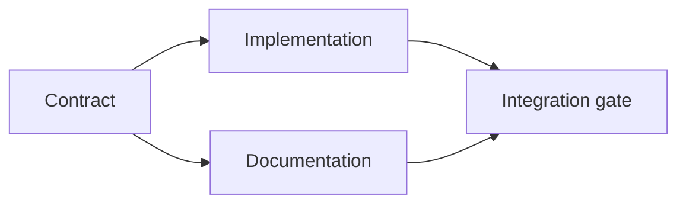

# 打造基於證據的實體執行計畫

> 一份計畫絕非換個漂亮格式的待辦清單（To-Do List）。它是一張相依性有向圖——其中每處變更皆具備充足的實體依據，每個終端節點皆擁有確鑿的驗收證明。

**Type:** Learn + Build
**Languages:** Python (stdlib)
**Prerequisites:** Phase 14 lesson 43
**Time:** ~65 minutes

## Learning Objectives｜學習目標

- 將任務框架轉化為附帶客觀依據與驗收證明的實體工作項目（Work Items）。
- 將執行順序建模為相依性圖結構，而非脆弱的自然語言散文循序序列。
- 在動手修改檔案前，及早檢測缺失的事實、未知的相依關係與潛在的循環死迴圈。
- 將能並行推進的步驟與必須等待前置條件的步驟清晰剝離。

## 為何 Agent 的計畫屢屢破產（Why Agent Plans Fail）

軟弱無力的計畫往往只是把使用者的原始請求用未來時態換句話說：

1. 更新 API；
2. 新增單元測試；
3. 更新文檔。

這份清單中完全沒有說明在程式碼中究竟發現了什麼、為何修改這些檔案是正確的、哪個契約應當最先演進，或者哪些步驟獲准並發執行。Agent 即使百分之百遵循了清單中的每一步，產出的成果依然極易面臨全面返工的命運。

一份健全的工程計畫，為每個工作項目做出五大承諾：

| 承諾維度 | 核心架構目的 |
|---|---|
| Identifier（唯一標識） | 用於相依性引用與階段移交的穩定標籤 |
| Change（實體變更） | 最小必要之系統行為或契約變更 |
| Evidence（出處依據） | 支撐該項變更正當性的儲存庫客觀事實 |
| Dependencies（前置相依） | 在本項目啟動前，必須已確立為真的前置工作 |
| Proof（完工證明） | 能宣告該工作項目正式完工的精確檢驗指令 |

## 契約設計先於具體實作（Plan the Contract Before Its Implementations）

當多個系統表面皆相依於完全相同的底層行為時，必須優先確立該行為的標準契約。單元測試、實體實作、架構文檔與系統整合便能共享單一權威契約，而非在各自的邊界上分別捏造四種不同的方言。



相依性圖清晰暴露了安全的高並發路徑：一旦契約拍板定案，實體實作與文檔撰寫即可同時並行推進。最後由整合關卡負責雙向收口。

## 證據推動計畫動態演進（Evidence Changes the Plan）

儲存庫客觀事實絕非單純用來裝飾的點綴。它必須具備實質顛覆與重塑計畫的能力：

- 既有輔助函式的發現，徹底免去了原訂新增抽象層的計畫；
- 一項向下相容性測試的約束，強制追加了資料庫遷移步驟；
- 部署環境資源的限制，促使資料結構變更被剝離至另一個獨立任務中；
- 公開對外之回應型別的約束，改變了實體實作與文檔更新的推進先後順序。

若一項客觀證據完全無法對後續架構決策產生任何影響，那它大概根本算不上是支撐該決策的有效依據。

## 為隨時中斷而設計（Design for Interruption）

寫程式 Agent 的對話階段作業隨時會非預期中斷。一個具備可斷點續傳性的計畫，其工作項目粒度足夠精細，使下一個階段作業能精準判定：

- 哪個項目已經圓滿完工；
- 哪項驗收證明已經成功執行；
- 哪些實體產物發生了變更；
- 哪些下游相依項當前已正式解鎖；
- 下一個最安全的推進項目究竟為何。

切勿僅將系統狀態編碼於聊天視窗中被勾選的打勾框框中。務必將執行計畫持久化存放在實體工作目錄旁。

## 計畫的靜態校驗（Plan Validation）

在實質執行前，一旦遭遇以下情況，堅決拒絕該計畫：

- 出現重複的任務識別碼；
- 某個工作項目完全缺乏客觀事實依據；
- 某個工作項目完全缺乏完工證明指令；
- 相依項引用了未知的幽靈項目；
- 相依性圖中出現了循環死迴圈；
- 在相關的不確定性被徹底消除之前，過早排程了不可逆的高危險破壞性動作。

前五項檢查屬於確定性的機械化規則；而最後一項則需要深刻的工程判斷，必須在架構審查中被顯式指明。

## Build It｜動手實作

`code/main.py` 建模了標準工作項目、驗證各項出處憑證、透過拓撲排序計算出並行的「執行波次（Execution Waves）」，並將成果寫入 `outputs/evidence-plan.json`。

執行指令：

```bash
python3 code/main.py
python3 -m unittest discover code/tests -v
```

範例程式產出了三個執行波次：第一波次確立契約；第二波次同時並行推進實作與文檔更新；第三波次由整合關卡負責最終驗收。

## 協同寫程式 Agent 實踐（Use It with a Coding Agent）

在允許 Agent 動手修改檔案之前，強制要求其先產出執行計畫。針對以下三點審查該計畫：

1. 每個路徑與行為主張，皆背靠確鑿的儲存庫出處憑證；
2. 每個工作項目，皆具備清晰唯一的完工驗收證明；
3. 相依性圖在涉及高昂代價或不可逆的危險操作時，嚴格排程於相關不確定性被徹底消除之後。

審批的是白紙黑字的確定性計畫，而非「我保證會格外小心」的口頭承諾。

## Exercises｜練習

1. 新增一個強制要求人類顯式審批確認的資料庫遷移項目。
2. 人為製造一個循環相依，並深入剖析其背後隱藏的產品需求矛盾。
3. 拆解一個同時綁定兩條不同驗收指令的臃腫項目。
4. 新增一個能在第二波次中並行推進、且完全不碰觸既有任何路徑的全新工作項目。
5. 將該計畫排版輸出為人類易讀的 Markdown，同時確保 JSON 始終作為唯一的事實來源。

## Further Reading｜延伸閱讀

- [Nuseibeh and Easterbrook, Requirements Engineering: A Roadmap](https://www.cs.toronto.edu/~sme/papers/2000/ICSE2000.pdf) ——目標、規範契約與動態演進之間迭代關係的權威論文
- [Barry Boehm, A Spiral Model of Software Development and Enhancement](https://dl.acm.org/doi/10.1145/12944.12948) ——以風險化解而非固定線性序列來排程開發的螺旋模型奠基論文

## 留存產物（What You Keep）

妥善保留 `outputs/evidence-plan.json`。它將直接作為下一課中進行工作委派的核心契約。
