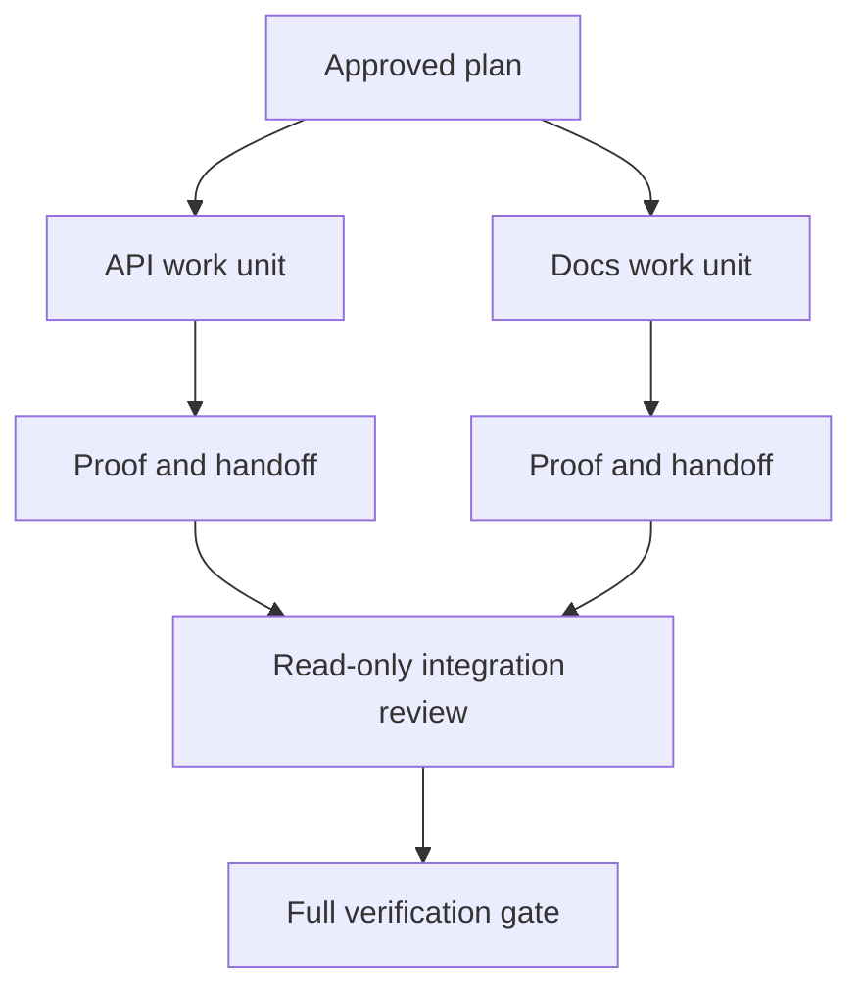

# 透過隔離與合併契約委派 Agent 任務

> 平行化 Agent 唯有在工作確實具備完全獨立性時，方能實質節省實體掛鐘時間。否則，它們只會將一個清晰的任務轉化為協同障礙，並以更快的速度釀成系統崩潰。

**Type:** Learn + Build
**Languages:** Python (stdlib)
**Prerequisites:** Phase 14 lessons 39 and 44
**Time:** ~70 minutes

## Learning Objectives｜學習目標

- 依據真實客觀的獨立性，理性決策任務是否確實值得進行向下委派。
- 為每個 Worker 工作者指派排他的檔案所有權與明確的驗收證明。
- 依據相依關係計算出安全的執行波次（Execution Waves）。
- 設計合併契約（Merge Contract），安全可靠地整併多 Agent 的工作產物。

## 並行性驗證（The Parallelism Test）

切勿單純因為系統中擁有更多可用的 Agent 就盲目發起委派。唯有在滿足以下至少一項條件時，委派才具備正當性：

- 兩項獨立調研能各自解答不同的未知問題，且彼此互不干涉；
- 兩項具體實作各自擁有完全互斥的不相交檔案路徑與契約；
- 審核者能在完全不修改產物的前提下，對完工產物進行獨立唯讀審查；
- 一項耗時緩慢的外部檢查能在本地工作持續推進的同時於背景並行執行。

當多個 Agent 需要碰觸完全相同的檔案、依賴尚未拍板的同一個未決決策，或共用同一個可變環境時，**必須堅決維持串行循序推進**。

## 工作單元本質上是一份契約（A Work Unit Is a Contract）

每個被委派的獨立工作單元皆嚴格需要：

| 欄位名稱 | 核心架構含義 |
|---|---|
| Goal（目標） | 一個可被客觀觀測的實體結果 |
| Owner（負責人） | 單一承擔完全責任的具體 Worker |
| Paths（路徑） | 排他性的唯一檔案寫入所有權 |
| Dependencies（前置相依） | 在啟動前必須已正式完工的前置單元清單 |
| Proof（證明） | 必須交回給整合者的精確客觀憑證 |
| Handoff（移交） | 修改的檔案清單、確立的架構決策與遺留風險 |

「負責後端」絕非合格的工作單元；「在 `app/accounts.py` 中實作防重複檢查，並透過帳號專項單元測試出示證明」才是。

## 三層隔離防護體系（Isolation Has Three Layers）

1. **檔案系統隔離（Filesystem isolation）**：獨立的 Git Worktrees 或沙盒環境，徹底杜絕非預期的共享意外編輯。
2. **所有權隔離（Ownership isolation）**：透過契約明確禁止兩個 Worker 有意或無意地修改相同的路徑。
3. **狀態隔離（State isolation）**：獨立的日誌記錄與輸出目錄，防止一個 Worker 的輸出覆寫了另一個 Worker 的客觀證據。

檔案系統層級的物理隔離，並不能自動解決架構所有權的衝突。兩個乾淨獨立的 Worktrees 依然能產出在架構層面完全衝突的相悖設計。合併契約必須在正式開工前，預先拍板解決共享介面的規範。



## 整合者絕不重寫底層工作（The Integrator Does Not Rebuild the Work）

整合者（Integrator）的職責是：

1. 確認每個移交封包完全合乎預先指派的範疇；
2. 逐一閱讀實體驗收證明輸出，而非單純相信 Worker 的口頭摘要；
3. 嚴格依據相依性順序組合各項變更；
4. 運行跨單元的全局完整驗收關卡；
5. 果斷拒絕任何暗中擴大範疇的隱性修改；
6. 將介面衝突記錄為全新的待決決策，嚴禁私自靜默修改。

若整合工作演變為必須親自動手重寫 Worker 交付的絕大部分成果，這確鑿證明最初的任務拆解在根本上就是徹底錯誤的。

## 人類與 Agent 的角色邊界（Human and Agent Roles）

向下委派絕不代表可以架空人類的工程判斷。人類工程師始終全權掌控那些會改變對外公開行為、系統風險、安全權限或帶來不可逆高昂代價的核心決策。Agent 則獲准全權負責受控的特定調研、功能實作、測試驗收與審查。

這正是**標定自主權（Calibrated autonomy）**的精髓：在客觀證據充分且具備強回滾能力的領域，系統給予 Agent 充分的行動自由；而在操作後果極其嚴重的關鍵樞紐上，系統強制要求設立人工檢驗卡點。

## Build It｜動手實作

實驗會主動檢查路徑重疊衝突、驗證相依合法性、計算安全的執行波次，並輸出 `outputs/delegation-plan.json`。

執行指令：

```bash
python3 code/main.py
python3 -m unittest discover code/tests -v
```

嘗試修改文檔工作單元，使其也宣告擁有 `app/` 目錄。執行計畫應當立即被安全阻斷，因為該父目錄與 API 工作單元的專屬路徑發生了重疊衝突。

## Exercises｜練習

1. 將一項真實的業務變更，精確拆解為兩個完全獨立的工作單元與一個整合者角色。
2. 找出一處表面看似完全獨立、實質深度耦合的偽平行切分方案。明確指出雙方共享的隱性架構決策。
3. 新增一個唯讀的調研 Worker，其唯一的交付產物是一份結構化的客觀事實資料表。
4. 新增一個合併檢查關卡：將最終修改的檔案清單與所有工作單元的契約進行聯集交叉審計。
5. 為特定 Worker 定義取消中斷規則：當其前置相依項被判定為無效或失敗時，該 Worker 如何即時安全終止。

## Further Reading｜延伸閱讀

- [Reid Smith, The Contract Net Protocol](https://doi.org/10.1109/TC.1980.1675516) ——分散式任務分配與結果回報的經典契約網協定論文
- [Eric Horvitz, Principles of Mixed-Initiative User Interfaces](https://dl.acm.org/doi/10.1145/302979.303030) ——何時自動化應當大膽行動、何時應當將主導權歸還人類的混合主動性介面準則

## 留存產物（What You Keep）

妥善保留 `outputs/delegation-plan.json`。它忠實記錄了為何該次拆解是安全的、誰排他性擁有各個路徑，以及整合階段必須強制驗收哪些客觀證明。
