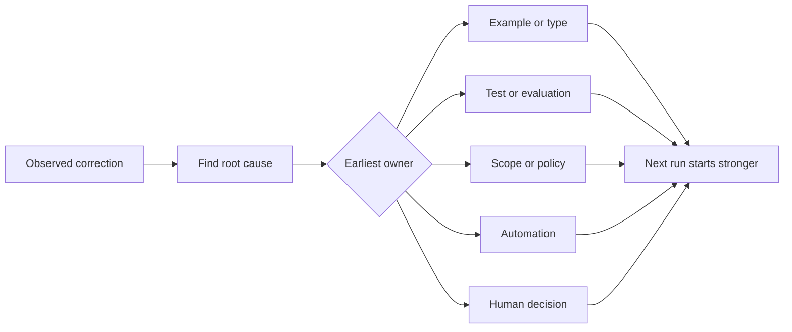

# 將每次 Agent 糾偏沉澱為系統級演進

> 僅存在於即時聊天視窗中的糾偏指導，只能修復眼前的單次運行。唯有將糾偏晉級固化為自動化測試、系統邊界、規範範例或實體工具，才能讓未來的每一次運行皆從中獲益。

**Type:** Learn + Build
**Languages:** Python (stdlib)
**Prerequisites:** Phase 14 lessons 37 to 41
**Time:** ~65 minutes

## Learning Objectives｜學習目標

- 將 Agent 的人工糾偏轉化為持久化的系統級控制措施。
- 將每項控制措施安插在能最先阻止問題重現的最早生效防護層。
- 透過穩定的特徵指紋，對反覆出現的經驗教訓實施自動去重。
- 定期退役淘汰那些不再防範實質真實風險的過時控制項。

## 人工糾偏是系統層面的客觀證據（Corrections Are Evidence）

當你對 Agent 說「不要修改那個檔案」時，代表你發現範疇邊界在實體系統層面缺乏可執行約束力。當你說「這個輸出結構格式錯誤」時，代表系統缺失了一項規範範例或自動化測試。當環境建置再次崩潰報錯時，代表環境經驗知識應當被封裝為確定性的自動化腳本。

請將每一次人工糾偏，視為對整個工作系統的一項客觀診斷觀測，而非單純責怪自己「Prompt 寫得不夠好」。

## 晉級至最早生效的防護層（Promote to the Earliest Effective Layer）

嚴格遵循以下處理順序：

| 反覆出現的失效模式 | 持久化沉澱的終端防線 |
|---|---|
| 錯誤的計算結果或回歸退步 | 單元測試或 Evals 自動化評測 |
| 範疇蔓延或越權高危險操作 | 範疇契約或存取權限安全策略 |
| 重複出現的建置或指令調用錯誤 | 自動化腳本或專用實體工具 |
| 重複出現的輸出格式畸形問題 | 標準規範範例搭配強型別校驗器 |
| 模糊不清的本地編程約定 | 明確指引搭配具體的情境檢查 |
| 產品層面的業務需求分歧 | 白紙黑字的人類架構決策記錄 |

越早生效的控制措施，維運成本越低廉。在型別層面直接阻斷無效狀態，遠比在事後程式碼審查中苦口婆心提出修改建議更具防禦力；一條高精度的自動化測試，遠比要求 Agent 死記硬背一大段文字指引強大得多。



## 棘輪演進記錄（The Ratchet Record）

客觀記錄以下核心要素：

- 表面症狀（Symptom）；
- 底層根本原因（Root cause）；
- 造成的實質後果（Consequence）；
- 歷史重現次數（Recurrence count）；
- 採納的控制措施（Chosen control）；
- 該控制措施的驗證手段（Verification）；
- 責任人（Owner）；
- 預定審查或退役日期（Retirement date）。

切勿將每項一時興起的主觀偏好皆盲目晉級。唯有在重現頻率或事故後果足以支撐系統複雜度上升時，方獲准將糾偏固化為永久控制項。

## 區分表面症狀與根本原因（Separate Cause from Symptom）

「Agent 修改了 README」僅僅是表面症狀。背後的根本原因可能包含：

- 該任務契約允許了儲存庫根目錄；
- 文檔檔案被系統隱式誤判為安全無害；
- 執行計畫將程式碼實作與文檔撰寫粗暴捆綁在一起；
- 兩個工作者之間的檔案所有權產生了重疊衝突。

每個根本原因對應著截然不同的控制防護層。單純重複表面症狀的死板規則，在面對下一次稍微變形的類似案例時必將再次失靈。

## 控制措施同樣會老化衰敗（Controls Also Decay）

陳舊的控制項可能會彼此衝突、擠爆寶貴的上下文預算，並試圖約束一套早已不復存在的歷史舊架構。每條被晉級的規則皆必須接受定期的退役審查。在以下情況下，果斷將其刪除或重寫：

- 底層軟體架構已發生根本性重構；
- 更強大、更低層級的可執行控制項已徹底取代了它；
- 該失效在足夠長的有意義時間視窗內從未再次重現；
- 維護該控制項所帶來的摩擦阻力，已遠遠超過了它所防範的潛在風險。

工程目標絕非產出最冗長的指引檔案，而是打造一套最小化、卻能忠實守護千錘百鍊之工程經驗判斷的精實系統。

## Build It｜動手實作

實驗會對糾偏記錄進行智慧分類、將其晉級為對應控制項、依特徵指紋對重複項進行去重，並將成果寫入 `outputs/feedback-ratchet.json`。

執行指令：

```bash
python3 code/main.py
python3 -m unittest discover code/tests -v
```

嘗試輸入兩條措辭不同但根本原因完全相同的糾偏記錄。持續調整正規化規則，直到它們能自動收斂合併為單一控制項，同時絕不誤傷無關的其他失效模式。

## Exercises｜練習

1. 自你最近的寫程式階段作業中挑選五次真實的人工糾偏，為其精準分類最合適的法定歸屬層。
2. 將一條散文形式的軟性規則，實質改寫為可程式化執行的自動化單元測試。
3. 為系統新增後果嚴重性加權機制：一旦首次發生的故障造成了嚴重破壞，允許跳過次數統計立刻強制晉級。
4. 在實驗輸出中，為每條控制項追加責任人與退役審查日期欄位。
5. 審視儲存庫中現有的一條 Agent 指引，唯有在確鑿證明存在更強大的實體控制項接管後，方可將其正式刪除。

## Further Reading｜延伸閱讀

- [Basili, Caldiera, and Rombach, The Goal Question Metric Approach](https://www.cs.toronto.edu/~sme/CSC444F/handouts/GQM-paper.pdf) ——將抽象目標轉化為具體問題與可操作度量指標的經典 GQM 方法論論文
- [Shinn et al., Reflexion](https://arxiv.org/abs/2303.11366) ——利用反饋追蹤改進後續決策且完全無需修改模型權重的奠基論文
- [Madaan et al., Self-Refine](https://arxiv.org/abs/2303.17651) ——在任務迴圈內部進行迭代式反饋與修正的論文

## 留存產物（What You Keep）

妥善保留 `outputs/feedback-ratchet.json`。它是 Agent 輔助工程學路線的持久化終點，亦是未來推動工作台持續演進的核心資料源。
