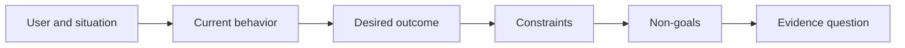

# 在挑選產出前先界定業務成效（Outcome Before Output）

> 極速的實作能力，只會成倍放大選錯問題所帶來的懲罰。在動手前先確立業務成效（Outcome），確保團隊的高速奔馳朝向正確的方向。

**Type:** Learn + Build
**Languages:** Python (stdlib)
**Prerequisites:** None
**Time:** ~60 minutes

## Learning Objectives｜學習目標

- 在完全不預設任何具體解法的前提下，撰寫標準的成效框架（Outcome Frame）。
- 精確辨識使用者、觸發情境、當前既有行為與期望達成的實質改變。
- 顯式確立不可動搖的硬性約束與非目標（Non-goals）。
- 在解法外洩（Solution Leakage）固化為任務範疇前，及早將其揪出。

## 形式產出絕非實質成效（Output Is Not Outcome）

「打造一個事故排查助手」僅僅是在命名一項**形式產出（Output）**。它絲毫沒有說明究竟是誰需要它、何種現狀將因此改善，或是哪些紅線必須嚴格守住。

而一份**成效框架（Outcome Frame）**則明確宣告：

> 當線上正式環境發布告警時，值班工程師能在兩分鐘內精準定位發生故障的微服務並確立安全的下一步處置，同時整個診斷過程全程保持唯讀且具備完整審計追蹤。

這句話可以透過軟體系統、一份應變手冊、一次資料修復，或是一次微小的介面調整來達成。它讓團隊緊密聚焦於最終期望的「實質成效」，而非過早執著於某人最初腦海中構想的第一個產物形態。

## 六部式框架（The Six-Part Frame）

| 組成維度 | 核心檢核問題 |
|---|---|
| User（使用者） | 誰在業務一線直接承受該問題的痛點？ |
| Situation（情境） | 該問題在何時、何地具體發生？ |
| Current behavior（當前現狀） | 今天大家是如何應對的（包含各類臨時變通方案）？ |
| Desired outcome（期望成效） | 何種可被客觀觀測的狀態將獲得實質改善？ |
| Constraints（硬性約束） | 哪些安全、法規、成本或向下相容限制是不可妥協的？ |
| Non-goals（非目標） | 哪些表面誘人、但當前堅決排除的相鄰工作？ |



## 揪出解法外洩（Find Solution Leakage）

當成效描述中偷渡了未經客觀證據支撐的產品形態、介面外觀、模型選型、軟體框架或特定架構時，即發生了「解法外洩」：

- 「使用者每週收到一份 AI 摘要」——外洩了摘要的形式與每週的頻率。
- 「使用者在審批前能完全理解帳號變更的影響」——陳述了客觀成效。
- 「部署一套向量資料庫」——外洩了底層基礎設施。
- 「在審查時能即時出示相關法規依據」——陳述了一項業務能力。

唯有在相容性要求確實將技術寫死時，約束條件方獲准提及具體技術。同時必須白紙黑字記錄其為何不可替代。

## 約束條件守護業務成效（Constraints Protect the Outcome）

約束條件絕非微不足道的實作細節，它們是真實世界目標的有機組成部分：

- 診斷過程中嚴禁發起任何正式環境寫入；
- 響應時間必須維持在事故處理時間預算之內；
- 現有的審計日誌體系必須繼續維持最高法定權威；
- 嚴禁引入任何全新的執行時期相依性；
- 既有的無障礙輔助功能必須完好無損。

任何靠違背約束條件所達成的所謂成效，在工程本質上皆算不上真正達成了目標。

## 非目標確立系統邊界（Non-Goals Create a Boundary）

非目標能防止一個原本小巧實用的業務切片，無休止地演變為尾大不掉的龐大平台。優質的非目標必須足夠具體，能直接拒絕無關工作：

- 不做自動化修復與自癒；
- 不打造全新告警路由系統；
- 不取代事故現場指揮官的決策權；
- 在本次切片中不包含歷史趨勢分析報表。

## Build It｜動手實作

實驗會校驗 `OutcomeFrame`、驗證其各項邊界與客觀事實，並輸出 `outputs/outcome-frame.json`。

```bash
python3 code/main.py
python3 -m unittest discover code/tests -v
```

嘗試將期望成效替換為「使用事故排查助手」。校驗器應當精準報警：擬採用的形式產物已嚴重外洩偷渡進了成效描述中。

## Exercises｜練習

1. 將你待辦清單（Backlog）中的一項功能需求，重寫為標準的成效框架。
2. 新增一條足以徹底改變潛在候選解法集合的硬性約束條件。
3. 新增兩項非目標，確保第一個業務切片保持極度小巧克制。
4. 找出能最快推翻或證偽該期望成效的最早客觀觀測信號。
5. 寫出三種形態截然不同、卻能滿足完全相同實質成效的形式產出。

## Further Reading｜延伸閱讀

- [Nuseibeh and Easterbrook, Requirements Engineering: A Roadmap](https://www.cs.toronto.edu/~sme/papers/2000/ICSE2000.pdf) ——將真實世界目標作為軟體工程最高錨點的需求工程論文
- [Dardenne, van Lamsweerde, and Fickas, Goal-Directed Requirements Acquisition](https://doi.org/10.1016/0167-6423(93)90021-G) ——將高層次目標精煉為操作約束與工程規格的經典目標導向需求擷取方法

## 留存產物（What You Keep）

妥善保留 `outputs/outcome-frame.json`。下一課將對照人類一線實踐的真實工作流程，對該成效框架進行嚴格實地檢驗。
