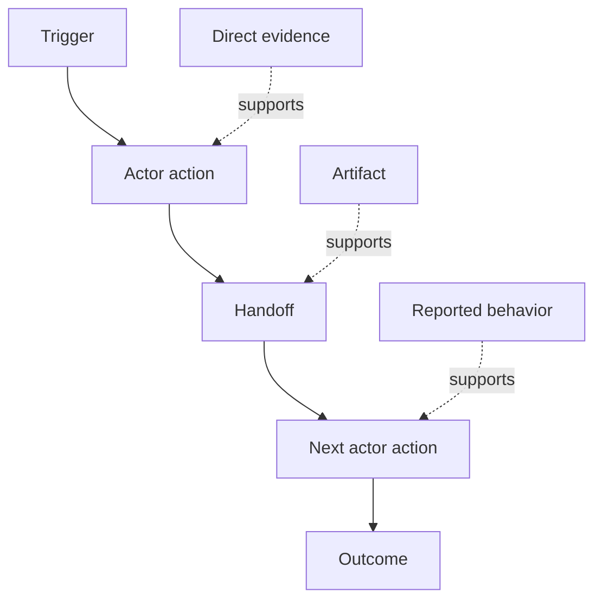

# 發掘人們實際執行的一線真實工作流程

> 軟體需求絕非靜靜端坐在會議室裡等待被「收集」。它們零散散落於人類的實體操作、各類權宜妥協、歷史記錄與意見分歧之中。

**Type:** Learn + Build
**Languages:** Python (stdlib)
**Prerequisites:** Phase 14 lesson 47
**Time:** ~70 minutes

## Learning Objectives｜學習目標

- 將現有真實工作流程建模為具備客觀證據支撐的有序動作序列。
- 嚴格區分直接行為觀測、實體產物憑證、口頭描述與主觀推論。
- 精準定位流程摩擦阻力、階段移交斷點、法定權威邊界與隱性私有狀態。
- 讓不確定的推測保持清晰可見，絕不將主觀揣測暗中包裝為既定需求。

## 從現有系統出發（Start with the Current System）

切勿一開始便詢問大家「想要什麼新功能」。應當首先完整復原「今天現場究竟是如何運作的」。

為工作流程中的每個步驟，客觀記錄：

| 欄位名稱 | 具體工程範例 |
|---|---|
| Actor（操作者） | 值班工程師 |
| Trigger（觸發事件） | 線上正式環境告警抵達 |
| Action（具體動作） | 開啟告警詳情，隨後跨多個儀表板檢索日誌 |
| Input（輸入資料） | 告警酬載與部署上線記錄 |
| Output（產出產物） | 候選的故障微服務與其負責人 |
| Friction（摩擦阻力） | 跨三套異質監控工具頻繁切換脈絡 |
| Authority（法定權威） | 事故現場指揮官批准實施寫入操作 |
| Evidence（客觀證據） | 螢幕錄影、事故處置日誌、既有應變手冊 |

真實工作流程遠比螢幕上呈現的畫面更加龐大複雜：它包含漫長等待、複製貼上、私下即時通訊溝通、多級審批授權、故障復原嘗試，以及那些大家早已習慣到視而不見的隱性繁瑣步驟。

## 證據具備強弱階梯（Evidence Has Strength）

採用清晰的四級證據階梯：

1. **直接行為觀測（Direct behavior）**：實地現場觀測、全鏈路追蹤 Trace、錄影紀錄或底層系統事件。
2. **實體產物憑證（Artifact）**：工單記錄、應變手冊、系統日誌、表單或最終完成的交付物。
3. **口頭回報行為（Reported behavior）**：當事人口頭向你描述他平時是如何操作的。
4. **主觀推論（Inference）**：團隊內部推測分析「此時大機率會發生什麼」。

這四種資訊皆具備參考價值。但唯有前兩項能直接確鑿證明當前現狀的客觀真實性。為每項資訊標註證據等級，防止系統置信度在無形中被虛假膨脹。



## 重點探尋四大核心要素（Search for Four Things）

- **Friction（摩擦阻力）**：重複的人工操作、等待延遲、重新鍵入輸入，或繁瑣的失敗復原。
- **Hidden state（隱性狀態）**：長久存留於人類大腦記憶、私聊群組或個人便籤中的非公開經驗。
- **Authority（法定權威）**：獲准做出實質重大後果決策的具體人員或法定授權系統。
- **Exceptions（異常例外）**：標準理想流程突然遭遇意外中斷的各類非典型邊界案例。

AI 產品往往在階段移交與異常例外處理處發生慘重潰敗，正是因為當初設計時只一廂情願地塑型了最理想的順遂路徑。

## 絕不透過「平均化」抹除客觀分歧（Do Not Average Away Disagreement）

兩位一線使用者在處理相同事務時採用截然不同的操作流程，背後往往存在合情合理的原因。完整保留這些路徑變體，直到你搞清它們究竟代表著：

- 不同的職責角色；
- 不同的安全風險等級；
- 新舊世代業務流程的過渡期；
- 熟練度與專業技能的差異；
- 還是組織內部真實存在的制度政策分歧。

強行將兩種異質流程「平均化」捏造出的單一折衷流程，通常無法代表任何真實人類的操作習慣。

## Build It｜動手實作

實驗會為工作流程的每個步驟綁定客觀證據、校驗步驟順序與置信度、計算直接證據比例，並輸出 `outputs/workflow-evidence.json`。

```bash
python3 code/main.py
python3 -m unittest discover code/tests -v
```

新增一條部署記錄缺失時的異常例外路徑。保持主幹流程順序完好，並清楚記錄該分流路徑自何處展開。

## Exercises｜練習

1. 在不訪談任何人的前提下，純粹依據系統日誌完整還原一條真實的業務流程。
2. 訪談一位使用者，並明確標註其所有陳述中目前尚缺乏直接證據支撐的具體主張。
3. 為流程圖新增一道具體的人工審批權威邊界與一步故障復原處理。
4. 在不強行合併的前提下，將兩種真實存在的工作流程變體並排建模呈現。
5. 識別一項提議的新功能：表面上看它消除了一個可見的步驟，但實質上是否將沉重的隱性工作完全留給了人類？

## Further Reading｜延伸閱讀

- [Nuseibeh and Easterbrook, Requirements Engineering: A Roadmap](https://www.cs.toronto.edu/~sme/papers/2000/ICSE2000.pdf) ——特別是其將需求探詢（Elicitation）視為深度詮釋、建模與驗證而非單純機械收集的經典論述
- [Gotel and Finkelstein, An Analysis of the Requirements Traceability Problem](https://doi.org/10.1109/ICRE.1994.292398) ——深入探討需求與其最初源頭之間可追溯性維護難題的奠基論文

## 留存產物（What You Keep）

妥善保留 `outputs/workflow-evidence.json`。它將在下一課中，把觀察到的流程摩擦阻力與不確定性轉化為系統假設對照地圖。
