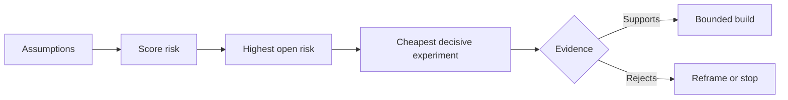

# 繪製假設地圖並優先化解最高風險

> 產品路線圖（Roadmap）往往把巨大的不確定性巧妙隱藏在各項功能特性內部。而假設地圖（Assumption Map）則將這些功能獲准存在之前「必須為真」的底層前提完整暴露於陽光下。

**Type:** Learn + Build
**Languages:** Python (stdlib)
**Prerequisites:** Phase 14 lesson 48
**Time:** ~65 minutes

## Learning Objectives｜學習目標

- 將擬執行的工程工作轉化為清晰明確的可證偽假設。
- 分別獨立量測衝擊度（Impact）、不確定性（Uncertainty）與不可逆性（Irreversibility）。
- 嚴格依據風險高低挑選下一個實驗，而非憑藉主觀熱情或喜好。
- 透過實證資料與明確決策，逐步取代並消除已驗證的假設。

## 每次建置皆包含底層賭注（Every Build Contains Bets）

一套事故排查輔助工具，其成敗往往高度仰賴以下前提全數為真：

- 告警上下文脈絡中包含充足的資訊以精準定位微服務；
- 一線工程師願意信任一條並非由他們親自推導出的決策建議；
- 所追求的目標響應時間在維運層面確實具備實質意義；
- 所需的資料能在無需授予過度危險權限的前提下被安全存取；
- 該工作流程的發生頻率足夠高，足以支撐系統長期的維護成本。

這些絕非具體的實作任務。它們是一項工程建置要具備價值、易用、可行且安全所必須滿足的底層前置條件。

## 五大假設分類（Assumption Classes）

| 假設類別 | 該類別回答的核心問題 |
|---|---|
| Value（價值） | 最終取得的成效是否具備足夠實質價值？ |
| Usability（易用性） | 一線使用者能否正確理解並順暢採取行動？ |
| Feasibility（可行性） | 系統能否在既有可用資料與約束下順利產出成果？ |
| Viability（生存力） | 組織能否長期承受其維運成本、責任歸屬與運營開銷？ |
| Safety（安全性） | 它能否在遭遇非預期失敗時絕不釀成無法承受的災難？ |

將假設撰寫為具備**可證偽性（Falsifiable）**的精確陳述。「該功能極具價值」是完全無法被測試的廢話；而「十位值班工程師中有八位能借助該唯讀結果更快定位正確的故障微服務」，才是真正可被科學檢驗的合格假設。

## 風險絕非單一扁平數字（Risk Is Not One Number）

實驗採用 1 到 5 分的三維評分體系：

- **Impact（衝擊度）**：若該假設為假，會釀成多大的破壞性損失？
- **Uncertainty（不確定性）**：當前客觀證據的薄弱程度。
- **Irreversibility（不可逆性）**：一旦全量投入後，若發現方向錯誤所需付出的掉頭代價。

範例評分公式將衝擊度與不確定性相乘，隨後疊加不可逆性。該數學公式並非放之四海皆準的真理；其核心工程目的在於**逼迫團隊清晰闡明為何某個未決問題應當排在另一個問題之前優先化解**。



## 設計嚴謹實驗，而非自我確認的過場儀式（Design an Experiment, Not a Confirmation Ritual）

一次真正有價值的驗證實驗必須具備：

- 一個有可能被證偽為假的核心主張；
- 具備統計代表性的一線使用者群體或逼真樣本；
- 可被客觀量測的具體結果；
- 在看到實驗結果**之前**預先拍板的成功門檻；
- 針對通過、失敗與模稜兩可三種不同結果的明確下一步決策方案。

堅決摒棄那些僅僅用來證明「我們團隊確實有能力把這個點子做出來」的自嗨型驗證。

## 可逆性徹底改變執行順序（Reversibility Changes Order）

破壞後果嚴重且不可逆的關鍵抉擇，需要及早取得客觀證據。唯讀的日誌回放驗證，必須先於正式環境深度整合；臨時性的適配器過渡，必須先於大規模資料結構遷移；經人工審批確認的輔助建議，必須先於完全放任的自動化執行。

實體建置的架構形態，必須嚴格順應不確定性的分佈形態。

## Build It｜動手實作

實驗會對假設進行風險優先級排序、區分已驗證與未決主張、精準篩選出當前最高未決風險，並輸出 `outputs/assumption-map.json`。

```bash
python3 code/main.py
python3 -m unittest discover code/tests -v
```

修改最高風險假設上的客觀證據，親眼觀察下一個最優先實驗如何動態隨之重排。

## Exercises｜練習

1. 為你目前正規劃開發的一項新功能，寫下五條具備可證偽性的核心假設。
2. 補齊一條你的功能清單中原本忽略的安全維度假設。
3. 明確定義一個會促使你「立刻終止該專案建置」的客觀指標門檻。
4. 將一項龐大耗時的複雜實驗，改寫為成本顯著更低、但同樣具備決定性證明力的精實測試。
5. 對比風險排序結果與既有產品路線圖的優先級，深入剖析兩者之間的衝突根源。

## Further Reading｜延伸閱讀

- [Barry Boehm, A Spiral Model of Software Development and Enhancement](https://dl.acm.org/doi/10.1145/12944.12948) ——在進一步投入前優先化解不確定性的風險驅動螺旋開發模型
- [Dardenne, van Lamsweerde, and Fickas, Goal-Directed Requirements Acquisition](https://doi.org/10.1016/0167-6423(93)90021-G) ——在精煉高層次目標的同時主動暴露障礙與約束的經典論文

## 留存產物（What You Keep）

妥善保留 `outputs/assumption-map.json`。下一課將依託該檔案，精準切分出能以最小代價換取決定性客觀證據的最小可驗收切片。
