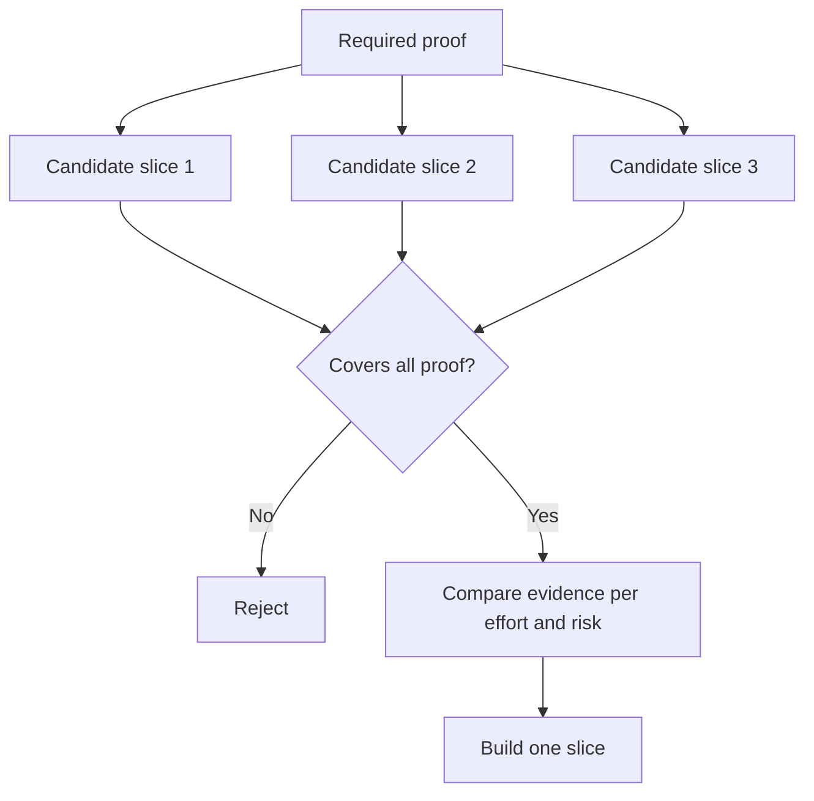

# 挑選能撼動決策的最小可驗收切片（Smallest Testable Slice）

> 唯有當「小巧」能證明真正重要的事情時，它才具備工程價值。一個根本無法改變下一個系統決策的微小建置，純粹只是殘缺不全。

**Type:** Learn + Build
**Languages:** Python (stdlib)
**Prerequisites:** Phase 14 lesson 49
**Time:** ~65 minutes

## Learning Objectives｜學習目標

- 依據其所能證偽的關鍵假設，精準定義垂直切片（Slice）。
- 平衡成效價值、不確定性消除、投入精力與操作後果。
- 始終優先選擇具備可逆性的客觀證據，而非過早做出正式環境的重度承諾。
- 果斷拒絕那些巧妙剔除了工作流程中最高風險部分的偽切片。

## 「垂直切片」意味著端到端的客觀證據（Vertical Means Evidence End to End）

一個真正實用的切片，必須完整貫穿能觀察到實質成效的最小真實工作流程。它在使用者範圍、資料規模、存續時長與功能廣度上可以極度狹窄；但**絕對不能**透過閹割你原本需要驗證的核心不確定性來投機取巧。

實用對照：

- 跨十起真實歷史事故進行唯讀日誌回放，能有效檢驗微服務定位準確度與值班工程師的信任度；
- 基於合成假資料搭建的精美前端儀表板，或許能驗證視覺理解，卻完全無法檢驗真實資料的可行性；
- 直接在線上部署自動化自癒系統，則是在無法承受的災難性後果下，盲目一次性測試所有未知。

## 優先定義必備驗證清單（Define Required Proof First）

將風險最高的未決假設轉化為一組「必備驗證清單（Required Proof Set）」。一個候選切片**唯有在能完整覆蓋該清單的前提下，才具備候選資格**。

隨後，對所有合乎資格的候選切片進行多維度綜合評估：

| 評估維度 | 優劣方向 |
|---|---|
| Outcome value（成效價值） | 越高越好 |
| Uncertainty reduced（消除的不確定性） | 越多越好 |
| Effort（投入精力） | 越少越好 |
| Consequence（潛在破壞後果） | 越低越好 |
| Reversibility（可逆性） | 越高越好 |

實驗的評分計算刻意保持簡單。資格准入卡點的篩選價值，遠高於複雜的數學算術。



## 常見的偽「最小化」陷阱（Common False Minimums）

- **純前端 UI 的虛假最小化**：徹底閹割了真實資料與底層維運層面的核心不確定性。
- **純基礎設施的虛假最小化**：證明了技術上的可行性，卻完全未驗證任何真實使用者價值。
- **純理想路徑（Happy-path）的虛假最小化**：巧妙迴避了真正蘊藏最大系統風險的異常例外路徑。
- **純 Demo 演示的虛假最小化**：產出了一份極具說服力的展示產物，卻缺乏任何可重複量測的客觀標準。
- **過早平台化的虛假最小化**：在單一業務流程證明其價值之前，過早著手打造通用可復用的龐大基底架構。

## 確立停損止血規則（Add a Stop Rule）

在正式動手實作前，白紙黑字寫明當該切片檢驗失敗時系統應當如何應對：

- 徹底放棄該業務成效目標；
- 調整目標使用者族群或觸發情境；
- 測試截然不同的替代機制；
- 收集更高精度的客觀證據；
- 進一步收斂並壓縮授權權限。

若無論測試產出何種結果，團隊唯一的反應皆是「繼續往下硬做」，那麼該切片根本不是科學實驗。

## Build It｜動手實作

實驗會依據必備驗證清單嚴格篩選候選切片、為合乎資格的切片進行量化評分，並輸出 `outputs/slice-decision.json`。

```bash
python3 code/main.py
python3 -m unittest discover code/tests -v
```

嘗試新增一個成本極低、但僅能證明單一假設的廉價候選切片。即便它的數值評分極高，系統依然應當將其判定為「不具備候選資格」而果斷拒絕。

## Exercises｜練習

1. 針對完全相同的實質成效，在不同破壞後果等級下設計三個候選切片。
2. 在對它們進行數值打分之前，先明確列出不可妥協的必備驗證清單。
3. 大膽砍掉一項功能特性，同時完整保留能產生決定性證明的核心依據。
4. 為一個失敗的小規模試點（Pilot）撰寫清晰的停損止血規則。
5. 識別出一個應當暫緩至切片驗證通過後、方獲准啟動的可復用平台化元件。

## Further Reading｜延伸閱讀

- [Barry Boehm, A Spiral Model of Software Development and Enhancement](https://dl.acm.org/doi/10.1145/12944.12948) ——使每個開發週期緊密匹配其所必須化解之核心風險的螺旋模型論文
- [Lenarduzzi and Taibi, MVP Explained: A Systematic Mapping Study on the Definitions of Minimal Viable Product](https://arxiv.org/abs/1609.07592) ——軟體產品工程實踐中圍繞「最小化（Minimum）」與「可行性（Viable）」語義歧義的系統性映射研究

## 留存產物（What You Keep）

妥善保留 `outputs/slice-decision.json`。它忠實記錄了為何當前選定的切片是能以最小代價撼動系統決策的最佳切片。
