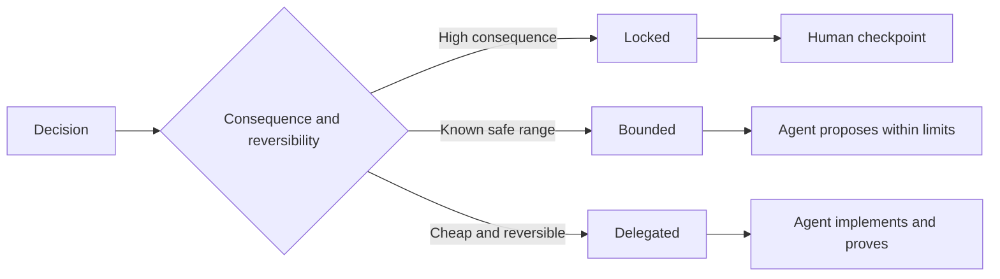

# 撰寫保留工程判斷力的規格說明書（Executable Specifications）

> 一份實用的規格說明書（Specification）負責鎖定系統不變量與客觀驗收證據，同時將具備可逆性的實作細節留給工程判斷。它是一道決策邊界，絕非事無巨細的電影劇本。

**Type:** Learn + Build
**Languages:** Python (stdlib)
**Prerequisites:** Phase 14 lesson 50
**Time:** ~75 minutes

## Learning Objectives｜學習目標

- 清晰分離成效（Outcome）、不變量（Invariants）、範例（Examples）、非目標（Non-goals）與驗收證明（Proof）。
- 將各項架構決策明確標註為：鎖定（Locked）、有界（Bounded）或委派（Delegated）。
- 在決策成本低廉且具備完全可逆性的領域，大膽保留 Agent 的工程推理判斷力。
- 在涉及操作後果嚴重或公開行為變更的關鍵卡點上，強制設立人類審批關卡。

## 兩種糟糕的極端（Two Bad Extremes）

規格不足（Underspecified）的任務，迫使 Agent 只能盲猜系統意圖；而過度規範（Overspecified）的任務，則將 Agent 當作打字機器人去抄寫一份本身可能早已過時錯誤的架構設計。

優雅的黃金中庸之道是**可執行的契約（Executable Contract）**：

| 契約表面 | 核心架構目的 |
|---|---|
| Outcome（成效） | 可被客觀觀測的實質成果 |
| Invariants（不變量） | 無論如何實作皆必須永遠維持為真的硬性條件 |
| Examples（範例） | 揭示真實意圖的具體代表性案例 |
| Non-goals（非目標） | 經過深思熟慮後刻意排除的相鄰工作 |
| Decision policy（決策策略） | 明確宣告哪些決策屬於鎖定、有界或委派 |
| Proof（驗收證明） | 宣告完工前必須強制出示的客觀憑證 |

## 三大決策模式（Three Decision Modes）

- **鎖定（Locked）**：Agent **絕對嚴禁擅自挑選**。適用於公開對外相容性、法定授權權限、系統安全性、不可逆的高昂成本或重大產品承諾。
- **有界（Bounded）**：Agent 獲准在顯式劃定的邊界內自主提議。適用於搜尋預算、重試次數上限、允許引用的依賴項，或已知相容的介面家族。
- **委派（Delegated）**：Agent 全權承擔選擇責任並必須給出合理解釋。適用於本地程式碼結構、命名命名規範、具備完全可逆性的重構與內部實作細節。



## 透過具體範例規範行為（Specify Behavior Through Examples）

範例在傳遞核心意圖時，比任何華麗的形容詞更具壓縮力。「好用」、「穩健」與「生產級」在工程上是完全無法被自動化執行的空話。一組涵蓋常規標準、極端邊界、異常失敗與絕對禁止的具體範例，能同時賦予建置者與驗收關卡具象化的驗證依據。

範例絕不能取代不變量。單次通過的測試案例，完全無法證明一條全域適用的安全規則。

## 驗收證明必須嚴格匹配具體主張（Proof Must Match the Claim）

- 單元測試僅能證明本地函式的合規契約；
- 線路封包測試方能證明序列化與傳輸層行為；
- 瀏覽器端操作演練方能證明使用者介面路徑；
- 基準回放測試集方能證明代表性案例上的泛化行為；
- 審計日誌方能證明法定權限邊界未被突破。

切勿接受以低層級的憑證冒充高層級系統宣告的混淆行為。

## 深思熟慮地保留未知（Preserve Unknowns Deliberately）

規格說明書完全可以明確宣告：「實作可以自由挑選能在時間預算內回傳的任何唯讀資料來源。」這絕非含糊不清，而是一項邊界清晰、驗收明確的**有意委派決策**。

規格說明書應當隨客觀證據的浮現而動態演進。忠實記錄鎖定與有界決策背後的深層緣由，使未來的團隊能在無需進行考古挖掘的前提下，從容修訂它們。

## Build It｜動手實作

實驗會校驗契約的全部表面、檢查決策模式設定，並輸出 `outputs/executable-specification.json`。

```bash
python3 code/main.py
python3 -m unittest discover code/tests -v
```

嘗試將「正式環境寫入權限」自 Locked 模式修改為 Delegated 委派模式。深入思考：為何 Schema 在技術層面接收該欄位值，但在產品資安維度上卻必須堅決予以拒絕？

## Exercises｜練習

1. 將待辦清單中的一張任務工單，重構為包含六大契約表面的標準規格說明書。
2. 用一條不變量加兩個具體範例，大膽替換掉三條繁瑣的實作步驟指令。
3. 為每個決策點打上標籤，並為每項鎖定或有界決策提出充分論證。
4. 為每一條不變量追加一項可執行的驗收證明出處。
5. 剔除一條缺乏客觀證據支撐與風險評估依據的陳舊約束條件。

## Further Reading｜延伸閱讀

- [Nuseibeh and Easterbrook, Requirements Engineering: A Roadmap](https://www.cs.toronto.edu/~sme/papers/2000/ICSE2000.pdf) ——目標、精確規格、驗收與演進之間迭代關係的權威論文
- [Zave and Jackson, Four Dark Corners of Requirements Engineering](https://doi.org/10.1145/237432.237434) ——清晰劃分環境假設、系統需求與規格說明書的奠基論文
- [Gotel and Finkelstein, An Analysis of the Requirements Traceability Problem](https://doi.org/10.1109/ICRE.1994.292398) ——深入探討需求背後緣由與來源出處追溯的經典論文

## 留存產物（What You Keep）

妥善保留 `outputs/executable-specification.json`。它將成為寫程式 Agent 與人類審核者共同恪守的權威協同契約。
