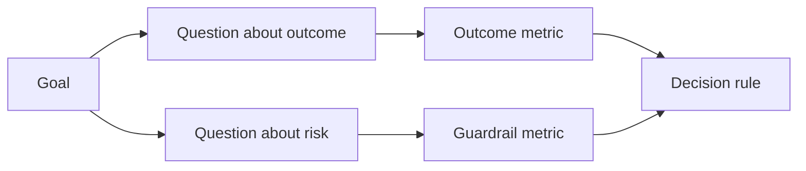

# 在看到結果前預先設計成功指標

> 量測是為了回答具體的工程決策，而非裝飾儀表板。始於清晰的目標，推導出關鍵問題，隨後挑選能精準回答這些問題的最小指標集合。

**Type:** Learn + Build
**Languages:** Python (stdlib)
**Prerequisites:** Phase 14 lessons 47 and 51
**Time:** ~70 minutes

## Learning Objectives｜學習目標

- 自業務成效目標出發，科學推導出關鍵問題與對應量測指標。
- 在實地觀察到任何結果之前，預先定義門檻、時間視窗、資料來源與目標方向。
- 將成效指標與安全護欄指標及對衡指標（Counter-metrics）成對搭配。
- 確保評測證據能精準匹配本次建置所必須支撐的核心決策。

## 目標、問題、指標（Goal, Question, Metric）

始於目標：

> 縮短定位受影響微服務所需的時間，同時絕不增加任何非安全操作。

推導關鍵問題：

- 系統多快能精準指出正確的微服務？
- 定位出的微服務其正確率究竟有多高？
- 整個排查診斷過程是否始終維持嚴格唯讀？
- 該工作流程是否意外導致告警被隨意忽略，或加重了維運工程師的負擔？

隨後挑選能將上述問題具象化落地的具體指標。



## 指標本身必須具備契約（A Metric Needs a Contract）

每項指標皆嚴格需要：

| 欄位名稱 | 具體工程範例 |
|---|---|
| Name（名稱） | `median_identification_seconds` |
| Direction（方向） | at most（不大於） |
| Threshold（門檻） | 120 |
| Window（時間視窗） | 跨十次歷史事故回放 |
| Source（資料來源） | 回放事件日誌 |
| Population（目標群體） | 參與試點的值班工程師 |
| Kind（指標型別） | outcome（成效）或 guardrail（護欄） |

若缺乏資料來源與時間視窗，任何數值皆無法被客觀重現。若缺乏合格門檻，它便無法驅動任何系統決策。

## 成效指標、護欄指標與對衡指標（Outcome, Guardrail, and Counter-Metric）

- **成效指標（Outcome metric）**：期望改善的狀態是否確實獲得提升？
- **護欄指標（Guardrail）**：硬性約束紅線是否始終維持為真？
- **對衡指標（Counter-metric）**：局部的指標提升是否將成本或負擔轉嫁至系統其他角落？

在事故排查流程中，單純追求「速度極快」是遠遠不夠的。正確率、正式環境寫入防護、工程師工作負擔與告警遺漏率，共同守護著系統免於滑向「速度飛快但危險致命」的虛假成功。

## 離線證據與線上證據（Offline and Online Evidence）

離線日誌回放極利於確定性可重現性與極端邊界覆蓋。受限的小規模線上試點（Pilot）則專門用於檢驗真實人類行為、信任度建立與工作流程整體衝擊。兩者互為表裡，不可相互替代。

始終採用能回答當前決策的最廉價客觀證據。切勿僅僅因為程式碼寫完了，就急不可耐地將真實使用者直接暴露於未經充分驗證的系統面前。

## 在量測前先確立決策路徑（Decide Before You Measure）

在親眼看見實測結果**之前**，預先白紙黑字寫明通過、失敗與模糊歧義時的具體處置方案。否則，團隊事後必然會下意識地移動門檻來為建置產物保駕護航。

範例路徑規劃：

- 通過（Pass）：正確定位微服務的比例至少達 0.9，且耗時中位數不大於 120 秒；
- 失敗（Fail）：發生任何正式環境寫入，或正確率低於 0.75；
- 模糊歧義（Ambiguous）：改善幅度微弱且變異數極大，要求擴大回放測試集規模重測。

## Build It｜動手實作

實驗會校驗度量量測計畫、評估包含極值的門檻、記錄缺失值，並輸出 `outputs/measurement-report.json`。

```bash
python3 code/main.py
python3 -m unittest discover code/tests -v
```

嘗試移除護欄指標。親眼觀察：為何即便成效指標全數存在，整個計畫依然會被直接判定為非法無效。

## Exercises｜練習

1. 自單一業務成效目標出發，科學推導出三個關鍵檢核問題。
2. 新增一項對衡指標，專門用於捕捉被轉嫁至其他角色的隱性成本。
3. 為每項指標完整定義其資料來源、目標受試群體與觀測時間視窗。
4. 在產生實測數值前，預先寫下明確的通過、失敗與模糊處置規則。
5. 識別出一項極易收集、但本質上根本無法改變任何系統決策的虛榮指標。果斷將其刪除。

## Further Reading｜延伸閱讀

- [Basili, Software Modeling and Measurement: The Goal/Question/Metric Paradigm](https://drum.lib.umd.edu/items/8119803a-362b-42ec-b6ce-2311713e7236) ——自顯式目標科學推導操作度量指標的 GQM 範式奠基論文
- [Basili, Caldiera, and Rombach, The Goal Question Metric Approach](https://www.cs.toronto.edu/~sme/CSC444F/handouts/GQM-paper.pdf) ——將 GQM 作為反饋與持續改進系統的實戰指引

## 留存產物（What You Keep）

妥善保留 `outputs/measurement-report.json`。它將為後續的原型驗證、小規模試點或正式上線階段，確立最不可動搖的客觀證據閘門。
