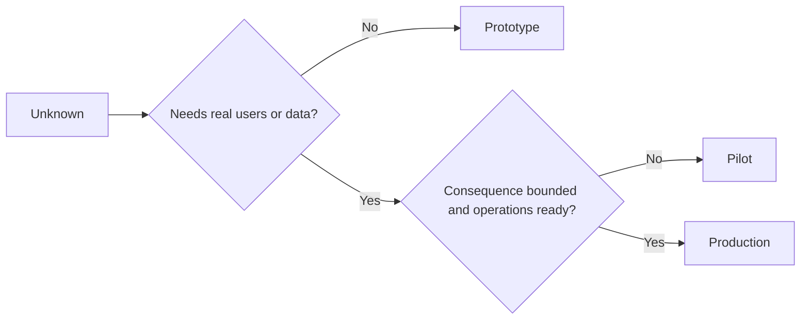

# 深思熟慮地抉擇原型、試點或正式環境上線

> 這三者代表著截然不同的認知學習環境，而非單純是打磨精細度的多寡。挑選能以最小非必要代價解答當前未知問題的最適階段。

**Type:** Learn + Build
**Languages:** Python (stdlib)
**Prerequisites:** Phase 14 lessons 50 to 52
**Time:** ~70 minutes

## Learning Objectives｜學習目標

- 依據未知問題、受眾族群、資料特性、潛在後果與維運就緒度，精準抉擇建置階段。
- 定義階段專屬的控制措施與退出標準（Exit Criteria）。
- 堅決防範原型（Prototype）程式碼在不知不覺中悄悄演變為正式環境系統。
- 延後授予實體關鍵權限，直到客觀證據與維運體系充分成熟證明其正當性。

## 三大截然不同的本質問題（Three Different Questions）

| 演進階段 | 該階段回答的核心問題 |
|---|---|
| Prototype（原型） | 該機制究竟能否產出所需的客觀證據？ |
| Pilot（試點） | 它能否在受限的真實受眾與真實環境條件下安全運作？ |
| Production（正式環境） | 我們能否在承諾的可靠度與風險門檻下，對其負起長期的持續維運責任？ |

原型可以在技術層面極其完備，但本質上依然屬於拋棄式試驗。試點可以使用真實資料，但在受眾範圍與法定權限上受到嚴格限制。而正式環境，則始於組織正式接受對其承擔長期維運責任的當下。

## 原型階段（Prototype）

當待解答的未知問題完全不需要真實使用者或真實資料時，採用原型。維持其特性：

- 拋棄式可丟棄；
- 物理環境嚴格隔離；
- 專注於狹窄的核心行為；
- 明確宣告正在探索的認知問題；
- 絕不給予虛假的維運保證承諾。

在該機制尚未贏得邁向下一階段的資格前，切勿過早實施架構最佳化。

## 試點階段（Pilot）

當待解答的未知問題確實需要真實人類行為、真實資料或真實業務流程，但潛在後果或維運體系尚不足以支撐全面對外發布時，採用試點。

試點必須具備：

- 具名指定的受試受眾；
- 明確的人類責任人；
- 受限的存續時長與權限邊界；
- 完整的審計日誌與緊急回滾方案；
- 明確的成效指標與安全護欄門檻；
- 針對擴展、修訂或終止的三向退出標準。

## 正式環境階段（Production）

正式環境所要求的，遠比「程式碼已完成部署」沉重得多：

- 服務水準目標（SLO）；
- 專職的值班工程師與事故應變責任人；
- 嚴格的資安審查與隱私合規驗收；
- 成本控制與容量配額管理；
- 回滾與災難復原演練；
- 全天候持續性監控與報警；
- 明確的系統退役淘汰路徑。



## 階段漂移危機（Stage Drift）

原型程式碼最危險的時刻，莫過於在尚未確立長期維運責任歸屬的前提下，悄悄取得了真實使用者、真實資料或實體系統權限。必須在系統設定檔、存取控制清單、遙測日誌與架構文檔中，用技術手段強制劃定原型與試點的實體邊界。單純在網頁上掛一個「測試版警示橫幅」根本無濟於事。

系統所處的演進階段，必須能自系統本身的底層配置直接被客觀觀測。

## Build It｜動手實作

實驗會依據決策脈絡自主挑選合適的階段、回傳必備的控制措施，並輸出 `outputs/stage-decisions.json`。

```bash
python3 code/main.py
python3 -m unittest discover code/tests -v
```

將試點範例調整為「低破壞後果且維運體系完全就緒」。深入思考：還需要何種額外客觀證據，方能正式支撐其晉級進入正式環境？

## Exercises｜練習

1. 依據「認知學習階段」而非部署狀態，為你當前進行中的三個專案進行精準分類。
2. 撰寫一份包含「明確終止決策」的試點退出標準。
3. 新增一項技術控制手段，從底層物理防範原型程式碼意外觸及正式環境資料。
4. 指出究竟是哪一項具體的維運職責確立，標誌著該建置正式邁入了正式環境。
5. 為受限試點設計一份標準的回滾憑證。

## Further Reading｜延伸閱讀

- [Barry Boehm, A Spiral Model of Software Development and Enhancement](https://dl.acm.org/doi/10.1145/12944.12948) ——使每次迭代的承諾投入緊密匹配已消除風險的螺旋模型論文
- [Fagerholm et al., Building Blocks for Continuous Experimentation](https://doi.org/10.1145/2601248.2601276) ——持續運行科學實驗所必備的組織文化與技術基礎設施

## 留存產物（What You Keep）

妥善保留 `outputs/stage-decisions.json`。它忠實記錄了為何各階段的選擇具備正當性，以及在邁向下一階段前必須具備哪些實體控制措施。
