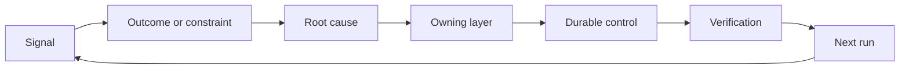

# 打造具備責任歸屬與退役機制的反饋棘輪（Feedback Ratchet）

> 產品上線關閉了當前建置的閉環，同時開啟了持續學習的循環。客觀證據必須實質改變系統，否則它只會淪為無人認領的沉睡遙測日誌。

**Type:** Learn + Build
**Languages:** Python (stdlib)
**Prerequisites:** Phase 14 lessons 46 and 53
**Time:** ~75 minutes

## Learning Objectives｜學習目標

- 將線上事故、評測指標、使用者真實行為與人工糾偏轉化為具備明確責任人的實體行動。
- 將每個反饋信號精準路由至上下文脈絡、自動化評測、安全策略、執行時期或產品待辦清單。
- 依據破壞後果與重現頻率，科學排列問題處置的優先順序。
- 為每項控制措施賦予清晰的退役淘汰條件。
- 依託客觀證據、權衡取捨與負責擔當的責任人，對外清晰溝通系統交付決策。

## 反饋本身即是基礎設施（Feedback Is Infrastructure）

一個團隊即便收集了海量的追蹤鏈、Evals 評測結果、客服工單與事故日誌，依然可能完全沒有從中汲取任何實質教訓。系統缺失的關鍵核心機制是**晉級（Promotion）**：一條從客觀觀測現象通往具備明確責任人與驗收證明的持久化系統變更之標準路徑。

演進閉環：

1. 觀測到具體的實體信號；
2. 將其與業務成效、約束條件或底層假設精確關聯；
3. 找出對該根本原因承擔最高責任的最早生效系統層級；
4. 建立一項邊界明確的實體變更；
5. 驗證該問題重現的機率已被實質降低；
6. 定期審查該控制措施是否應當繼續保留。

## 精準路由至對應的負責層級（Route to the Owning Layer）

| 反饋信號類別 | 持久化沉澱的目的地 |
|---|---|
| 偽陽性誤報、指標回歸退步、計算錯誤 | 自動化評測或單元測試 |
| 缺失上下文脈絡、重複無效勞動、陳舊事實 | 上下文資料來源或檢索召回路由 |
| 越權不安全操作或授權防護盲區 | 安全策略或權限隔離邊界 |
| 連線逾時、重試風暴、依賴服務不可用 | 執行時期控制機制 |
| 全新產品需求或未決的權衡取捨 | 結構化的產品待辦清單條目 |

始終在最早生效的防護層修復問題根本原因。當一條單元測試或權限設定就能使故障從底層物理不可能發生時，切勿徒勞無功地向 prompt 中堆砌更多空洞的叮囑段落。



## 責任歸屬是控制措施的不可分割部分（Ownership Is Part of the Control）

每個棘輪改進動作皆嚴格需要：

- 單一負責擔當的責任人（Owner）；
- 基於破壞後果與重現頻率的客觀優先級；
- 擬修改的實體產物；
- 能確鑿證明變更生效的驗收機制；
- 明確的定期審查或到期時間視窗；
- 清晰的退役淘汰條件。

一項無人認領的「系統改進」，只是一條排版稍微好看一點的普通觀測紀錄而已。

## 退役淘汰過時的控制項（Retire Stale Controls）

反饋系統極易隨著時間推移而不斷堆積過時策略。這些策略可能會彼此矛盾並大幅推高維運成本。在以下情境下，對現有控制項進行審查淘汰：

- 軟體架構或業務流程已發生實質變革；
- 低層級的底層系統不變量徹底取代了高層級的軟性指引；
- 該項受保護的故障在指定的觀察時間視窗內從未再次出現；
- 該控制項阻礙正常合法工作推進的頻率，遠高於它防範潛在危害的次數。

退役淘汰同樣需要客觀證據支撐。切勿單純因為一條規則「感覺看起來很老」就隨意將其刪除。

## 串聯系統建置與寫程式 Agent 的反饋（Connect Build and Coding-Agent Feedback）

同一套反饋棘輪架構同時服務於兩大軌道：

- 產品層面的客觀證據，會動態推動成效框架、假設地圖、業務切片或度量計畫的演進；
- 寫程式 Agent 的人工糾偏，會實質推動單元測試、上下文脈絡、範疇契約、自動化工具或階段移交的改進；
- 線上發生的真實事故，則會同時重塑產品業務邊界與 Agent 的工作台環境。

這正是為何「定義建置」絕非在動手寫程式之前就徹底終止的孤立階段。它貫穿於每一次被系統接納的實體變更之中。

## Build It｜動手實作

實驗會對反饋信號進行智慧分類、建立具備明確責任人的棘輪動作、按風險排定優先順序，並輸出 `outputs/feedback-backlog.json`。

```bash
python3 code/main.py
python3 -m unittest discover code/tests -v
```

新增一條執行時期連線逾時的信號，確認系統會將其精準路由至執行時期控制層，而非推入通用的產品待辦清單中。

## 實戰實驗：在遭遇挫折後自主承擔決策（Practice Lab: Own a Decision After a Setback）

自你的職涯代表專案中挑選一個真實的工作流程。帶領它走過一次決策、一次小規模驗證實驗與一次審核復盤。將所有客觀證據妥善記錄於 [career-delivery-evidence.md](https://github.com/rohitg00/ai-engineering-from-scratch/blob/main/phases/14-agent-engineering/54-build-the-feedback-ratchet/outputs/career-delivery-evidence.md) 範本中。

Python 實驗僅負責生成範例待辦動作。它既不親自觀察真實使用者、不度量實體干預成效，亦無法證明你的職涯就緒度。跑通 Python 實驗純屬本實戰的前置準備。

### 1. 確立事實真相

記錄使用者、任務、當前工作流程，以及你期望改善的實質成效。附帶一份經授權的真實觀測紀錄、一份經脫敏的客服工單，或一條可重現的任務執行 Trace。嚴格區分你親眼觀察到的客觀事實、他人向你口頭陳述的主張，以及團隊內部的主觀推論。

揪出一次真實的挫折：一項被證偽的假設、一份無法被一線採納的產物、一次非預期的高昂成本，或是一次拖延的階段移交。清晰解釋究竟是哪項最新證據顛覆了你先前的理解。面對挫折需要的是及時的應對與果斷的決策，而非圍繞失敗編造粉飾太平的成功敘事。

若你暫時無法與真實使用者協同，與同行進行一場標註清晰的模擬演練，或在明確的假設情境下推進。嚴格將模擬觀測與真實使用者證據分開標註。切勿捏造訪談、審批、採納率或業務衝擊結論。

### 2. 在你的法定權限範圍內推進行動

列舉當前所有未知決策，挑選能以最小可逆代價解答最具影響力問題的行動。清晰界定哪些事項在你的授權範圍內可自主裁決、哪些事項受到既有協議約束，而哪些事項在實質執行前強制要求取得授權。

例如，在等待存取客戶資料的正式批准期間，你可以在本地準備經脫敏的離線回放資料庫。發揮主觀能動性意味著積極推進已獲授權的工作，並將受阻的未決決策清晰向上呈報。它絕不代表可以擅自僭越你的存取權限或審批邊界。

### 3. 對比多種方案並向決策人匯報

為那些無需關心過多底層技術細節的決策人員，撰寫一份簡明扼要的決策簡報。必須包含：

- 使用者真實痛點，以及促使計畫發生變更的客觀證據；
- 至少兩種可行方案，在合情合理的場景下必須包含更廉價的人工替代方案或完全不做（No-build）選項；
- 針對品質、互動體驗、投入精力、維運成本與潛在風險的深度權衡取捨；
- 你的具體建議、尚存的不確定性，以及當下迫切需要的決策項；
- 具體的決策責任人、受波及的關係人，以及必須做出決定的截止日期。

邀請一位同行扮演受波及的利益關係人，對其中一項權衡取捨發起嚴厲挑戰。如實記錄對方的反對意見，以及該意見究竟如何實質改變（或未改變）你的最終建議。將角色扮演的反饋明確標註為模擬；它絕無法替代真實關係人的法定同意。

### 4. 運行有界限的驗證實驗

依據當前急需解答的核心問題，理性挑選原型（Prototype）、試點（Pilot）或正式環境（Production）階段。在收集結果之前，預先定義目標受眾、資料範圍、授權限度、存續時間、回滾方案，以及決定繼續、修改或終止的明確門檻。

完整走過從使用者的起始起點到任務完工的全流程互動體驗。務必包含輸出錯誤或資料缺失的異常邊界案例。實地觀察使用者能否及時察覺故障、動手糾偏，並在無需你暗中提示協助的前提下順利復原。

將人類工程師的審查與糾偏耗時，作為整個工作流程不可分割的一環計入總成本。一個響應速度飛快的大模型，依然可能會讓整個任務的全流程耗時變得更長、或讓系統信任度變得更脆弱。

### 5. 綜合對比業務成效與經濟效益

使用完全相同的指標定義、受試樣本群體、採集方法與可比的觀測時間視窗，忠實記錄基準線（Baseline）與後續成效。將樣本數量、排除項目與證據鏈結緊鄰數字客觀呈現。若測試條件發生改變，坦誠說明為何該對比存在局限性。

評估體系必須同時包含一項使用者實質成效、一項品質或安全護欄指標，以及人類審核所投入的總精力。即使未達預期，亦如實記錄真實結果。小規模或模擬樣本僅能支撐受限的認知學習主張，絕無法直接宣告已達成可證明的商業價值。

結合大模型呼叫開銷、失敗重試、輔助微服務以及人工審查耗時，精準核算每個成功交付任務的單元經濟成本（Cost per task）。明確說明人工時薪的假設基準，並將實測用量與主觀預估清晰分離。將該成本與純人工替代方案或專案背後的預期價值假設進行深度對照。

善用現有的 [大語言模型 FinOps 成本架構](https://aiengineeringfromscratch.com/lesson?path=phases/17-infrastructure-and-production/27-finops-llms) 進一步深化成本歸因與單元經濟效益分析。更換模型僅是眾多可能對策中的一種；進一步收斂業務流程或刻意保留特定人工環節，往往是更明智的產品決策。

### 6. 完成全流程閉環

依據預先宣告的成功標準，明確提出繼續推進（Continue）、修改方案（Change）或果斷終止（Stop）的具體建議。若當前客觀證據不足以得出結論，明確指出缺失的關鍵觀測是什麼，以及下一步的最小有界測試為何。忠實記錄負責該項決策之責任人的正式回覆；若尚未拍板，如實標註為暫緩未決。

為交付流程本身挑選一項可執行的具體改進措施：更清晰的任務框架、更提前的使用者演練、更完善的審核檢查清單、更精煉的 Agent 階段移交，或是更嚴格的評測測試案例。為該項改進明確指派單一責任人與預定審查日期。

在後續的審查會議上，依據實證資料決定是保留、修訂還是退役該項改進措施。忠實記錄做出該決定的客觀依據。一項只會製造更多工作負擔、卻完全無法防範目標故障的全新檢查清單，根本沒有資格在系統中獲得永久居留權。

## Shipped Artifact｜交付產物

將 [career-delivery-evidence.md](https://github.com/rohitg00/ai-engineering-from-scratch/blob/main/phases/14-agent-engineering/54-build-the-feedback-ratchet/outputs/career-delivery-evidence.md) 複製至你自己的專案中，並完整附上各項客觀證據鏈結。保留儲存庫既有的範本作為可復用資產。將決策簡報、互動演練紀錄、度量對照表以及具備責任人追蹤的後續行動，納入你的職涯代表作品集之中。

## Verify It｜成果驗證

邀請同行依據以下人工驗收標準手冊共同審查。在每一列中標註 **met**（已達成）、**needs work**（需返工）或 **not observed**（未觀測到），並提供證據指標或指明具體缺失的觀測依據。填滿的表單欄位絕不能證明工程判斷的健全性。

| 檢核項目 | 能證明達成該項的客觀依據 |
|---|---|
| 工作流程真實接地 | 具備可追溯的真實觀測證據支撐問題；口頭主張、推論與模擬演練皆被清晰標註 |
| 恪守法定權威邊界 | 具備可逆性的下一步行動明確無誤，任何受限高危險操作皆耐心等待其法定決策人拍板 |
| 權衡取捨充分溝通 | 記錄了合情合理的替代方案、利益關係人的質疑挑戰、自身建議以及顯式的決策請求 |
| 實體互動充分檢驗 | 全流程演練完整覆蓋成功、失敗、異常復原，以及人類審核所投入的精力成本 |
| 業務成效嚴格對照 | 基準線與後續評估的定義嚴格對齊；樣本容量、安全護欄、維運成本與對照局限性清晰可見 |
| 坦誠擔當挫折責任 | 客觀證據實質改變了「繼續／修改／終止」的決策，並轉化為具備責任人負責的下一步行動 |
| 交付流程實質進化 | 針對工作流程本身的改進具備明確責任人、審查日期，以及依託客觀證據的保留／修訂／退役決策 |

未曾實地觀測到真實使用者行為，始終是一項必須被承認的客觀盲區。在作品集宣告中完整保留該邊界，並明確指出日後消弭該盲區所需的下一步關鍵觀測。

## Exercises｜練習

1. 將一次線上真實事故與一則真實使用者投訴，分別轉化為具備明確責任人的棘輪行動。
2. 指出能最先阻止這兩起問題重現的最早生效系統防護層。
3. 為實驗輸出的待辦條目，追加具體的驗收檢驗指令或客觀觀測信號。
4. 為一條安全策略規則定義明確的退役淘汰條件。
5. 將一項已獲接納的人工糾偏，逆向追溯並注入下一個任務框架的邊界定義中。

## Further Reading｜延伸閱讀

- [Basili, Caldiera, and Rombach, The Goal Question Metric Approach](https://www.cs.toronto.edu/~sme/CSC444F/handouts/GQM-paper.pdf) ——透過目標導向度量推動組織級學習的經典 GQM 論文
- [Fagerholm et al., Building Blocks for Continuous Experimentation](https://doi.org/10.1145/2601248.2601276) ——將客觀證據與持續產品開發無縫連接的技術與組織閉環
- [Nuseibeh and Easterbrook, Requirements Engineering: A Roadmap](https://www.cs.toronto.edu/~sme/papers/2000/ICSE2000.pdf) ——將軟體需求視為貫穿整個生命週期動態演進的權威需求工程論文

## 留存產物（What You Keep）

妥善保留 `outputs/feedback-backlog.json` 作為路由範例，並保留你親手填寫的職涯交付證據檔案作為你個人工程判斷的里程碑記錄。兩者共同為「產品判斷力與交付路線（Product Judgment and Delivery path）」畫上圓滿句號，並為下一個業務成效框架提供源源不絕的演進動力。
